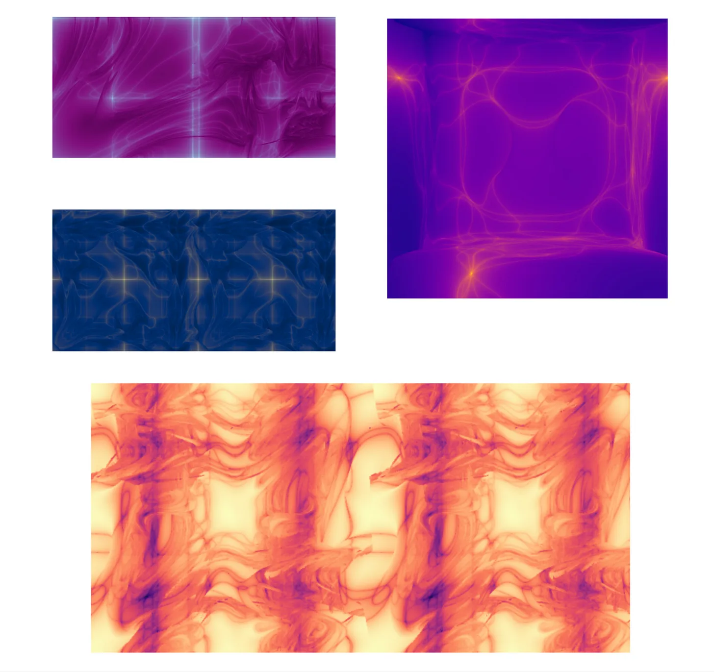

---
title: 'Generative Arts Weekly #001'
author: Chris Ried
date: '2020-08-01'
slug: generative-arts-1
categories: 
featured: 
tags: ['generative']
---
_Originally posted on [Substack](https://generative.substack.com/p/001-generative-arts-weekly)_

> “Nothing's perfect, the world's not perfect. But it's there for us, trying the best it can; that's what makes it so beautiful.”  - *Hiromu Arakaw*

The beauty of art is that it is experimental, its emotional, it's spiritual and as an artist, it helps better understand who we are and why we are by expressing the inner self. It can be a medium of unity, it can be a cry for anarchy. It can be informative, or it can just be there because we can. It's one of the wonders we possess as humans. 

This is the first newsletter that I have put together and i know it won't be read by many. However I hope that I can bring you the same amount of joy from learning and developing an interesting 

# Inspirations

---

## 🖌️Unconventional Media

[https://youtu.be/F35-HJc0ZcM](https://youtu.be/F35-HJc0ZcM)

To be honest, I am not sure what to think about this style. It seems to be a bit worrisome to use ants as agents to generate the images that are here. But at the same time, there are some very interesting concepts of generative intelligence that I find interesting enough to add. ([source](https://kottke.org/20/10/paintings-by-fire-ants))

## 📸 Generative Graphics

Here is a newly started [Twitter account](https://twitter.com/LFractals?s=20)  called @LFractals, as you see with the following images. There are some complex looking mathematics going on produce some beautiful [Lyapunov fractals](https://en.wikipedia.org/wiki/Lyapunov_fractal).

## 🎶 Music

{{youtube PnIyPsjaDAg}}

In this showcase we simply used the [Zwobot](https://www.zwobotmax.com) LorenzFX-Module as a basis FX and just playing around with other Zwobot-FX on top of it. The variety is endless.

{{youtube 995vS_pHrUk}}

This time we learn no new programming concepts, but find out how to install a MIDI library in Processing to be able to control program parameters using an external hardware device. MIDI controllers are often used together with music programs to do things like changing volumes or effect amount. But they are a great tool for experimenting with your programs, because they allow you to change numbers without having to restart your program. You just turn a knob or move a slider and see the graphics change.

# 🏛️ Exhibits / Installations

A couple of weeks ago, the Daemon LED installation occurred at the Luch Festival in Yekaterinburg, Russia. Below you can see some video from the installation and some further images that capture some simple generation of lights. 

[https://twitter.com/i/status/1313794279106641921](https://twitter.com/i/status/1313794279106641921)

Daemon LED at Luch Festival
September 01 — 06, 2020

## 🚤Motion

# Articles and Tutorials

---

- [Algorithmic Beauty: 10 Artists Pushing the Boundaries of Code](https://medium.com/feed-fatigue/algorithmic-beauty-10-artists-pushing-the-boundaries-of-code-2d55b58aedea)

> "The following is a compilation of artists whose medium happens to be code. They are artists first and technologists second. Technology is used in the service of the art and not the other way around."
> 

I found this article as a great way of  highlighting the latest innovations / techniques in the generative arts. 

- [The Game of Life](https://brooklynrail.org/2020/09/artseen/The-Game-of-Life-Emergence-in-Generative-Art)

> "Game of Life is an automaton or zero-player game in which every cell on a two-dimensional, rectilinear grid responds to the behavior of its neighboring cells—the development of the system varies only according to the initial configuration provided by a player.
> 

- [Slime Mold Simulations](https://fronkonstin.com/2020/08/11/abstractions/)

> "This post talks about a generative system called Physarum model, which simulates the evolution of a colony of extremely simple organisms that, under certain environmental conditions, result into complex behaviors."
> 

I've been following the blog from Fronkonstin for a while now and I am always impressed by the incredible things he finds interesting and then performs some magic to create the most fantastic images.  

# Courses

## 🎨 Impressionistic Paintings from Photos with Processing

Here is a [fun course](https://www.skillshare.com/classes/Creative-Generative-Art-How-to-Easily-Code-Impressionistic-Paintings-from-Photos-With-Processing/1676257234) on using Processing to generate impressionistic like paintings using processing.  It is on the Skillshare platform which does require a subscription. 

# Books

- [The Nature of Code](https://www.amazon.com/Nature-Code-Daniel-Shiffman-ebook/dp/B00BPFT8D4/ref=sr_1_50?dchild=1&keywords=processing&qid=1602357653&sr=8-50) by Adam Shiffman

> This book focuses on a range of programming strategies and techniques behind computer simulations of natural systems, from elementary concepts in mathematics and physics to more advanced algorithms that enable sophisticated visual results. Readers will progress from building a basic physics engine to creating intelligent moving objects and complex systems, setting the foundation for further experiments in generative design.

> The Nature of Code written by the Youtuber Daniel Shiffman of [The Coding Train](https://www.youtube.com/user/shiffman) is by far the best "get into the nitty-gritty" how-to book to build oneself a framework to build the beautiful systems that mimic nature including fractals, fungal growth, firefly lighting patterns, and more. It's been a long time since I've read it, but I found it particularly useful to help create a framework by which interesting experiments can be run to experience the excitement of discovery. 

# Send me your inspirations...