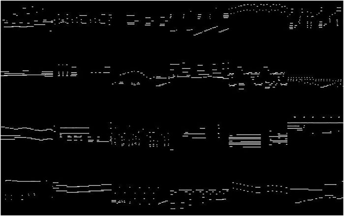
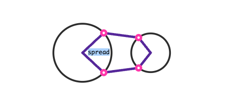
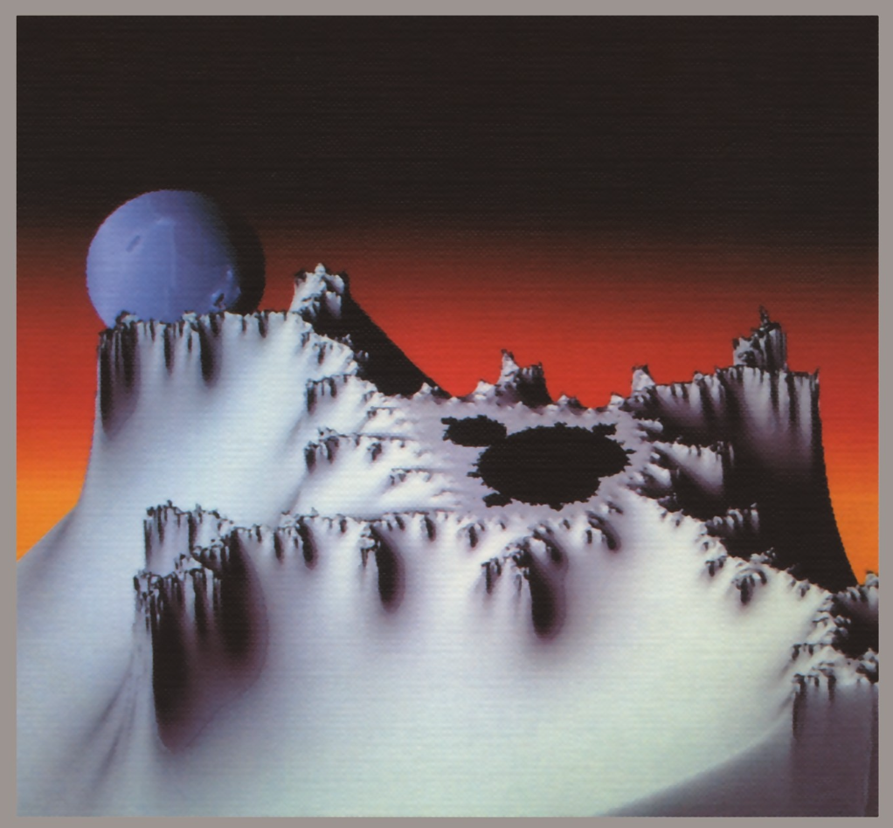

_Originally posted on [Substack](https://generative.substack.com/p/algorists-metaballs-and-shader-prototyping)_

> if(creation && object of art && algorithm && one’s own algorithm) { 
include * an algorist* 
} else if(!creation && !object of art && !algorithm && !one’s own algorithm) {
exclude *not an algorist* }
> 

The above statement was the manifesto coined by J. P. Herbert and the mantra of The Algorists; a group  formed in 1995 at [SIGGRAPH](https://www.siggraph.org/) which included (Roman Verostko, Jean-Pierre Hébert, and Ken Musgrave). 

# 🔖 Articles and Tutorials

## **[Thoughts On Designing Data Sculptures](https://civic.mit.edu/index.html%3Fp=2555.html#:~:text=It)**

> I’m seeing an increase of the number of people trying physical data visualizations, which I tend to call “data sculptures”, and I’m very excited about this! As more of our society is shaped by data-driven systems it is up to us to come up with more relatable and comprehensible representations of those data and processes. **I believe data sculptures have a unique power in this response because of the way they engage people in space with data.**
 They use the power of spectacle and novelty to catch attention, provide novel ways for people to relate to data they don’t know, and to bring regular people together to create things based on data.
> 

## **[Data Sculptures at ZKM](https://zkm.de/en/data-sculptures)**

> Traditional network layout algorithms perceive the connections between two components, called »links,« as virtual and bodyless lines that are allowed to cross each other. Yet in physical networks, like the network within a brain, this is not possible. The BarabásiLab created a new mathematical algorithm that permits the layout of three-dimensional networks without link crossings. The algorithm’s formula, inspired by actual physical and biological patterns, shapes the final structure of the data sculpture. Through the software developed and the possibilities offered by the emerging powder-based 3D printing process, »The Flavor Network« was realized in 2018 as the first three-dimensional network representation.
> 

## ****[NFTs and Generative Art: Women Working with Code](https://www.aleksandra.art/featured-story/2022/10/22/nfts-and-generative-art-women-working-with-code)**

> It’s been a while since I’ve had a chance to publish on my personal blog. But key things remain, including the timeliness of our commentary and efforts towards building space with equal opportunities. If 2021 was a rollercoaster for artistic creativity within web3, in 2022, we somehow collectively accepted that the world is changing at an accelerated pace and are just trying to keep up.
> 

## ****[Creativity in Generative Musical Networks: Evidence From Two Case Studies](https://www.frontiersin.org/articles/10.3389/frobt.2021.680586/full)****

> Deep learning, one of the fastest-growing branches of artificial intelligence, has become one of the most relevant research and development areas of the last years, especially since 2012, when a neural network surpassed the most advanced image classification techniques of the time. This spectacular development has not been alien to the world of the arts, as recent advances in generative networks have made possible the artificial creation of high-quality content such as images, movies or music. We believe that these novel generative models propose a great challenge to our current understanding of computational creativity.
> 

## [Metaballs](https://varun.ca/metaballs/)

> Metaballs, not to be confused with meatballs, are organic looking squishy gooey blobs. From a mathematical perspective they are an iso-surface. They are rendered using equations such as `f(x,y,z) = r / ((x - x0)2 + (y - y0)2 + (z - z0)2)`. Jamie Wong has a fantastic [tutorial](http://jamie-wong.com/2014/08/19/metaballs-and-marching-squares) on rendering metaballs with canvas.
> 

# 🎒Courses

## [Shader Prototyping](https://shadercamp.gumroad.com/l/SHADERPROTOTYPING)

> is a two hour class on zoom covering shader workflow and tools: how to go from nothing → a sketch → something you can ship. This class is my daily professional workflow — what I wish I’d known when I started writing shaders 12 years ago. The creations we make can be ported anywhere, so the skills you learn will be portable to any platform or framework, like Unity, Three.js, TouchDesigner, OpenFrameworks, Processing, etc.

Patricio González Vivo is the coauthor of [The Book of Shaders](https://thebookofshaders.com/) and creator of the [PixelSpirit deck](https://pixelspiritdeck.com/), an artist and Creative Technical Director with more than 10 years of experience working at the forefront of computer graphics through projects that combine AR, VR, and ML.
> 

I watched the class last week and the course really helps abstract away the shader pipeline ductwork by using Lygia and glslViewer. Also just a great way to find little ways to make writing shaders more efficient. 

# 📚Books

## [The Beauty of Fractals](https://www.amazon.com/Beauty-Fractals-Complex-Dynamical-Systems/dp/3540158510/ref=sr_1_1?crid=7ITL99MNRNY2&keywords=The+Beauty+of+Fractals&qid=1667445549&qu=eyJxc2MiOiIwLjcwIiwicXNhIjoiMC41MCIsInFzcCI6IjAuMDAifQ%3D%3D&sprefix=the+beauty+of+fractals%2Caps%2C167&sr=8-1&ufe=app_do%3Aamzn1.fos.18ed3cb5-28d5-4975-8bc7-93deae8f9840)

> Fractals are all around us, in the shape of a mountain range or in the windings of a coast line. Like cloud formations and flickering fires some fractals under- go never-ending changes while others, like trees or our own vascular systems, retain the structure they acquired in their development. To non-scientists it may seem odd that such familiar things have recently become the focus of in- tense research. But familiarity is not enough to ensure that scientists have the tools for an adequate understanding. A child is familiar with his blue cradle and the blue sky long before he is conscious of blue as a common quality of different items. In his cognitive development there is a stage when he be- comes receptive to the notion of color; he hears that the sky is blue and sud- denly "discovers" that other things are blue too.
> 

# Send me your inspirations...