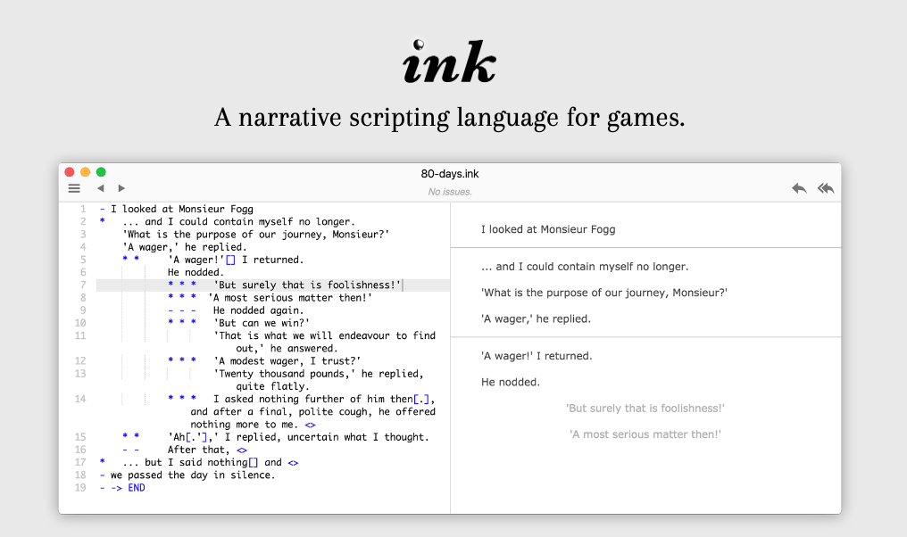
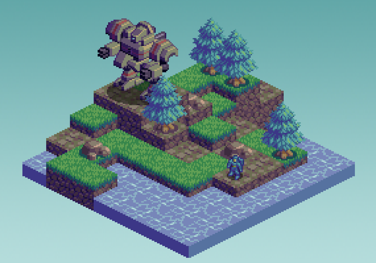

_Originally posted on [Substack](https://generative.substack.com/p/narrative-scripting-live-coding-and)_

> Every mistake is a new style. -Michael Meade 

Happy Holidays! 

I hope you find time to appreciate the little things in life. 

It is a time of stress,  family, loneliness, and remembering those we lost. 

So be kind to yourself, and find ways to appreciate the chaos.. 

May that be a little piece of code to obsess about, a quote to ponder,  a walk in nature to absorb the color, smells, emotions, or simply the sound of the cold wind tickling your inner ear. 

And you never know what will come from those seemingly uncomplicated activities. 

Chris 

## [Ink: Narrative Scripting Language](https://www.inklestudios.com/ink/)

> **ink** is a scripting language built around the idea of marking up pure text with the flow to produce interactive scripts.
> 
> 
> At its most basic, it can be used to write a Choose Your Own-style story or a branching dialogue tree. But its real strength is in writing dialogues with lots of options and lots of recombination of the flow.
> 
> **ink** offers several features to enable non-technical writers to branch often, and play out the consequences of those branches, in both minor and major ways, without fuss.
> 

## **[Isometric Pixel Art](https://www.slynyrd.com/blog/2022/11/28/pixelblog-41-isometric-pixel-art)**

> Isometric pixel art is based on isometric projection, a method for accurately ‘projecting’ 3D objects into fancy 2D. Unlike perspective drawing, there is no vanishing point in isometric projection. Furthermore, the three coordinate axis has equal foreshortening, eliminating the need to alter lengths based on the perceived distance from the viewer. This allows one to efficiently create 3D objects that accurately describe the complete form and all dimensions. Traditionally, Isometric projection is used for technical drawings in engineering, architecture, and the assembly guide to your Lego set. However, these characteristics also make it a perfect style for game graphics. Marry it with pixel art, and something truly special happens. Let’s make some magic.
> 

## [Pattern Collider](https://aatishb.com/patterncollider/?symmetry=13&pattern=1)

> Pattern Collider is a tool for generating and exploring quasiperiodic tiling patterns. Every pattern that you create has a custom URL that you can bookmark & share.
> 

## [Live Coding: A User’s Manual](https://livecodingbook.toplap.org/)

> Performative, improvised, on the fly: live coding is about how people interact with the world and each other via code. Live coding has emerged as a dynamic creative practice in the last few decades, gaining attention across cultural and technical fields—from music and the visual arts to computer science.
> 

## ****[Vector Animations With Python](http://zulko.github.io/blog/2014/09/20/vector-animations-with-python/)****

> It was generated using a special animation language called [Processing](http://www.processing.org/)
 (here is [Dave’s code](https://dribbble.com/shots/1692659-Shell-Spiral/attachments/268926)). While it seems powerful, Processing it is not very elegant, in my opinion; this post shows how to do similar animations using two Python libraries, [Gizeh](https://github.com/Zulko/gizeh)
 (for the graphics) and [MoviePy](http://zulko.github.io/moviepy)
 (for the animations).
> 

# 📰 Happenings

- [OFFF Barcelona](https://www.offf.barcelona/) March 23-25, 2023

# Send me your inspirations...