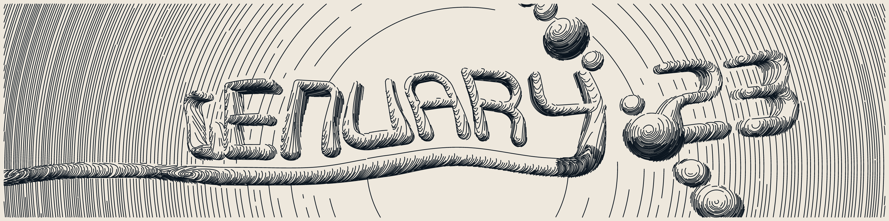

_Originally posted on [Substack](https://generative.substack.com/p/genuary-2023-reflections-and-artificial)_

> The true secret to happiness lies in taking a genuine interest in all the details of daily life. -William Morris
> 

A little over a year ago, I dedicated a year and my full-time work to generative/creative coding and thought I’d give a bit of an update. What went well, what I wished I could have done better, etc.  

I aimed to do the following: 

- Interview more generative artists like Tyler Hobbs [here](https://www.youtube.com/watch?v=pTesZREe73c&t=1285s)…
    - **Outcome**: I have done **0** of them since last year 😟. Most of it is due to my activation energy to get over the hump of asking.
    - I’ve been working on a podcast project with a friend that we will release in Q1 2023. The idea is to get more experience in podcasting/video so that I can build the skills to develop premium content.
- Weekly Newsletter
    - **Outcome**:  In aggregate, I was able to release an issue every other week, but a few months happened once a month. Some of that was due to content; I didn’t want to litter the newsletter with crypto-related work.
- [Webase](https://www.webase.com/) / [Paperai](https://paperai.app/) Collab: a no-code platform with Web3 built-in
    - **Outcome**: The vision is to allow creators to use blockchain technologies and create a subscription to a newsletter or members-only site. We got an interview with [Y-Combinator](https://www.ycombinator.com/), which was a neat experience.
- Delve into the history of generative art
    - **Outcome**: I have been able to collect and read several books. Many are gallery, some are academic papers and some are working through archives and finding interesting and relevant work. Though they are limited, I’ve found many fascinating works tidbits of artists experimenting with art and technology. It’s just remarkable to see so much great work. Plus there are an endless number of rabbit trails to follow and I am always ensnared by them. A few were the works of [Maeda & Media](https://www.amazon.com/Maeda-Media-John/dp/0789305259) for early work in late 1990s / 2000s which led to a bunch of thesis to read. Or the situations described in “T[he Troubled History of Computer Art”](https://www.amazon.com/Maeda-Media-John/dp/0789305259) of activism of 1970s against technologies due to the Vietnam war.
- Compile Generative Art History Resources
    - **Outcome**: I’ve been slowly working at this, as I have been collecting data and creating timelines; I’m envisioning to create a responsive timeline for artists and bios around them. There are great resources out there already, [Database of Digital Art](https://dada.compart-bremen.de/) (seems to be offline right now), [Spalter Digital](https://spalterdigital.com/),  and [Monoskop](https://monoskop.org/Index) to name a few.
- Learning new technologies
    - Generative workflows
        - I did a lot of conversion from R / Java-centric generative art; I have spent a lot of time in the browser, first playing with p5 and then slowly porting workflows to canvas along with shaders.
    - 3D / 3D Printing
        - **Outcome**: Spending a lot of time exploring the generative possibilities with Rhino and Grasshopper, Blender, Unity,, and C4D. I also wanted to understand using a 3D printer and working to generate 3D objects.
    - Frontend
        - This goes back to Javascript; I have yet to spend tons of time developing in the browser outside of like 15 years ago in high school.  I had a ton of great courses using [FrontendMasters](https://frontendmasters.com/) and dove into React, Next.js, and Svelte to get a thorough understanding.

What I have learned: 

- Even after a year, I am not tired of digital art. There is nothing more satisfying as the dopamine hit when I find something that just surprises or shocks.
- Continue to be convinced that generative art has an interesting page in the annals of history. The art form that intersects the introduction of man and machine. It is a visual history that encapsules the transition from Post Modern into the convergence of mediums into digital and the eventual divergence that will include the pseudo-sentient mediums that are to come.
- I have **mad respect for freelancers/artists** who continue doing full-time work. It isn’t easy and I have great respect for the dedication.
- Personally, I need to have many things going on at once. I love variety and working on many different projects, and for whatever reason, when the schedule is packed, there is an efficiency boost that I seem to be able to keep.

Striving to explore this year: 

- Start releasing some of the research I’ve done this year in a digestable manner.
- I’d also want to figure out how to work with a studio like [Oxman](https://oxman.com/) or [Nervous Systems](https://n-e-r-v-o-u-s.com/). Both of these studios have a vision to intertwine science, technology, design and engineering. It is extremely compelling work and the crossroads where I want to sit. It would be amazing to figure out how to merge Sustainability and Design together in such a way to do that or even to figure out.
- I am really interested in creating generative 3D models..  this is something more for me personally as its on my never ending list of curiosities.

Alright enough about me.  I do hope you all have a wonderful new year and look forward to the great things ahead!

Much Peace and Love, 

Chris  

## Articles

## [Genuary 2023](https://genuary.art/)

Suppose you haven’t participated or don’t yet know. In that case, Genuary is a daily prompt (just like [Advent of Code](https://adventofcode.com/) or [Inktober](https://inktober.com/)) for generative and creative coders looking to celebrate a month of writing code, sharing outputs, and enjoying the outputs of others. 

Here is an exciting entry from last year that I  happened upon and found quite interesting. 

{{ youtube skZDNexhYXU }}

## **[The Wavefunction Collapse Algorithm Explained](https://robertheaton.com/2018/12/17/wavefunction-collapse-algorithm/)**

> The Wavefunction Collapse Algorithm teaches your computer how to riff. The algorithm takes in an archetypical input, and produces procedurally-generated outputs that look like it.
> 

## **[Introduction for Artificial Life](https://thegradient.pub/an-introduction-to-artificial-life-for-people-who-like-ai/)**

> ALife is the bottom-up scientific study of the fundamental principles of life. Just as Artificial Intelligence researchers ponder the nature of intelligence by trying to build intelligent systems from scratch, ALife researchers investigate the nature of “life” by trying to build living systems from scratch
> 

[https://vimeo.com/277328815](https://vimeo.com/277328815)

This is a great example of artificial life that is further down in the article above. I just thought if you didn’t have the time to look it up this would be an easy way to do that. 

.png)

## [GUI IO](https://observablehq.com/@esperanc/gpu-io)

> GPU-io is a WebGL library that helps you easily compose GPU-accelerated computing workflows. This library can be used for various applications, including real-time physics simulations, particle/agent-based simulations, cellular automata, image processing, and general-purpose GPU computations. GPU-io supports rendering directly to the WebGL canvas and has built-in features that make interactivity easy. 
> 

# Send me your inspirations...

---