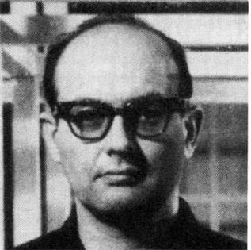
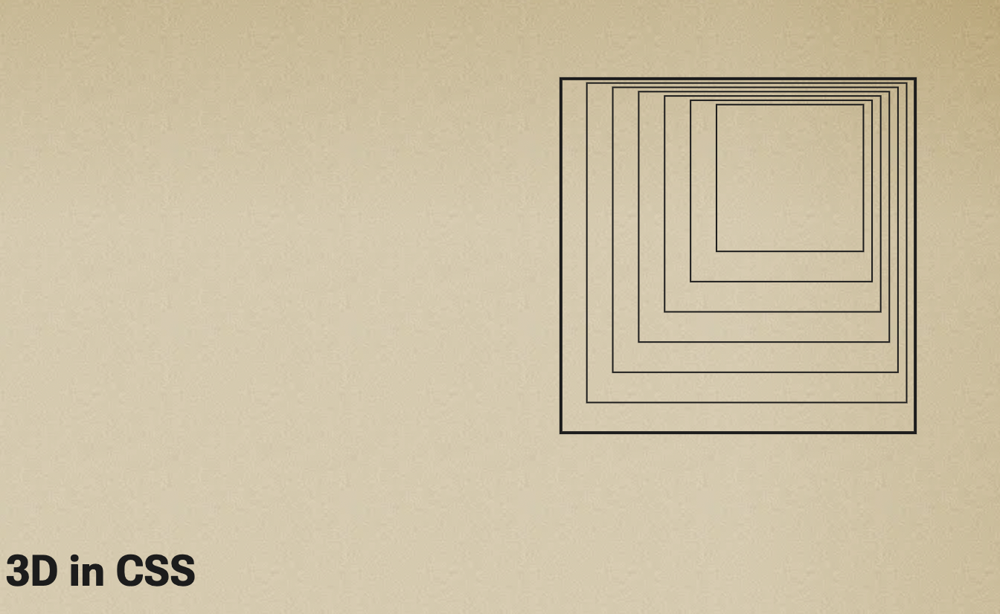

_Originally posted on [Substack](https://generative.substack.com/p/drawing-ideas-3d-css-and-immersive)_

> Great minds discuss ideas. Average minds discuss events. Small minds discuss people. - Henry Thomas Buckle
> 

I want to say thank you so much to the subscribers that continue to sign up far!  And thank you to the paid subscribers for your support that is so generous of you!

This week I’ve been thinking through various ways I can bring some interesting content into the mix. 

I’ll be experimenting over the next couple weeks with additional sections. This weeks, will be ***Who am I?*** 

 I’ll be experimenting with various ideas on how to generate sections that fall into the following categories: 

1. Saturate your interests and teaches
2. Keeps the history of digital art alive
3. Engages a community of sharing 

For the **Who am I** section, this will fall into the keeping history alive. I think it’s important to realize what has been done and will set some of the content for next week. 

## Who am I? (New Experiment)

I’ve thought this might be a fun little section for all of you readers.. I’ll add a picture of an artist who is generative / multimedia artist and leave the answer in the comments. 

Next week I’ll reveal the answer, and then add some more color to why I’ve picked the above artist. 

## Genuary 2023 Shoutouts!

We are day 16 of 31 into [Genuary](https://genuary.art/) with almost 1/2 of the prompts completed. Personally I’ve been posting them on my socials and most of them I’ve used the [Observable](https://observablehq.com/collection/@cdr6934/genuary-2023) platform. But here are some of the inspiring outputs I’ve come across so far:

For day 15  - Sine Waves 

*[Roni Kaufman](https://ronikaufman.github.io/)*, I’ve been a huge fan of his work and color choices. 

For day 14 - Aesemic 

[https://pbs.twimg.com/media/Fmms1XrX0AEXINt?format=jpg&name=large](https://pbs.twimg.com/media/Fmms1XrX0AEXINt?format=jpg&name=large)

*[Paola Curtoni](https://www.paolocurtoni.com/portfolio/)*  - A nice and unique script type

For day 9 - Plants 

[https://pbs.twimg.com/media/FmA7uM8aAAYiLmt?format=jpg&name=900x900](https://pbs.twimg.com/media/FmA7uM8aAAYiLmt?format=jpg&name=900x900)

[Elsif](https://twitter.com/ElsifThen) - just a calming and energizing flowing of color and texture 

Of course there are many more, don’t forget to look on [Mastodon](https://genart.social/home) at some of the work that is being posted over there as well! 

[https://neuralframes.s3.eu-central-1.amazonaws.com/20221214100256.mp4](https://neuralframes.s3.eu-central-1.amazonaws.com/20221214100256.mp4)

# [Neural Frames: AI Art Video](https://www.neuralframes.com/)

> The neural frames can already be done using some technical skills, but if you are looking to play with StableDiffusion and generate morph images, this at least will help you get going.
> 

Definitely in the early stages, but I think something to gain some inspiration 

## **[How to Draw Ideas](https://ralphammer.com/how-to-draw-ideas/)**

> Great ideas are hard to find. Drawing makes it a lot easier. And fun. How?
> 

When building generative systems, sometimes it's about welding an existing system; other times is taking an idea and creating a new algorithm.. I found this to be a helpful write-up on how to use the concept of drawing out ideas to further understand and demonstrate an algorithm's uniqueness. 

## **[3D in CSS](https://garden.bradwoods.io/notes/css/3d)**

> Some interesting CSS properties that can help create 3D like shapes in CSS
> 

Who would have thought 3D in CSS? 

## Game of Construction

[https://www.youtube.com/watch?v=n6FUXTDNKKQ](https://www.youtube.com/watch?v=n6FUXTDNKKQ)

> An overall overview of the work of Helena Sarin who uses GAN AI art (not to be confused with Dalle2 or Midjourney). The Game of Construction essentially talks through her work and artistic process which includes pottery.
> 

I’ve been watching her work for a number of years now and would highly recommend taking a look at her practice. 

# ****[Creative Coding: Immersive Art with openFrameworks](https://www.domestika.org/en/courses/4588-creative-coding-immersive-art-with-openframeworks) (Course)**

> **Learn the basics of C++ programming and creative coding to animate striking shapes and loops for immersive artistic installations**
> 
> 
> Coding goes far beyond programming languages and technology– it is also a medium of artistic self-expression. For Paul Ferragut, a multimedia artist and technologist, it’s allowed him to create immersive art installations with organizations like the Aquarium of the Pacific in California and collaborate with companies like Facebook, Microsoft, and Intel.
> 
> In this online course, learn the fundamentals of openFrameworks so that you can create your experiential art. Deepen your knowledge in C++ programming, and express yourself artistically in a wide variety of projects.
> 

If you haven’t looked into using [OpenFrameworks](https://openframeworks.cc/) as a toolkit to extend your work, here is a comprehensive start. It’s one of the main tools of Zach Liebermann as well. 

# **[Bio-Design: Living Construction** **(Book)**](https://www.routledge.com/Living-Construction/Dade-Robertson/p/book/9781138363038)

> Modern biotechnologies give us unprecedented control of the fundamental building blocks of life. For designers, across a range of disciplines, emerging fields such as synthetic biology offer the promise of new sustainable materials and structures which may be grown, are self-assembling, self-healing and adaptable to change. While there is a thriving speculative discourse on the future of design in the age of biotechnology, there are few realized design applications.
>