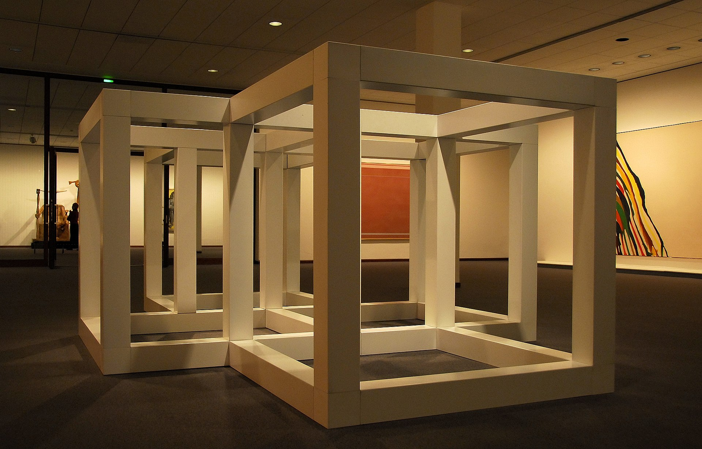
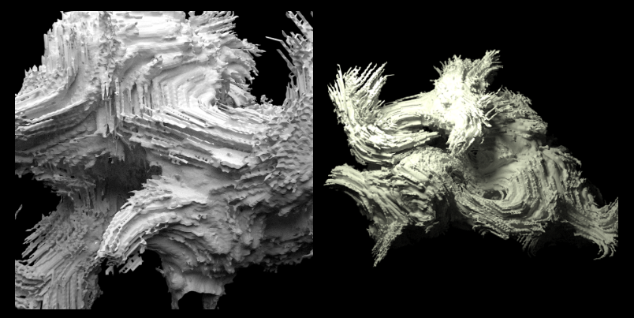
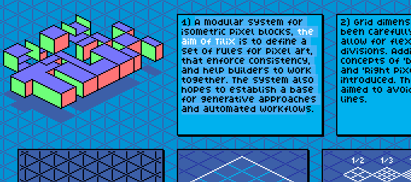
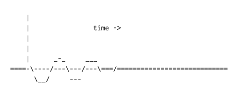
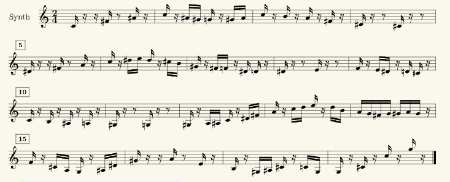

_Originally posted on [Substack](https://generative.substack.com/p/weiwei-evolving-alien-coral-and-visualizing)_

> Art is a tool to set up new questions -Ai Weiwei
 

So last week, I started adding a new segment to experiment with, and I have a couple more in mind that I’d like to try over the future weeks. But why this **“who am I?”**

As some of my long-time subscribers have probably noticed, History is important to me. It brings context to both the old and the new. 

History sometimes helps answer questions from the past and provides an avenue for to us reconnect with the past. 

Naturally, there are always questions that will be left unanswered.

Today’s questions might have had answers but aren’t sufficient in a future context. 

Trying to delineate the past as “out of date” or irrelevant can leave us reveling in the mire of our context without escaping it an infinite while loop that cannot be broken out of.  

Yes, sometimes moving forward is another mire or pit of problems. But new problems always provide new frameworks of thinking. 

In light of art and creativity, it is a mental framework by which we can query the future.

A way we can test the waters of the possible; almost becoming the oracles of the future. 

It is also an avenue in which the prophets can warn and imagine the worst cases. 

We need both the oracles and prophets to help shape how we might take steps into the dark. 

Hope you all have a great week! 

Chris Ried

## Who Am I… Solomon LeWitt

### [Sol LeWitt](https://www.notion.so/058-Creative-Coding-Generative-Arts-Weekly-4259ff9dc4774ab68cc52a7c157070a8?pvs=21)

- Sept 9, 1928 - Apr 8, 2008
- Linked with the first experiments of conceptual art (which include over 1200 wall pieces)
- Usually noted for his gallery conceptual pieces but started in the early 1960s with the radically simplified open cube, it became a basic building block of the artist's three-dimensional work playing on the 8.5:1 ratio of its negative space.

- “Conceptual art was neither mathematical nor intellectual but intuitive, given that the complexity inherent to transforming an idea into a work of art was fraught with contingencies.”

For next week: 

[https://encrypted-tbn1.gstatic.com/images?q=tbn:ANd9GcQTkjq9pUItKi66dwQSxrwBlQexhHRlAX1urCzixcraVwTuOlOi](https://encrypted-tbn1.gstatic.com/images?q=tbn:ANd9GcQTkjq9pUItKi66dwQSxrwBlQexhHRlAX1urCzixcraVwTuOlOi)

# 🔖 Articles and Tutorials

{{ youtube Xrxx3tpEuco }}

## Magdalena Abakanowicz - Woven Sculptures

> In the 1960s, Polish artist Magdalena Abakanowicz began making large-scale woven sculptures that defied all categorization. They seemed like coats or cocoons that tempted you to crawl inside or hairy living creatures suspended from the gallery ceiling. The critics did not know what to make of them and called them 'Abakans' - perhaps the only example of an art form named after their artist.
> 

Definitely a worthy watch. The sculptures are absolutely special and natural in their own way. Dystopian cocoons with 

## [Evolving Alien Corals](https://www.joelsimon.net/corals.html)

> A research project simulating the evolution of virtual corals. Corals are grown in underwater environments containing light and current flow and are evolved with a genetic-algorithm. Morphogens, signaling, memory and other biologically motivated capacities enable a multipurpose biomimetic form optimization engine. This work is part of a series of projects exploring emergent and generative forms.
> 

## [Growth Algorithms by Sheltron](https://nshelton.github.io/home/growth/)

> Along with fractals, I also got really into growth algorithms, especially making them run in realtime. It seems like a perfect intersection of design and art with computer science and math.
> 

## [Tilix](https://c6y.github.io/tilix-reference/)

> A modular system for isometric pixel blocks, the aim of TiliX is to define a set of rules for pixel art, that enforce consistency, and help builders to work together. The system also hopes to establish a base for generative approaches and automated workflow
> 

{{ youtube SFXvtm-vkvE }}

> Generative Music or Aleatoric Music is quite different in terms of method as compared to traditional music creation using musical instruments. In this video I try to create a fairly basic generative music system in the low code/no code web gl platform cables.gl.
> 

## ****[Digital sound processing tutorial for the braindead!](http://yehar.com/blog/?p=121)****

> A sampled sound can only represent frequencies up to half the samplerate. This is called the Nyquist frequency. An easy proof: You need to have stored at least two samplepoints per wave cycle, the top and the bottom of the wave to be able to reconstruct it later on:
> 

## [Visualizing Science: How Color Determines What We See](https://eos.org/features/visualizing-science-how-color-determines-what-we-see)

> Color strongly influences the way we perceive information, especially when that information is dense, multidimensional, and nuanced—as is often the case in scientific data sets. Choosing colors to visually represent data can thus be hugely important in interpreting and presenting scientific results accurately and effectively.
> 

## **[Common Lisp and Music Composition](https://ldbeth.sdf.org/articles/cm.html)**

> Once upon a time, there were many music composition software packages, mostly written in Common LISP. To name a few I know, Common Music, Symbolic Composer (not related to the Symbolics Lisp Machine). Common Music is still available in source code but I doubt if anyone is still able to setup that. Symbolic Composer just vaporized decades ago, which some archived programs scattered over the Internet. The package is also a 32bit Intel program so newer macOS versions would not support it and it is license protected anyway. Yet another is Patchwork, a more graphic-oriented composing program, and I'd be surprised if it is able to survive bit rot.
> 

## Genuary 2023

Following are a few of the genuary entries that I’ve found to be really neat. 

[https://twitter.com/i/status/1617142068727668736](https://twitter.com/i/status/1617142068727668736)

[https://twitter.com/thresfold/status/1619068135981862913?s=20&t=Xmr9gUrurQoS0jSwee0RZA](https://twitter.com/thresfold/status/1619068135981862913?s=20&t=Xmr9gUrurQoS0jSwee0RZA)