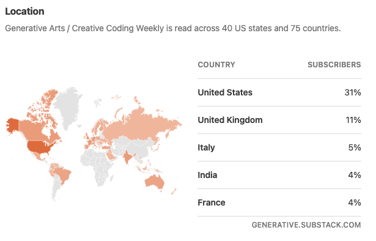
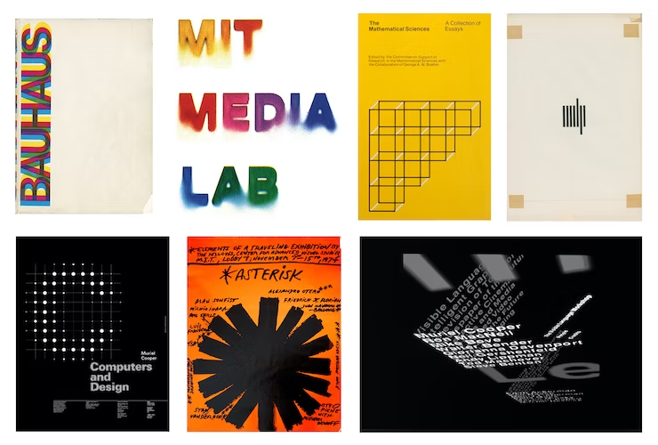
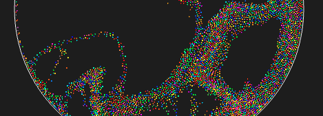
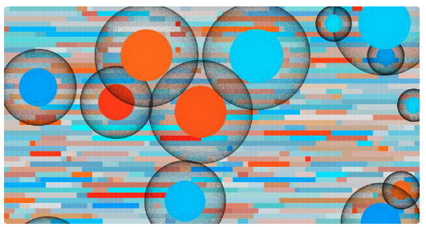

_Originally posted on [Substack](https://generative.substack.com/p/10print-svg-visual-language-workshop)_
 

It’s humbling that in the past 90 days, I’ve had subscribed readers from **75 different countries**. In a world with so much content and other things to do, I do appreciate your interest in this passion of mine and I hope I can continue celebrating this practice with you all.  

But to some of my weeks shenanigans: 

So speaking of AI,  I’ve been working with [ChatGPT](https://openai.com/blog/chatgpt/) to develop catchy article titles to gain inspiration for a few posts I’d like to write this year. Here are a few of my favorites: 

1. "Algorithms as Artists: The Impact of Generative Art on the Art World"
2. "From Randomness to Beauty: The Science behind Generative Art"
3. "A New Generation of Art: The Rise of Generative Art and its Place in Contemporary Art"
4. "Beyond Human Control: The Emergence of Generative Art in Modern Art"
5. "A New Dimension of Creativity: The Evolution of Generative Art"
6. "The Beauty of Randomness: Understanding Generative Art"
7. "Algorithms as Muse: The Role of Generative Art in Contemporary Art"

These all have gotten my wheels turning and find this to be a great way to gain inspiration to craft  stories for future editions. 

And I’m going to predict in the next year I’ll even be able to create my own intro music that sounds usable.

{{ youtube 2CUKU2iAzAs }}

It’s interesting for sure but it has yet to get even close to creating on its own. Until a model can control it’s own reward function without input it will be extremely hard to make the case for sentient output. 

Have a great weekend all! 

Chris Ried

## Who Am I?

And this week’s rendition is **Muriel Cooper (1924 - 1994)** 

.jpeg)

- Known best for her work in book design and engaging with digital art.
- Designer of the MIT Press Logo
- Although never learned to code, Muriel  was central to teaching and help ready a new generation of creative coding practices such as [John Maeda](https://maedastudio.com/) who continued to heavily influence the likes of [Golan Levin](https://www.flong.com/) and  [Casey Reas](https://twitter.com/reas?lang=en).
- Founder of the Visual Language Workshop (instrumental to exploring multimedia type in numerous mediums)

Just to showcase some of her work… 

References: 

- [Looking Back on Muriel Cooper’s Vision of the Future](https://eyeondesign.aiga.org/muriel-coopers-visions-of-a-future/)
- [Wikipedia](https://en.wikipedia.org/wiki/Muriel_Cooper)
- [Muriel Cooper’s Legacy](https://www.wired.com/1994/10/cooper-2/)

For next week.. 

Who are they? 

## [2D Fluid Simulation](https://magnum.graphics/showcase/fluidsimulation2d/)

> A 2D flu­id sim­u­la­tion us­ing the APIC ([Af­fine Particle-in-Cell](https://dl.acm.org/citation.cfm?id=2766996)) meth­od. Com­pared to [3D Flu­id Sim­u­la­tion](https://magnum.graphics/showcase/fluidsimulation3d/), the sim­u­la­tion is run­ning in a single thread.
> 

Just a fun simulation to play around with a bunch of technical documentation linked inside of it. 

## ****[Introduction to Raytracing: A Simple Method for Creating 3D Images](https://www.scratchapixel.com/lessons/3d-basic-rendering/introduction-to-ray-tracing/how-does-it-work.html)****

> The first thing we need to produce an image is a two-dimensional surface (this surface must be of some area and cannot be a point). With this in mind, we can visualize a picture as a cut made through a pyramid whose apex is located at the center of our eye and whose height is parallel to our **line of sight** (remember, to see something, we must view along a line that connects the eye to that object). We will call this cut, or slice, mentioned before, the **image plane**  (you can see this image plane as the canvas used by painters). An image plane is a computer graphics concept, and we will use it as a two-dimensional surface to project our three-dimensional scene. Although it may seem obvious, what we have just described is one of the most fundamental concepts used to create images on various apparatuses. For example, an equivalent in photography is the surface of the film (a sensor for a digital camera) or, as mentioned before, the canvas used by painters.
> 

## [Arcadia](https://zchwtsn.com/work/arcadia)

> *Arcadia i*s a long-form [generative art](https://en.wikipedia.org/wiki/Generative_art) series hosted on [Art Blocks](https://www.artblocks.io/project/358). The algorithm for the artwork takes a "seed" value - a large combination of numbers and letters - and then uses that to compute shapes, colors, and scribbles for the final output. There is no human intervention when an output is generated; the art is created solely by a computer. With this generation method, the possible outputs are almost endless and no two outputs will look the same. The project was created using [p5.js](https://p5js.org/)
 and [WebGL.](https://en.wikipedia.org/wiki/WebGL)
> 

I found the writeup for this piece to really pick through the process and thoughts of the artist Zach Watson. You can find him on [IG](https://www.instagram.com/zchwtsn/) and his [site](https://zchwtsn.com/).

## [10 PRINT with SVG](https://observablehq.com/@esperanc/10-print-with-svg-and-use?collection=@esperanc/generative-art)

> Yes, yet another [10 PRINT](https://10print.org/) notebook! The ideas of that seminal program is a favorite among creative coders and everybody should check the book. If you don't believe me, just type *10 print* in the Search box above...
> 

## ****[the breakout star of generative art](https://www.wallpaper.com/art/meet-tyler-hobbs-the-breakout-star-of-generative-art)****

> Tyler Hobbs is arguably the poster boy of [generative art](https://www.wallpaper.com/art/generative-art)
 and the most eloquent champion of code as a creative medium. A former software engineer with a side passion for (figurative) drawing and painting, he discovered the potential of abstract, algorithm-assisted art a decade ago and began writing relatively simple programs that could create multiple variants on a theme. Running, tweaking and repeatedly re-running these programs, Hobbs has developed a uniquely ‘painterly’ digital aesthetic rooted in non-digital 'system' art and Abstract Expressionism.
> 

I’m always very happy to see generative art continue to be part of the cultural conversation. 

## [Outburst](https://note.com/outburst/)

> Following is the profile site of ****おかず**** who has an entire blog filled with amazing tutorials around the work that he continues to do. Thanks to [Makio](https://observablehq.com/@makio135)135 for linking it in one of his many tutorials on [Observable](https://observablehq.com/@makio135/creative-coding)
> 

# 📚 Books

## [Coded: Art Enters the Computer Age](https://www.amazon.com/dp/1636810802?psc=1&ref=ppx_yo2ov_dt_b_product_details)

> *Coded: Art Enters the Computer Age, 1952–1982* explores how the rise of computer technology, together with its emergence in popular consciousness, impacted the making of art in the age of the mainframe. International and interdisciplinary in scope, *Coded*
 examines the origins of what we now call digital art, featuring artists, writers, musicians, choreographers and filmmakers working directly with computers as well as those using algorithms and other systems to produce their work. Whether computer-generated or not, the many artworks considered here reflect the simultaneous wonder and alienation that was characteristic of the 1960s and ’70s, along with the utopian and dystopian possibilities of these new machines. Today, with digital technology fully integrated into our lives, *Coded*’s examination of the years leading up to the advent of the personal computer is relevant, even imperative, to fully appreciating art and culture in the computer age―both then and now.
> 

I do hope to make it to this exhibition at some point. Being that it is in LA, I don’t make it out there that often but it might be worth the trip across the country.