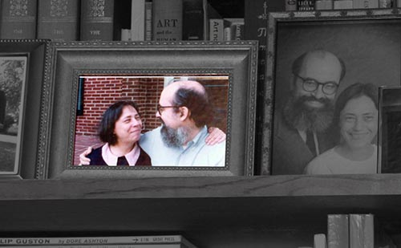
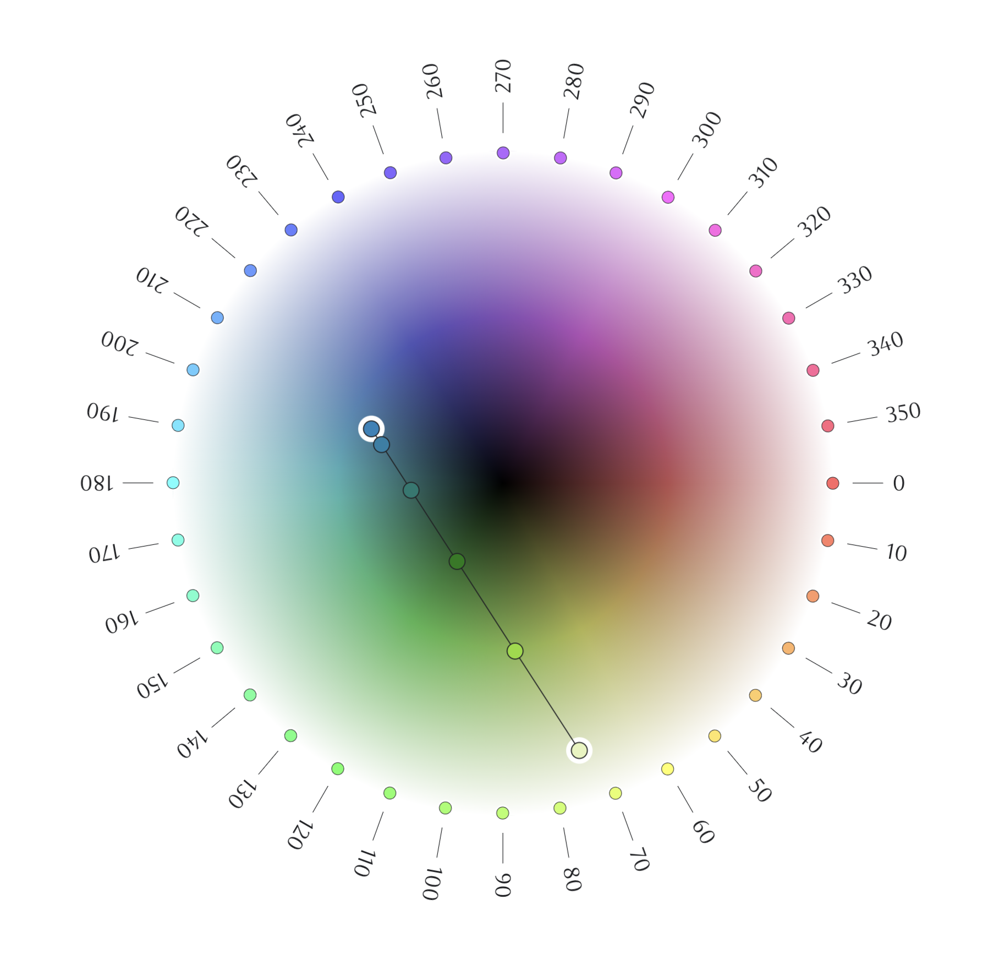
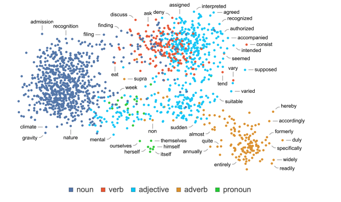

_Originally posted on [Substack](https://generative.substack.com/p/prophetic-art-chatgpt-inside-and)_

> The nature of yearning is urgent so as to guarantee evolution, change. -Darryl Calkins
> 

“We are the knights of a future realm.” 

I’ve been wading through the libraries of the mind trying to grapple with the relationship of art and it’s prophetic nature. There appears to be a correlation that art has a predilection to predict the future of culture. It also tends to have gravitational pull on innovation.

Think about the science fiction in the last 100 years; its quite impressive how the imagination has created some of the future. 

Some [examples](https://www.notion.so/BSC-BOSS-AI-b01999e7c9254aed822fd96300b6f93c?pvs=21) that come to mind (If I remember right there is a point in the book [How Innovation Works by Matt Ridley](https://www.goodreads.com/en/book/show/52219273) he had similar examples to make other points.) 

- **Flip phones**: Used in [Star Trek](https://en.wikipedia.org/wiki/Star_Trek:_The_Original_Series) in 1966
- **Autonomous cars**: Issac Asimov about [self driving cars](https://archive.nytimes.com/www.nytimes.com/books/97/03/23/lifetimes/asi-v-fair.html) back in  1964
- **Drones**: Or the “[hunter seekers”](https://en.wikipedia.org/wiki/Dune_(novel)) of the 1965 novel Dune
- **Smart Watches**: A character of the 1st half of the 20th century, “[Dick Tracy](https://en.wikipedia.org/wiki/Dick_Tracy)” and his two way radio watch which showed up in 1963

There is this interesting quotation by Jim Hill in an article “My Plexiglas and Light Sculptures” as I was digging to find other early computer art. 

It reads like this: 

> The artist serves society as a teacher of certain aspects of the present. Marshall McLuhan explains this future as follow: “The power of the arts to anticipate future social and technological developments, by a generation and more has long been recognized … **Art acts as radar acts as “an early alarm system”** … This concept of the arts as prophetics, contrasts with the popular idea of them as mere self-expression. McLuhan describes the artist’s function as one which presents current social and technological changes to society. The visual artist makes objects which are of abstractions of selected portions of the present social environment. - *Leonardo, Vol 3 pp.9-17 1970*
> 

 I’ll leave it at that because I need to think through this more myself. But one has to ponder the questions:  

- if art is prophetic, how does it emerge? Does art have a sentient nature driven by the collective of artistic pursuit?
- One might suggest the artist, or the collective of artist are the who drives the social conscience, does that affect how or why or what we create?
- Is the synthesis of art and its output what drives future new ideas / new innovations? If so, what responsibilities do we have to it?

Naturally these questions are a bit more philosophical in nature, but I think there is something interesting to query in that thread of thought. 

Mind you, I am sure there has been thought and probably much written around this as well. But it is  the brush strokes of thought that drive new ideas. 

Hope you all have a wonderful weekend! 

Chris Ried 

---

## Who Are We?

## Charles and Collette Bangert

- Early in her career, before her work in digital media, Bangert's paintings and drawings received critical attention. ([link](https://en.wikipedia.org/wiki/Colette_Bangert))
- Charles Bangert was employed at the University of Kansas, and when the university was given a plotter in 1967, he was asked to test it. ([Atari Archives](https://www.atariarchives.org/artist/sec5.php))
- “The Bangerts’ work thus explores the act of creation, regardless of medium, by utilizing the computer to push the boundaries of praxis.” ([link](https://spalterdigital.com/artists/colette-bangert/))

*Blue Circled Through Black' (continuous line study) 23 x 23 inches. 1972. Computer; colored inks on paper.*

*'Contained Contours I' 8 × 8 inches. 197. Computer; ink on paper.*

Their work was anything but deterministic. It provided a sense of handcraft that really explored how the digital becomes interwoven with the natural. 

Next week… 

# 🔖 Articles and Tutorials

Charles “Chuck” Csuri, Five Faces, 1966. Courtesy of The Anne and Michael Spalter Digital Art Collection

Charles “Chuck” Csuri, *Sine Curve Man*, 1967. Courtesy of The Anne and Michael Spalter Digital Art Collection

## [OUR FATHERS | CHUCK CSURI AND D. P. HENRY](https://www.rightclicksave.com/article/our-fathers-chuck-csuri-and-d-p-henry)

> Caroline Csuri and Elaine O’Hanrahan reflect on two pioneering generative artists with Douglas Dodds and Leslie Jones.
> 

Just an alternative perspective from the next generation. A different look into the life and times… 

## ****[Generative AI and Artistic Practice](https://www.media.mit.edu/events/future-sketches-lunch-lectures/)****

> **[Sofia Crespo](https://www.instagram.com/sofiacrespo/)** is an artist working with an interest in biology-inspired technologies. One of her main focuses is the way organic life uses artificial mechanisms to simulate itself and evolve, this implying the idea that technologies are a biased product of the organic life that created them and not a completely separated object.  Her work brings into question the potential of AI in artistic practice and its ability to reshape our understandings of creativity. she is also hugely concerned with the dynamic change in the role of the artists working with machine learning techniques. She’s the co-founder of **[Entangled Others Studio](https://entangledothers.studio/)**, together with artist **[Feileacan McCormick](https://www.instagram.com/feileacan.mccormick/)**. Together, they explore moving further into an entanglement with the more-than-human world. [entangledothers.studio](https://entangledothers.studio/)
> 

Ah Sofia’s work continues to inspire me. 

## ****[Visualizing Sound: A Beginner’s Guide to Using TouchDesigner with Live](https://www.ableton.com/en/blog/visualizing-sound-a-beginners-guide-to-using-touchdesigner-with-live)****

> Throughout the history of electronic music, audiovisual art has been integral to its aesthetic identity, both in live performance settings and more recently online. As a result, ever more music makers are incorporating visual media into their work, leading to a new generation of artists who continue to push the boundaries of music’s visual representation.
> 

## [Poline](https://meodai.github.io/poline/)

> "**poline**" is an enigmatic color palette generator, that harnesses the mystical witchcraft of polar coordinates. Its methodology, defying conventional color science, is steeped in the esoteric knowledge of the early 20th century. This magical technology defies explanation, drawing lines between anchors to produce visually striking and otherworldly palettes. It is an indispensable tool for the modern generative sorcerer, and a delight for the eye.
> 

## ****[The Art of the Shadow: How Painters Have Gotten It Wrong for Centuries](https://thereader.mitpress.mit.edu/the-art-of-the-shadow-how-painters-have-gotten-it-wrong-for-centuries/)****

> Shadows can do some adventurous, sometimes malignant, poetic things: They move, rebel, hide, refuse to be identified, vanish. All these visual aspects provide fertile ground for complex metaphors and narrations. Shadows are so visually telling that it takes little to move into emotionally tinged narratives. But it is the visual aspects that we primarily deal with here, with a special focus on several types of misrepresentations of shadows — shadows doing impossible things — that nevertheless reap a payoff for scene layout and do not look particularly shocking.
> 

## **[What Is ChatGPT Doing … and Why Does It Work?](https://writings.stephenwolfram.com/2023/02/what-is-chatgpt-doing-and-why-does-it-work)**

> That [ChatGPT](https://chat.openai.com/) can automatically generate something that reads even superficially like human-written text is remarkable, and unexpected. But how does it do it? And why does it work? My purpose here is to give a rough outline of what’s going on inside ChatGPT—and then to explore why it is that it can do so well in producing what we might consider to be meaningful text. I should say at the outset that I’m going to focus on the big picture of what’s going on—and while I’ll mention some engineering details, I won’t get deeply into them. (And the essence of what I’ll say applies just as well to other current “large language models” [LLMs] as to ChatGPT.)
> 

This gets deep quickly, but I think it helps really understand what ChatGPT is doing for sure. 

## Rain World: The Most Complex Ecosystem

{{ youtube GMx8OsTDHfM }}

> If I were to tell you ‘Rain World has the most complex ecosystem of any game,’ you might go… ‘What?’ Because Rain World doesn’t seem particularly advanced — it’s a 2D pixel art game where you play as a weird slug, how complicated could its world really be?
> 

This isn’t specifically educational, however it is has an amazing generative systems that is worth either playing or at least watching the video.