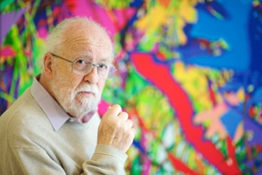
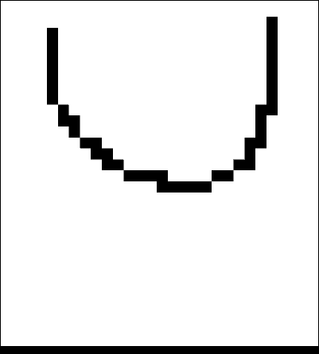
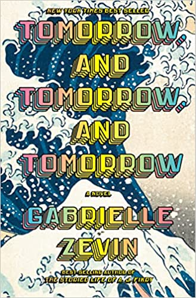

_Originally posted on [Substack](AI Sculpting, Voronoi Fonts, and Tomorrow and Tomorrow)_

> Creativity thrives where its roots are crowded. -Ozzie Zehner 

Good morning friends! 

I hope you all had a wonderful weekend! 

Here are a few interesting links for you all to explore and discover. Right now I’ve been rather busy so I hope that you can find some 

## Who Am I?

Last weeks image was **Harold Cohen** 

Here is a great overview of his life and work! 

{{ youtube LQu2AGXsv8U }}

# Articles and Tutorials

## **[AI Sculpting: co-creation in the age of artificial intelligence](https://onformative.com/work/ai-sculpting/)**

> The human interest in the manipulation of objects for an aesthetic purpose is very antique. By experimenting with different tools and techniques the old masters studied how material can be shaped into form. Transferring this curiosity to the age of technology, in 2020 we engineered a machine-learning process to observe the evolution of an AI learning how to sculpt a 3D model. While most of our art projects are guided by an open process the aim is to achieve a visual result in the end. With this project it was different. To best experience AI as the creator and to learn from it became our main pursuit.
> 

## [Difference Maps](https://community.wolfram.com/groups/-/m/t/2823307)

> Projection onto (non-)convex sets, e.g. the “[difference map](https://opg.optica.org/viewmedia.cfm?r=1&rwjcode=josaa&uri=josaa-20-1-40&html=true)” algorithm which was previously used to solve [Sudoku puzzles](https://barisdemiroz.github.io/sudoku/sudokusolver_demo.html) (which is of-course another problem amenable to Linear Programming). A slightly longer walk-through of the projections I used can be found [here](https://gvarnavides.com/musings/tilings-and-projection-set-algorithms/).
> 

{{ youtube AyOpYl-8ql4 }}

## **[*More than Words*](https://www.notion.so/060-Creative-Coding-Generative-Arts-Weekly-a66859dca6494c0287bbfd4ac15d0518?pvs=21)**

> Artistic fonts offer a way to transform any text into an art print, interactive software, or animation.  Thus we can view artistic fonts as a form of generative art: whereas most generative art is determined by an initial random seed, with fonts the “seed” is arbitrary text. An advantage of this approach is that the resulting print can encode one or more messages. With puzzle fonts, where the letters are encoded but not explicit in the glyphs, this message can be hidden within the resulting artwork. We demonstrate this approach to generative art using a series of mathematical and puzzle fonts we have designed over the years, which are available as free interactive web apps from [https://erikdemaine.org/fonts](https://www.youtube.com/redirect?event=video_description&redir_token=QUFFLUhqbTJKVzhyU1dmM3ZoY3kwT2Z1QlhOdFBrczVRUXxBQ3Jtc0trb25hcHhaeDg4UWFqYnd6QzJtRHdaUTlPeHdXekZBZ1FfdXVkWHpWSVZDV2hOb3gtcnJVU0tFdkhTamJLdW9vOWhDcHM3a3MwTVpIdWJVUXNiZ3A4YlM4RHZPTDZicXFfai00ZVJfeVpGYmJwdFBXSQ&q=https%3A%2F%2Ferikdemaine.org%2Ffonts&v=AyOpYl-8ql4)
> 

{{ youtube h-kXgTLJOOE }}

> In this in-depth video I examine Knowledge Systems and Simulations to explore new approaches to understanding nature and reality.
> 

## ****[Liquid Physics Using Cellular Automation](http://www.jgallant.com/2d-liquid-simulator-with-cellular-automaton-in-unity/)****

> One interesting way to represent liquids in a grid based world, is to use a form of cellular automaton. You may have heard of cellular automata from the popular “Conway’s Game of Life”, where cells evolve based on a set of rules that they adhere to.
> 

## [Tomorrow and Tomorrow and Tomorrow](https://www.amazon.com/Tomorrow-novel-Gabrielle-Zevin/dp/0593321200/ref=asc_df_0593321200/?tag=hyprod-20&linkCode=df0&hvadid=564680339415&hvpos=&hvnetw=g&hvrand=1245170118426259105&hvpone=&hvptwo=&hvqmt=&hvdev=c&hvdvcmdl=&hvlocint=&hvlocphy=9013074&hvtargid=pla-1576231491043&psc=1&gclid=Cj0KCQiAutyfBhCMARIsAMgcRJSUqIOa959H0jNH26ZMjQQs8hrJtiKOLZfZEiCKWXlPa24QngcayWkaAhksEALw_wcB)

> Sam and Sadie—two college friends, often in love, but never lovers—become creative partners in a dazzling and intricately imagined world of video game design, where success brings them fame, joy, tragedy, duplicity, and, ultimately, a kind of immortality. It is a love story, but not one you have read before.
> 

The cadence and literacy of the writing is next level. The story is essentially a homage to humanity, with a touch of nostalgia that reminds us of our childhood. The dialogue is especially well crafted and many of you will appreciate it.