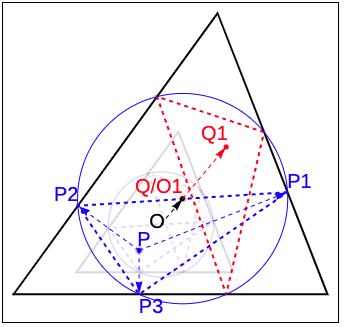
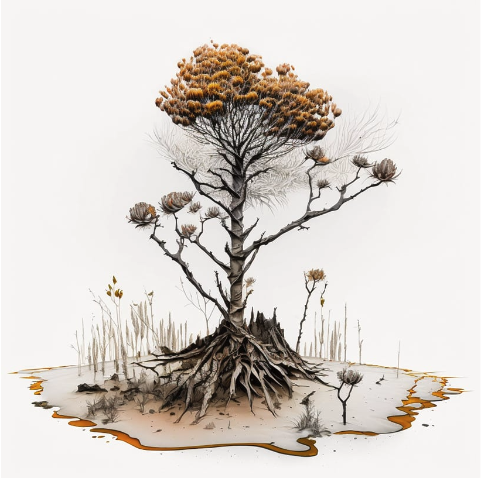
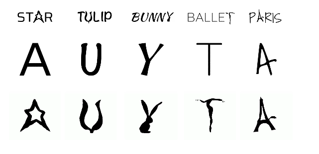

_Originally posted on [Substack](https://generative.substack.com/p/audio-reactive-shaders-prehistoric)_

> Creativity thrives where its roots are crowded. -Ozzie Zehner
> 

Good Morning! 

I've found that this is the best way for me to get inspiration. Unfortunately, I don't have as much time as I'd like, but I think it's all about finding balance. When I was a full-time artist, I had a difficult time with this, but when I have other things in my life that help drive me, that's when I'm at my best.

The week has flown by.. But I’ve been playing around with StableDiffusion (specifically LORA) quite a bit, working on a full time project for a client, and finishing up some finals. 

{{ youtube EbPUQv2c5gA }}

I’ve also been just fascinated by Unreal Engine and just the realism that comes from the engine itself. 

{{ youtube ifryjffUJT8 }}

That’s been my week, I’ve been really wanting to write a little more technical on random noise and really do some deep dive. I know there are a few articles but it would 

## ⭐️ New Section Poll

So I’ve been thinking about this for a while, and not sure how much fun or interest there is. I know that [Raphaël](https://twitter.com/sableRaph) from BirbsNest has a weekly challenge..  however I was thinking about posting a function in p5 like this:

```jsx
const sample_function = () => {return "Yay"}
```

 Then seeing what you all come up with using it sounds like a fun challenge. Not only for me to come up with an interesting function but then to see your creativity would be quite an interesting experiment.   I’ll highlight the most interesting in the newsletter. 

# Who Am I?

This is a section to celebrate artists who have taken generative / procedural art to another plane. This week I’ll leave it up to you to guess, but next week I’ll provide more context of her work. 


So who am I? 

# Articles & Tutorials



## **Isogonal conjugate and locus of center of inellipse in a regular triangle**

> *This an epic geometric problem combining the beauty of Euclidean geometry and powerful numerical computation in WL. Given a equilateral triangle, we want to find all ellipse with fixed eccentricity that touches all three sides. This problems uses the a theorem about pedal triangle that helps us to find the possible center of the ellipse bases on an initial seeding point (as one of the foci) and its isogonal conjugate.*
> 


## ****[The magic of Eurorack and ChatGPT](https://medium.com/@g.braakman/the-magic-of-eurorack-and-chatgtp-8e8144a6a1d5)****

> This is a story about a genuinely staggering discovery I made last week. Like many others, I use a Eurorack system to create music. I love the flexibility and creative challenges it offers. Just sitting in front of your system and letting your imagination flow: what happens if I connect the output of this module to that one? There is a dizzying amount of things to try, one, even more, promising than the other.
> 

Following came from this [article](https://cdm.link/2023/03/chatgpt-eurorack-patching/).



## [Midjourney Envisions How Centuries-long extinct creatures would look like](https://www.designboom.com/art/midjourney-envisions-centuries-long-extinct-creatures-angelo-renna-03-06-2023)

> ‘What is lost is (not) lost forever’ imagines how extraordinary species which have become extinct in the last few centuries would look today, had they survived. To visualize this new **[AI-generated](https://www.designboom.com/tag/artificial-intelligence/)** series, Italian architect **[Angelo Renna](https://www.designboom.com/tag/angelo-renna/)** looks to scientific research and characteristic descriptions of these **[animals](https://www.designboom.com/tag/animals-in-art/)** and plants, feeding them as text prompts to **[Midjourney](https://www.designboom.com/tag/midjourney/)** to visualize their appearances. The project, he notes, is not de-extinction or a revival of extinct species but is instead an educative process to learn about other forms of life in history.
> 



## ****[Word-As-Image for Semantic Typography](https://wordasimage.github.io/Word-As-Image-Page/)****

> A word-as-image is a semantic typography technique where a word illustration presents a visualization of the meaning of the word, while also preserving its readability. We present a method to create word-as-image illustrations automatically. This task is highly challenging as it requires semantic understanding of the word and a creative idea of where and how to depict these semantics in a visually pleasing and legible manner. We rely on the remarkable ability of recent large pretrained language-vision models to distill textual concepts visually. We target simple, concise, black-and-white designs that convey the semantics clearly. We deliberately do not change the color or texture of the letters and do not use embellishments. Our method optimizes the outline of each letter to convey the desired concept, guided by a pretrained Stable Diffusion model. We incorporate additional loss terms to ensure the legibility of the text and the preservation of the style of the font. We show high quality and engaging results on numerous examples and compare to alternative techniques
> 

{{ youtube ApHFmZpEnqw }}

## Create Audio Reactive Shaders with [Three.js](https://threejs.org/) and [ShaderPark](https://shaderpark.com/)

> this tutorial will cover how to create an audio reactive shader using [Three.js](https://threejs.org/) and [Shader Park](https://shaderpark.com/).
> 


## **[Diffusion With Offset Noise](https://www.crosslabs.org/blog/diffusion-with-offset-noise)**

> [Denoising Diffusion Probabilistic Models](https://proceedings.neurips.cc/paper/2020/file/4c5bcfec8584af0d967f1ab10179ca4b-Paper.pdf) are a relatively new form of generative neural network model - models which produce samples from a high-dimensional probability distribution learned from data. Other approaches to the same class of problem include Generative Adversarial Networks, Normalizing Flows, and various forms of autoregressive models that sample dimensions one at a time or in blocks. One of the major applications of this kind of modelling is in image synthesis, and diffusion models have recently been very competitive with regards to image quality, particularly with regards to producing globally coherent composition across the image.
> 

{{ youtube 51LwM2R_e_o }}

## Cairo Tiling Explained

> You probably know that you can tile the plane with triangles, squares and hexagons. But did you know you can do it with pentagons? While the pentagon has to be skewed a little, this is possible, and it makes for a beautiful, geometric-yet-organic looking pattern called a Cairo tiling, that isn't nearly used enough. In this video we will create this tiling from scratch, in the hopes that it will be used more in the future!
> 

[Website](https://www.generativecollective.com/) |  [Instagram](https://www.instagram.com/generate.collective/) | [Youtube](https://www.youtube.com/channel/UCBOYyqA-mqyoTSJ8pO9sQiA) | [Behance](https://www.behance.net/generatecoll) | [Twitter](https://twitter.com/generatecoll) | [Mastadon](https://genart.social/@generatecoll) | [Observable](https://observablehq.com/@cdr6934?tab=profile)