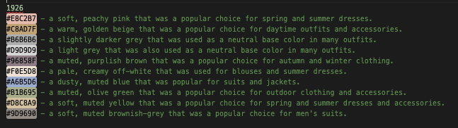
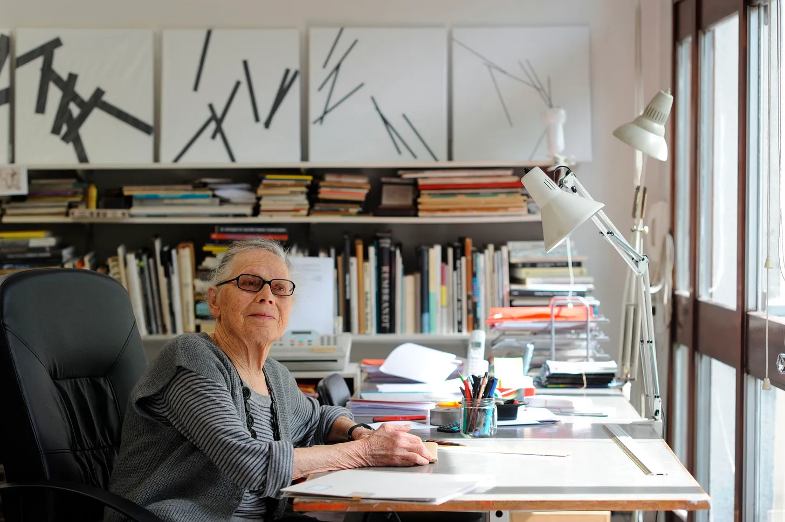

_Originally posted on [Substack](https://generative.substack.com/p/spinning-flips-3d-ceramics-and-genartcraft)_


> My mission in life is not merely to survive, but to thrive; and to do so with some passion, some compassion, some humor, and some style. - Maya Angelou
> 

Thank you so much to the **41 new subscribers** since the last newsletter. I am always so very thankful for the support that you all show by simply subscribing. 

### Up to…

Some weeks just fly by so quickly. I’ve been working on a new gig for a previous employer. It’s not art related which is sometimes sad but at the moment it is what needs to happen in order for my life to stay in balance. I’ve found that a mixture gives me the most satisfaction. 

### Generative LLMs

Recently (as many of us have been),  I’ve been playing a deep dive in creating  generative AI models. Specifically I’ve been wanting to see how much I can pull out of ChatGPT and the results are just fantastic. To think that the entire internet has been compressed into a neural net is just an powerful thing. 

Just working through and aggregating some of the interesting uses of ChatGPT. 

Here’s one that I think can be incredibly interesting and useful for generative artists:

> **Prompt**: I need a palette of 10 colors in HEX that were popular in 1926
> 



Who knows what interesting work you would get out of it.. I am still aggregating a list of creative uses for ChatGPT that I’ll sure in a future newsletter. 

Anyways, I hope you have a wonderful week! 

Chris Ried 

# Who Am I?

Last week… 



**Vera Molńar -**

A few interesting facts I have written down from reading a number of different sources: 

1. Vera Molnár's interest in geometric abstraction was initially sparked by a book on the subject that she discovered in a library during her studies at the Hungarian Academy of Fine Arts.
2. Molnár was one of the first artists to incorporate computer programming into her artistic practice, creating algorithmic drawings and paintings that explored mathematical patterns and visual perception.
3. Despite her significant contributions to the world of computer art, Molnár did not own a personal computer until the 1990s. Instead, she used the computers and plotters available to her through academic institutions and research centers.
4. Molnár was a co-founder of the GRAV artist collective, which was formed in 1960s Paris and sought to use art to engage with contemporary social and political issues. The group was influenced by the burgeoning fields of cybernetics and systems theory.
5. Molnár's artworks have been exhibited at numerous international venues, including the Centre Pompidou in Paris, the Museum of Modern Art in New York, and the Victoria and Albert Museum in London. In 2018, the Ludwig Museum in Budapest held a retrospective exhibition of Molnár's work, which was the first of its kind in her home country.

For this week… 


## **Who am I?**

## New Segment: #GenCodeCraft

In the last newsletter I asked the following question: 


And there are some of you who are interested in trying this out. So [Sinan](https://twitter.com/msawired) from [OpenProcessing](https://openprocessing.org/) reached out and he has graciously provided a way for your submissions to be aggregated on [OpenProcessing](https://openprocessing.org/) and that way we can collectively try some experiments. 

For the first week, though it is straight forward I am really curious what we might be able to make with the checkerbox box. 

## **[Week 1: Checkerboard](https://openprocessing.org/curation/84089)**

```jsx
const drawCheckerBox = (x, y, w, h, n, clr1, clr2) => {
    let w_diff = w / n;
    let h_diff = h / n;
    let cnt = 0;
    noStroke();
    push();
    translate(x, y);
    for (let j = 0; j < n; j++) {
      for (let k = 0; k < n; k++) {
        let clr = cnt % 2 == 0 ? clr1 : clr2;
        fill(clr);
        rect(j * w_diff, k * h_diff, w_diff, h_diff);
        cnt++;}}
    pop();
  };
```

You will be able to submit right to the the weekly challenge on [OpenProcessing](https://openprocessing.org/curation/84158). Once you have submitted, definitely post you submissions on Twitter and Instagram and tag it with  **#GenCodeCraft.** 

# Articles and Tutorials

[https://www.youtube.com/watch?v=G2XdZIC3AM8&t=3s](https://www.youtube.com/watch?v=G2XdZIC3AM8&t=3s)

> For the latest episode of our How to See series, we spoke with three artists—Kate Crawford, Trevor Paglen, and Refik Anadol—who engage with the ways that AI and machine learning algorithms are demanding new approaches to artmaking.
> 

If you haven’t seen this yet, it is a well deserved watch. There is much to be said to see how generative AI art has made it into the MOMA.

And speaking of have you seen the new work from Ali We-Wei? 


## [650,000 Lego Bricks to Recrate Monet’s Water Lilies](https://www.artnews.com/art-news/news/ai-weiwei-lego-bricks-recreation-calude-monet-water-lilies-design-museum-1234661708/)

> Art fans can already build **[Lego](https://www.artnews.com/t/lego/)** sets of Andy Warhol’s *Marilyn Monroe* screen prints, Vincent van Gogh’s *Starry Night*, and Hokusai’s *The Great Wave*. Chinese artist **[Ai Weiwei](https://www.artnews.com/t/ai-weiwei/)** recently took that combination of notable artworks and the popular Danish toy to another level, with a 50-foot-long iteration of one of **[Claude Monet](https://www.artnews.com/t/claude-monet/)**’s most famous images.
> 

Its not necessarily creative coding but I do think that there is some computational work that has gone into this piece. 

[https://twitter.com/DanielMartinNL/status/1635556407167549440?s=20](https://twitter.com/DanielMartinNL/status/1635556407167549440?s=20)


## Secret Colors of the Commodore 64

> In 1991 I was fourteen years old. It would be fair to say I was obsessed with computers. I proudly owned a brown ‘breadbox’ Commodore 64 with an exotic upgrade - an Oceanic 5.25” disk drive:
> 

Growing up,  my dad had a Commodore 64 and that was the first time I tried my hand at coding and gaming. 


## **[Realistic ceramic materials with three.js](https://charlottedann.com/article/realistic-ceramic-materials)**

> This is the third article in my series about my first long-form generative art project 
Ceramics, which is being released in Art Blocks’ Curated collection today! In this article we’re making materials with three.js that look and feel like physical ceramics, it follows on from my first article on making textured surfaces with three.js**.**
> 

[https://www.youtube.com/watch?v=huMO4VQEwPc](https://www.youtube.com/watch?v=huMO4VQEwPc)

## Let’s Program Doom Part 1 / [2](https://www.youtube.com/watch?v=fRu8kjXvkdY)

> I might be the most excited about this video. I really wanted to learn how the original Doom game engine works. l spent a long time learning the basic concepts but created the code myself from scratch and how I wanted to design it. You can follow along or convert this code to any other programming language since I kept it simple in C that draws a pixel at x and y coordinates.
> 

These are just great way to appreciate the work that goes into game design. 


## [Generative AI Tools](https://generativetools.pages.dev/)

> A fun site to explore a number of generative AI tools.. Do take some time and
> 


## [Mathematicians have finally discovered ‘einstein’ tile](https://www.sciencenews.org/article/mathematicians-discovered-einstein-tile?utm_source=Nature+Briefing&utm_campaign=1ed07363dc-briefing-wk-20230324&utm_medium=email&utm_term=0_c9dfd39373-1ed07363dc-42134095)

> A 13-sided shape known as “the hat” has mathematicians tipping their caps.
> 
> 
> It’s the first true example of an “einstein,” a single shape that forms a special tiling of a plane: Like bathroom floor tile, it can cover an entire surface with no gaps or overlaps but only with a pattern that never repeats.
> 


## **[3D Printed Split-Flap](https://www.printables.com/model/69464-split-flap-display/files)**

I don’t know about you, but I’ve been tempted for a couple years to get a **[Vestaboard.](https://www.vestaboard.com/)** Its of course a bit pricy. I came across this ingenious way to “build my own” which I thought even though time would amount to the same price, it would be a really unique way of creating it on my own. The software is [here](https://github.com/Dave19171/split-flap).

 I’d take on this project, but I’ve been working on a home made CNC machine to do some interesting generative things with but have yet to finish. 

By the way, if you find this newsletter to be useful, please consider becoming a paid subscriber. 