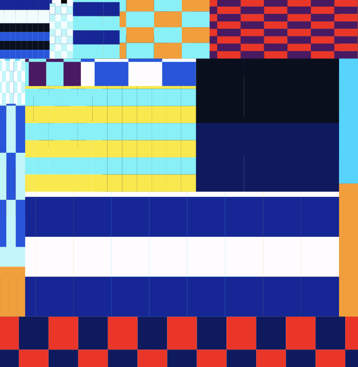
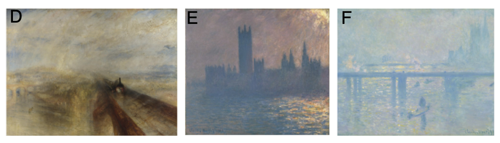
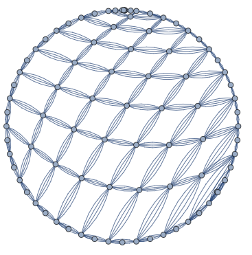
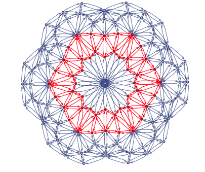
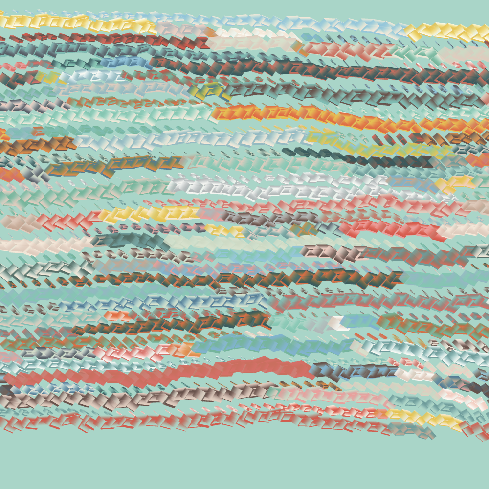

_Originally posted on [Substack](https://generative.substack.com/p/fungal-architectures-r-as-a-game)_

> "Creativity is intelligence having fun." - Albert Einstein
> 

I am so floored and thankful to the **53 new subscribers** and **2 paid subscribers** since the last edition of the newspaper. I do try my best to bring interesting content that I’ve found interesting. 

## Who Am I?

**Jasia Reichardt** was born in 1933 in Warsaw, Poland. 

Reichardt began her career as an art critic, writing for publications such as the Times Literary Supplement, Studio International, and Art International. She went on to work as the Assistant Director of the Institute of Contemporary Arts (ICA) in London from 1963 to 1971.

 Perhaps her most famous achievement, Reichardt curated the groundbreaking "**Cybernetic Serendipity"** exhibition in 1968 at the ICA. The exhibition was one of the first to showcase the connection between art and technology, featuring interactive installations, computer-generated art, robotics, and other innovative works.

Reichardt has authored and edited several books on art and technology, including "Cybernetics, Art and Ideas" (1971) and "Robots: Fact, Fiction, and Prediction" (1978). These works have contributed to shaping the discourse around the relationship between art, technology, and society.

Jasia Reichardt's contributions to the field of computer and cybernetic art have had a lasting impact on the art world. She helped pave the way for digital art and its integration into mainstream artistic practices, and her work continues to inspire artists and curators to explore the potential of technology in creative expression.

To mix it up a little: **Who made me?** 

## [#GenCodeCraft](https://openprocessing.org/curation/84089) : [Checked Board](https://generative.substack.com/p/spinning-flips-3d-ceramics-and-genartcraft)

Last episode I started experimenting with a coding challenge. I haven’t received any submissions so I’ll put it out there for another couple of weeks. 

# Articles

[https://twitter.com/takawo/status/1646645508625301504?s=20](https://twitter.com/takawo/status/1646645508625301504?s=20)

{youtube bXClHwMlei0}

## Fungal Architectures

> Fungal Architecture exhibition from Dec 2021.
> 

I just finished listening to the book ****Entangled Life: How Fungi Make Our Worlds, Change Our Minds & Shape Our Futures**** and when I cam across this exhibition it just has a way of bringing up alot of interesting questions about life and nature that can be explored from an artist’s perspective. 

## ****[Working with Photoresistors (LDRs) on the Raspberry Pi with RNBO](https://rnbo.cycling74.com/learn/working-with-photoresistors-ldrs-on-the-raspberry-pi-with-rnbo)****

> In this article we'll cover how to use Photoresistors with RNBO on the Raspberry Pi target. Before attempting these, make sure you're familiar with the basics of exporting your RNBO patchers to the RPi and that your audio interface is working correctly with it.
> 

## [Paintings by Turner and Monet Depict Trends in 19th Century Pollution](https://fermatslibrary.com/s/paintings-by-turner-and-monet-depict-trends-in-19th-century-air-pollution)

> Individual paintings by artists including Vincent van Gogh and Edvard Munch
have been shown to depict specific atmospheric phenomena, raising the question
of whether longer-term environmental change influences stylistic trends in painting.
Anthropogenic aerosol emissions increased to unprecedented levels during the 19th
century as a consequence of the Industrial Revolution, particularly in Western European
cities, leading to an optical environment having less contrast and more intensity.
Here, we show that trends from more figurative to impressionistic representations in
J.M.W. Turner and Claude Monet’s paintings in London and Paris over the 19th
century accurately render physical changes in their local optical environment. In
particular, we demonstrate that changes in local sulfur dioxide emissions are a highly
statistically significant explanatory variable for trends in the contrast and intensity of
Turner, Monet, and others’ works, including after controlling for time trends and
subject matter. Industrialization altered the environmental context in which Turner
and Monet painted, and our results indicate that their paintings capture changes in
the optical environment associated with increasingly polluted atmospheres during the
Industrial Revolution.
> 

## **[What Would Space Look Like.. Hypergraphs](https://community.wolfram.com/groups/-/m/t/2777621)**

> The global goal of the project is to investigate conditions on hypergraphs to represent our physical space. In particular, the focus is on its isotropy. I defined rotations for hypergraphs, and studied the groups of rotational symmetries of hypergraphs. I introduced several properties of the models relevant to determine connections between the Wolfram Physics Project and the traditional physics and checked them for different models.
> 

Using Spectral JS to generate some unique color blending 

## **[Spectral JS**](https://github.com/rvanwijnen/spectral.js)

> Spectral.js is an powerful and versatile JavaScript library designed to deliver realistic color mixing in your web-based projects. By harnessing the power of the Kubelka-Munk theory, a robust scientific model that simulates light interaction with paint for true-to-life color mixing, Spectral.js ensures that your projects exhibit vibrant and authentic colors.
> 

## [R As a Game Engine](https://www.rostrum.blog/2023/04/02/splendid-r-games/)

> R is not a general, multi-purpose programming language. It was written to do statistical analysis and make charts. You are literally not allowed to do anything else with it. You should use <LANGUAGE> instead, which is much more suited to your specific use case. R is a joke language for nerds.
> 

[https://www.youtube.com/watch?v=coUKTLUX2Gw](https://www.youtube.com/watch?v=coUKTLUX2Gw)

> 
> 

> Great couple tool highlights on current AI tools used for 3D…
> 

# Book Recommendation

## Digital Mantras: The Languages of Abstract and Virtual Worlds

> Computer technology is making possible new worlds of expression that are already being explored by a growing subculture of artists, musicians, virtual reality enthusiasts, and cyberpunks. In Digital Mantras, Steven Holtzman synthesizes ideas from a number of different disciplines to arrive at a new philosophy of creativity for the digital age. Blending ideas from music, computing, art, and philosophy, with biographical and historical anecdotes and a thread of mysticism, Holtzman gives us new ways to think about the integration of computers into the creative process. He shows how computers will change the way we create, and reveals the exciting potential for entirely new forms of expression. Running throughout the book are episodes from Holtzman's own sometimes mystical journey in search of the personal aesthetic he presents. Holtzman explores the presence and use of structure in fields as diverse as the development of ancient human languages, the philosophy of the Buddhist monk Nagarjuna and the linguist Ferdinand de Saussure, the music of Arnold Schoenberg and Anton Webern, the paintings of Wassily Kandinsky, and the pioneering grammars of Panini and Noam Chomsky. He then turns to the use of computers for building abstract and virtual worlds in language, music, and art as well as virtual reality, and surveys the work of AI pioneer Terry Winograd, composers Gottfried Michael Koenig and Iannis Xenakis, and artist Harold Cohen. Holtzman concludes by discussing the aesthetic implications of these new worlds. He introduces the concept of digital expression, along with examples that hint at its far-reaching possibilities.
> 

[Website](https://www.generativecollective.com/) |  [Instagram](https://www.instagram.com/generate.collective/) | [Youtube](https://www.youtube.com/channel/UCBOYyqA-mqyoTSJ8pO9sQiA) | [Behance](https://www.behance.net/generatecoll) | [Twitter](https://twitter.com/generatecoll) | [BuyMeACoffee](https://www.buymeacoffee.com/generatecoll)