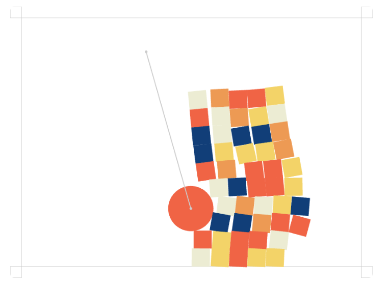
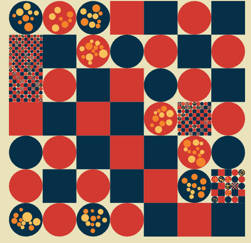
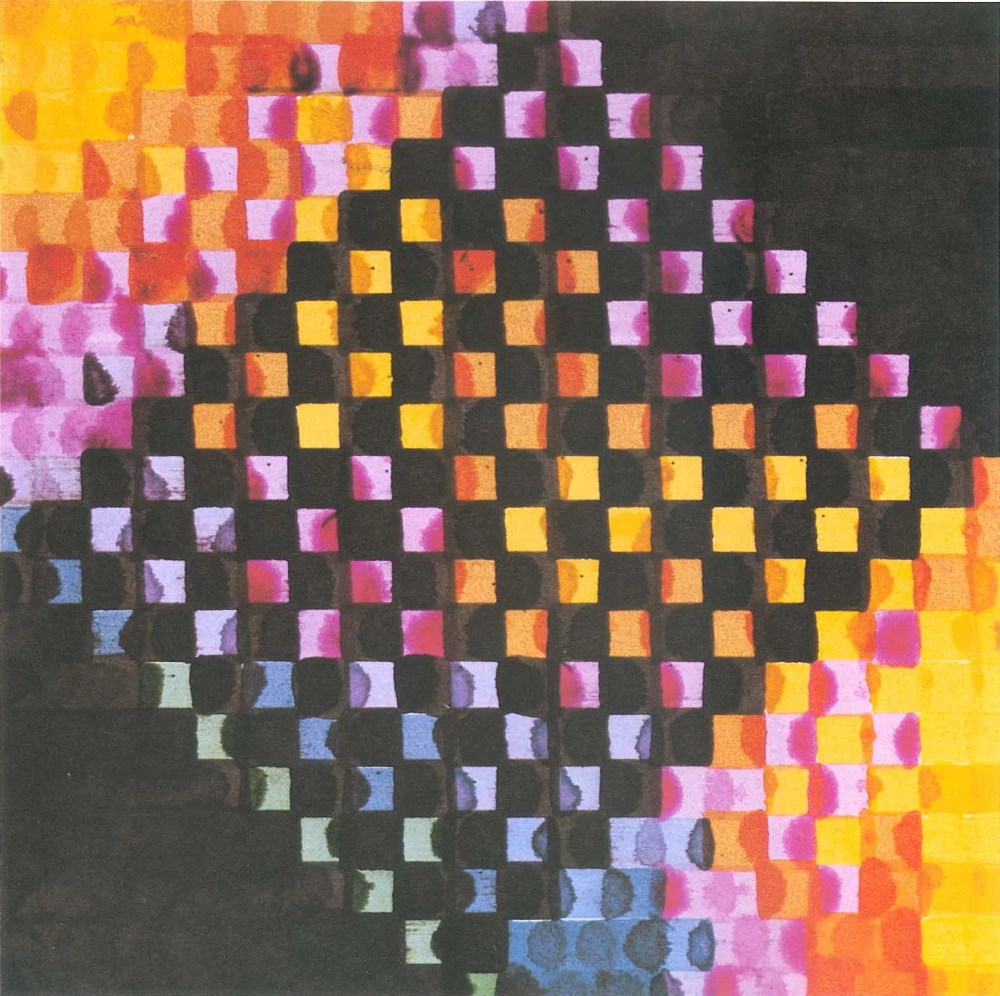
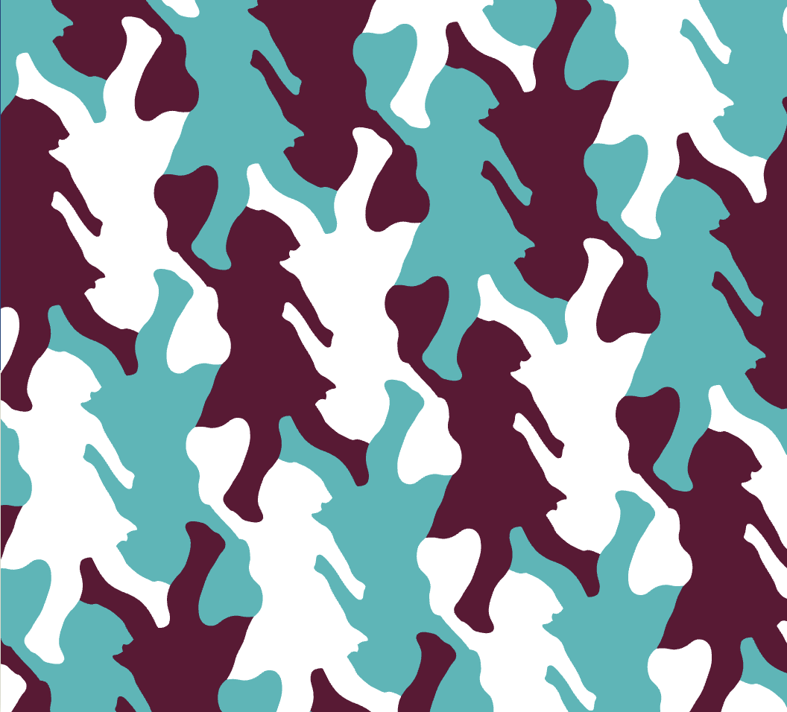

_Originally posted on [Substack](https://generative.substack.com/p/javascript-game-engines-very-low)_

# #065 - Creative Coding / Generative Arts Weekly

> "Creativity is the art of connecting randomness, the harmony found in unexpected patterns, the beauty in the chaos. It's our mind's dance with the universe's spontaneity.” - **ChatGPT by the wisdom of humanity**
> 

My apologies for not sending out a newsletter in the past couple of weeks. I've been finishing up some master's classes, and the work has been quite intense. However, I am still here and hope that you are too!

I want to thank you for your subscriptions and continued support.

# 2D Javascript Game Engines

I feel guilty about including gaming platforms in a creative coding/generative art newsletter. Part of me thinks they don't belong within the realm of generative art. However, gaming engines use the player's random actions to create a generative experience. I believe this falls under the branch of creative coding, but can we consider it a part of generative art?

### Art is for art sake right?

Yet do we see the largest art collections have a place for a video game? Or we might say a game is a museum unto its own?  

 However, I’ve been wanting to really play around with wanting to see what can be done with a gaming engine and generative experience. 

So where to start, there are a number of different libraries and frameworks out there. We have talked about some of them in earlier newsletters. 

But here are a few to get started with! 

| Library | Github  | Description | Notable Features |
| --- | --- | --- | --- |
| https://pixijs.com/ | https://github.com/pixijs/pixijs | 2D WebGL renderer for digital content creation | Fast rendering engine, support for texture atlases, filters and shaders, interactivity and input handling, support for multiple platforms |
| https://phaser.io/ | https://github.com/photonstorm/phaser | Open source game framework for Canvas and WebGL | Fast rendering engine, support for physics engines, input handling, audio, support for multiple platforms |
| https://melonjs.org/ | https://github.com/melonjs/melonJS | Open source HTML5 game engine | Comprehensive collection of components, support for third-party tools, fast rendering engine, built-in physics engine, support for multiple platforms |
| https://brm.io/matter-js/ | https://github.com/liabru/matter-js | 2D physics engine for the web | Fast and efficient rendering engine, support for collision detection, rigid body dynamics, and constraints, modular architecture, support for multiple platforms |
| https://piqnt.com/stage.js/ | https://github.com/shakiba/stage.js | DOM-like tree data model for web applications | Fast rendering engine, simple API, support for rendering graphics and animations, input handling, event handling, support for multiple platforms |
| https://piqnt.com/planck.js/ | https://github.com/shakiba/planck.js | JavaScript (TypeScript) rewrite of Box2D physics engine for HTML5 game development | Fast and efficient rendering engine, support for constraints, modular architecture, support for multiple platforms |

---

## [#GenCodeCraft](https://openprocessing.org/curation/84089) : [Checked Board](https://generative.substack.com/p/spinning-flips-3d-ceramics-and-genartcraft)

Two newsletters ago I started experimenting with a coding challenge. I wanted to see if there was some interest.

I have received a submission by [Aric R. Maddux](https://openprocessing.org/user/150400?view=sketches&o=38), thank you so much for adding. I really do enjoy the color choice and then the recurrence of the boards! 

As for now, I think I’ll try to experiment with this later. As summer comes along, I know that usually means less time. So maybe in the fall I will try to make that happen again. 

## Who Made Me?

Following piece was created by [Frieder Nake](https://en.wikipedia.org/wiki/Frieder_Nake) from the [Spalter Collection](https://spalterdigital.com/artists/frieder-nake/)  - **Matrix multiplication (1967-68)**

For next edition… 

**Who made me?** 

# **[The Sferic Project](https://www.mattdesl.com/sferics.html)**

> *The Sferic Project* is an ongoing art and research project studying Earth's natural radio and atmospheric noise. The project involves recording data in the wild using a Very Low Frequency (VLF) radio receiver, and transcribing this into a digital format. These recordings are being used as a source of random entropy for new cryptographic protocols and generative artworks.
> 

Matt is always up to some interesting work. I been following him for years and always a massive fan of his work and understanding of color. Not to mention his level of finesse. Definitely check it out! 

## [Pulsar Synthesis](https://nathan.ho.name/posts/pulsar-synthesis/)

> Curtis Roads' book *Microsound* is a must-read for any nerdy music technologist. Despite its age, it contains many exciting techniques under the granular synthesis umbrella that still sound fresh and experimental. I recently started exploring one of these methods, called *pulsar synthesis*, and thought it'd be fun to write my own review of it and demonstrate how to accomplish it in SuperCollider or any similar environment.
> 

I was absolutely floored by the sounds that Nathan Ho has been able to create using [SoundCollider](https://supercollider.github.io/) and his blog posts are definitely worth reading and checking out. 

## [From Random Number to Texture](http://www.science-and-fiction.org/rendering/noise.html)

> A noise function for 3d rendering is a function which inputs at least a coordinate vector (either 2d or 3d) and possibly more control parameters and outputs a value (for the sake of simplicity between 0 and 1) such that the output value is not a simple function of the coordinate vector but contains a good mixture of randomness and smoothness. Dependent on the type of noise, that may mean different things in practice. A noise function is usually chosen based on its ability to represent a natural shape, so it should emulate structures in nature.
> 

[https://www.youtube.com/watch?v=XF2IrULLzLA](https://www.youtube.com/watch?v=XF2IrULLzLA)

## Self-Programmed Generative Ambient Music

> In today's episode, we are going to talk about generative ambient music, which is music being programmed to be randomly generated, paying particular attention to 'Random' and 'Probability' devices.
> 

[https://www.youtube.com/watch?v=NL7KnFZ8SgQ](https://www.youtube.com/watch?v=NL7KnFZ8SgQ)

# i3D Paper Preview

> ACM SIGGRAPH Symposium on Interactive 3D Graphics and Games
Bellevue, WA, United States: 3-5 May, 2023
> 

This is just some really interesting new techniques from Academia and research labs around the world. 

## [Tesselated Art](https://tiled.art/en/home/?id=GreenWoodpeckers)

> Welcome to the world of tessellated art, where talented artists craft a figure that interlocks with itself perfectly to fill the page. Dutch artist [M. C. Escher](https://tiled.art/en/artists/?id=escher) mastered the form first, inspiring artists worldwide to create the captivating art shown on this site.
> 

## **iKeleton-OSC**

> An application capturing body tracking data.
> 

Its a rather interesting project, this can be done through the browser using [tensorflow](https://blog.tensorflow.org/2018/05/real-time-human-pose-estimation-in.html) or any of the many other [implementations](https://github.com/wangzheallen/awesome-human-pose-estimation#popular-implementations). This does work as an input device to [TouchDesigner](https://derivative.ca/) and could be an interesting opportunity to play with if those are your tools. 

## Interesting Released Papers

- [Dreamix: Video Diffusion Models are General Video Editors](https://dreamix-video-editing.github.io/)
- [SegmentAnything: Working toward the first foundation model for image segmentation](https://ai.facebook.com/blog/segment-anything-foundation-model-image-segmentation/)

## Book

## **[Internet_Art](https://www.phaidon.com/store/art/internet_art-from-the-birth-of-the-web-to-the-rise-of-nfts-9781838664077/)**

> Since 1989, the year the World Wide Web was born, the art world has grappled with the rise of networked culture. This unprecedented survey of the artists and innovators in this area from 1989 to today is interwoven with the personal narrative of one of the leading voices on the digital world. In this book, Omar Kholeif, whose prolific career parallels the growth of the internet, tells the story of this mass medium and how it has fostered new possibilities for artists, both analog and digital.
> 

[Website](https://www.generativecollective.com/) |  [Instagram](https://www.instagram.com/generate.collective/) | [Youtube](https://www.youtube.com/channel/UCBOYyqA-mqyoTSJ8pO9sQiA) | [Behance](https://www.behance.net/generatecoll) | [Twitter](https://twitter.com/generatecoll) | [BuyMeACoffee](https://www.buymeacoffee.com/generatecoll)