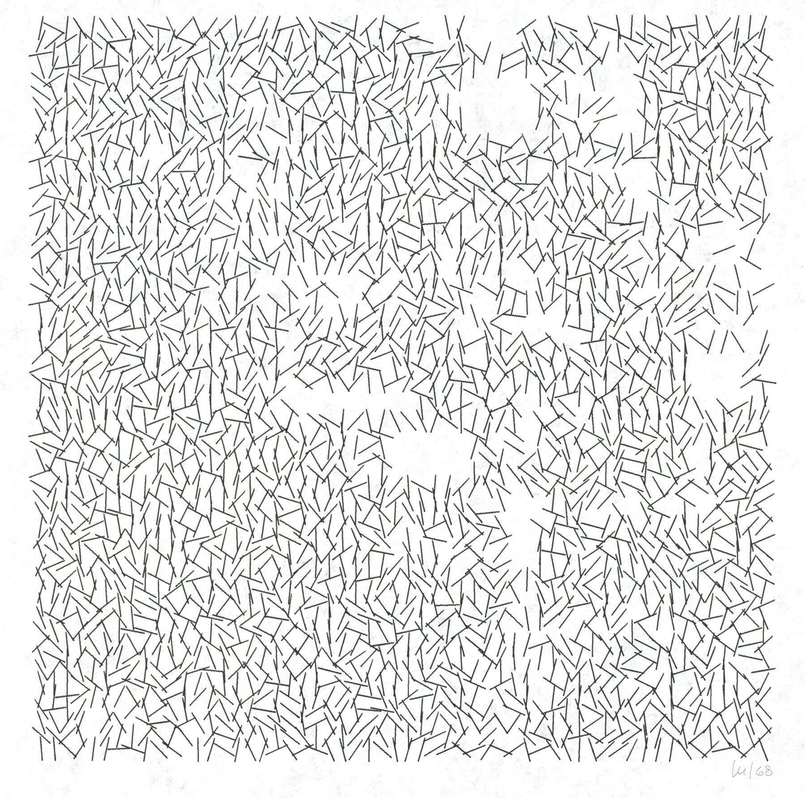
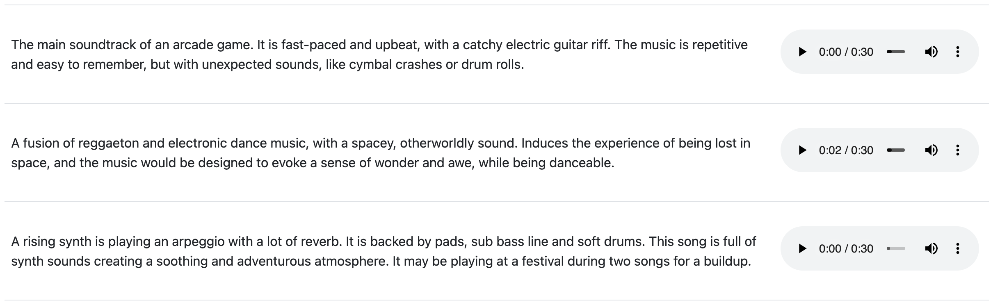
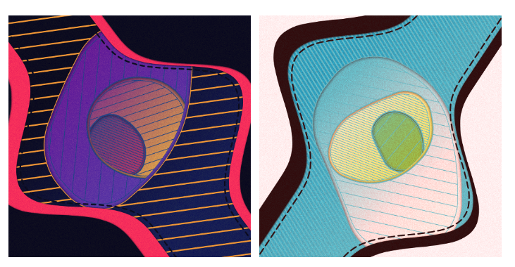
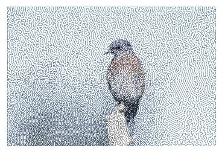

_Originally posted on [Substack](https://generative.substack.com/p/early-computer-art-word-music-and)_

> I had no idea how creative ambition and life balance could coexist, because achieving balance seemed to imply being content, and didn't contentment mean you were no longer hungry"? And if you lost your hunger, didn't you one day wake up in the suburbs helicopter parenting a couple of kids or working at a soul sucking corporate job? You stopped making art. You stopped being passionate. You stopped being you.” - Rachel Friedman
> 

Life is just a whirlwind.. spend some time in the beautiful state of Washington with my wonderful wife. Then hit with COVID and just recovering from that. 

## **[EARLY COMPUTER ART IN THE 50’S & 60’S](https://www.amygoodchild.com/blog/computer-art-50s-and-60s)**

> Computing and creativity have always been linked. In the early 1800’s when Charles Babbage designed the Analytical Engine, his friend Ada Lovelace wrote in a letter that, if music could be expressed to the engine, then it “might compose elaborate and scientific pieces of music of any degree of complexity or extent.”
> 

If you haven’t read any of Amy’s writings, please do. She does a wonderful job and trying to provide a full picture of the art and historical context. Definitely a read worth checking out if you hadn’t already! 

## ****[Word Music: Composing Using Text Scores, with Maya Shenfeld](https://www.ableton.com/en/blog/word-music-composing-using-text-scores-with-maya-shenfeld/)****

> Whether you’re an electronic producer, a pop musician or a classical composer, you likely have at some point found yourself feeling hemmed in by the impression that there are some intangible rules that music-makers must follow. We might feel that we should try and fit into a certain role; that to be a producer we must meet others’ expectations; or that the performer is this and the composer that, and the audience is neither of these things. For our creative processes, these supposed norms can be more of a hindrance than a help. We can find ourselves gripped by the fear of making a ‘wrong’ move, musically, creatively, or even relationally, as a composer, a performer or a producer.
> 

## ****[MusicLM: Generating Music From Text](https://google-research.github.io/seanet/musiclm/examples/)****

> We introduce MusicLM, a model generating high-fidelity music from text descriptions such as *"a calming violin melody backed by a distorted guitar riff"*. MusicLM casts the process of conditional music generation as a hierarchical sequence-to-sequence modeling task, and it generates music at 24 kHz that remains consistent over several minutes. Our experiments show that MusicLM outperforms previous systems both in audio quality and adherence to the text description. Moreover, we demonstrate that MusicLM can be conditioned on both text and a melody in that it can transform whistled and hummed melodies according to the style described in a text caption. To support future research, we publicly release MusicCaps, a dataset composed of 5.5k music-text pairs, with rich text descriptions provided by human experts.
> 

[https://www.youtube.com/watch?v=_3loq22TxSc](https://www.youtube.com/watch?v=_3loq22TxSc)

## Great Impractical Ideas In Computer Science

> More on the procedural end of creativity, but there are some strange usage of Powerpoint and definitely would be a tool  to explore further just because you can. I mean fractals in PPT is a impractical but sure fun.
> 

Definitely check out the fractal pieces… more fun to see and not really practical but quite interesting nonetheless. 

[https://vimeo.com/823081753](https://vimeo.com/823081753)

# ****Light Years - Dmitri Cherniak****

> Overview of one of the most recent works of Dmitri Cherniak - Light Years. The video gives insight into the creative process and also is full of great insights into the artist who inspired  Light Years, [Laszio Moholy-Nagy](https://en.wikipedia.org/wiki/L%C3%A1szl%C3%B3_Moholy-Nagy) a professor and ambassador of the Bauhaus tradition.
> 

# **[Making of Behind the Canvas](https://www.gorillasun.de/blog/making-of-behind-the-canvas/)**

> A good starting point for figuring out how to weave the Configurator into my code were previous Crayon Code sketches, which conveniently have their code publicly visible. There's a couple of ways to do this, depending on how you structure your sketch, if it's animated or not, and how you want to incorporate the initial random seed throughout your sketch. The most fitting way to do this for my purposes, was how Okazz handled it in his 'Crack' sketch, which only draws and redraws the graphics to the canvas on three occasions:
> 

# **[How to draw any regular shape with just one JavaScript function](https://developer.mozilla.org/en-US/blog/javascript-shape-drawing-function/)**

> Ok alright, I know I used a clickbait title, but bear with me. I want to share a function I've been using for ages. I originally wrote it to draw a hexagon – hexagons are cool, lots of hexagons are better, and [tessellated](https://www.dictionary.com/browse/tessellated) hexagons are the best. So I wrote a function to draw one, which I could then repeat.
> 

# **[Creating a Maze from an Image](https://resources.wolframcloud.com/ExampleRepository/resources/Create-a-Maze-from-an-Image/)**

> Using Wolfram, the functional notebook Create a maze image by computing a shortest tour through a set of image points.
> 

# [The Music of the Spheres](https://fronkonstin.com/2023/01/20/the-music-of-the-spheres/)

> I love legends. The life of Pythagoras is riddled with them: from the discoverie of consonant intervals in music while [walking past a forge](https://en.wikipedia.org/wiki/Pythagorean_hammers) to how give death to his disciple Hippasus throwing him overboard a ship after this one proved the existence of irrational numbers. My favorite is the one that heads this post: it is said that Pythagoras could hear the sound of the spheres, the harmony of the universe. No more no less.
> 

[https://www.youtube.com/watch?v=rtTWtzWav8I](https://www.youtube.com/watch?v=rtTWtzWav8I)

# An Addictive Alternative to DAWs

> 
>