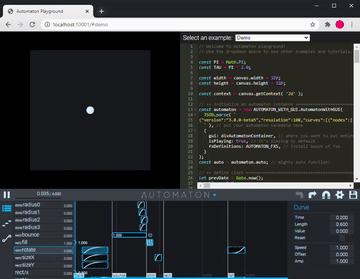
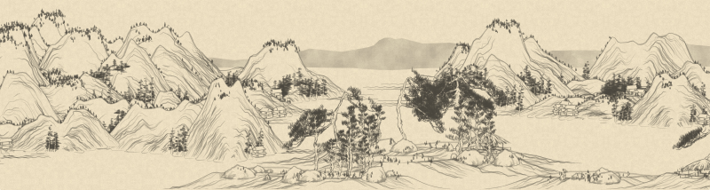
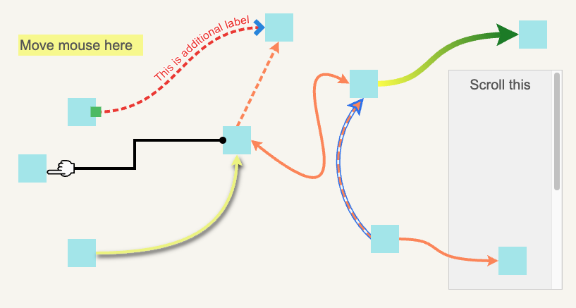
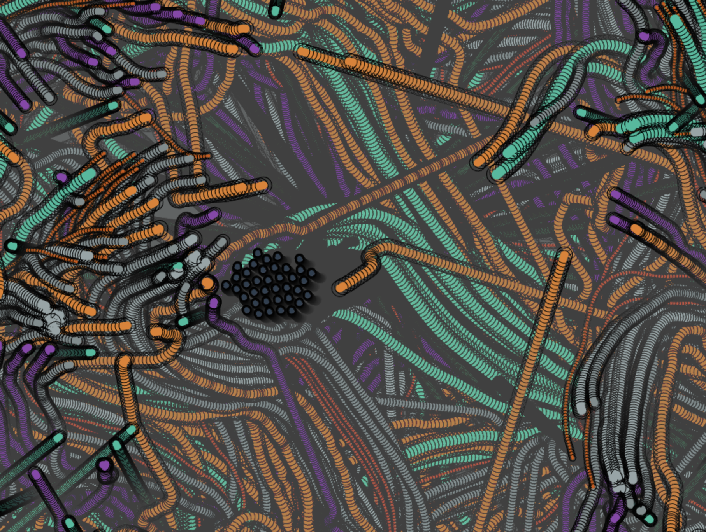
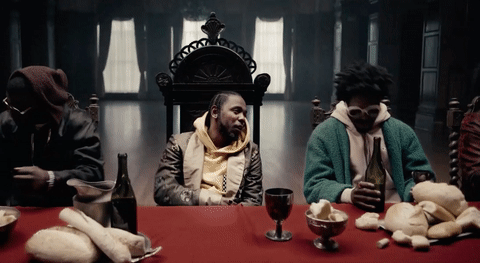
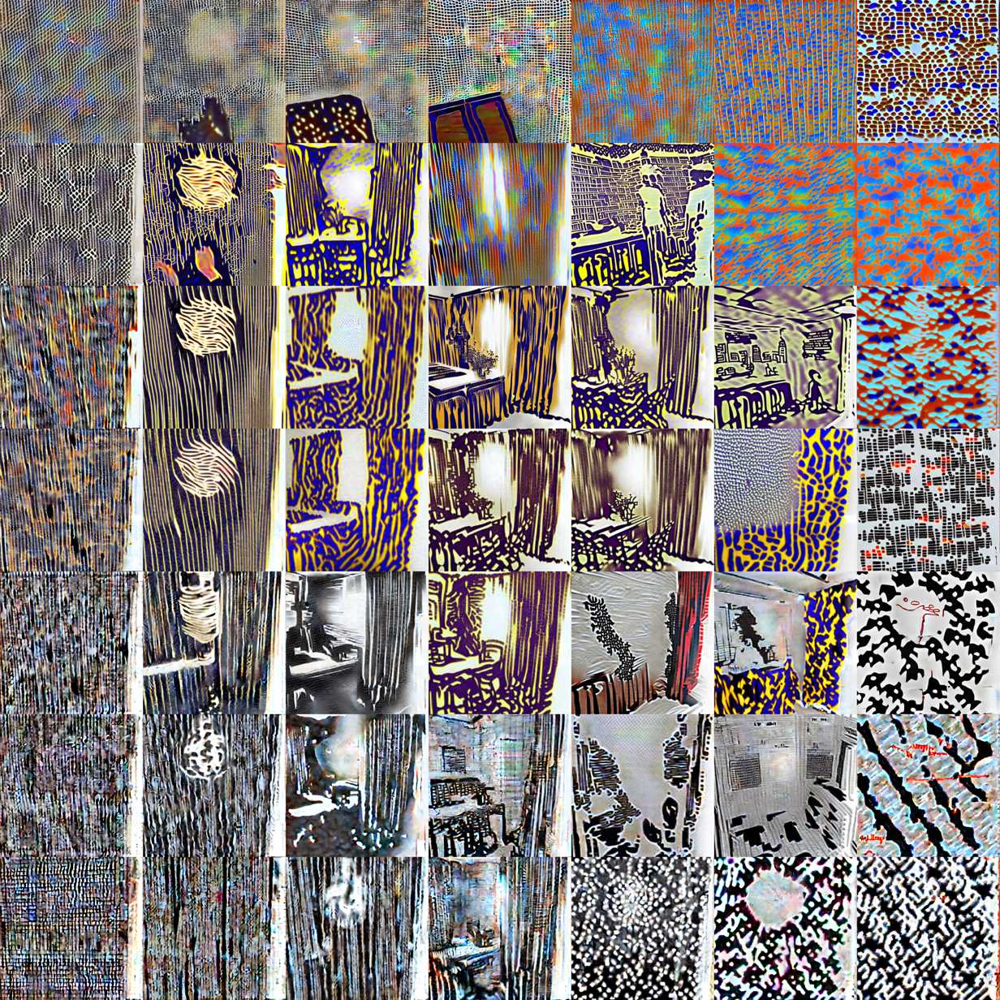
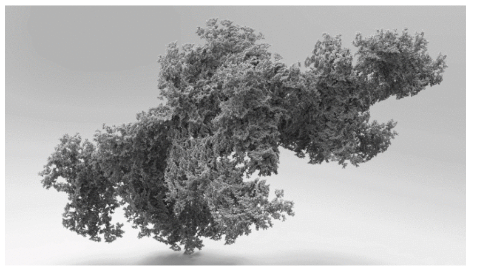

First published on [Substack](https://open.substack.com/pub/generative/p/organic-architecture-automation-and?r=58kr3&utm_campaign=post&utm_medium=web)

> Very well then! I'll write, write write. He let the words soak into his mind and displace all else. - Richard Matheson
> 

## [Automation: Animation Engine for Creative Coding](https://github.com/0b5vr/automaton)

> Automaton is an animation engine for creative coding. While you're doing creative coding, doing time-based animation by code sometimes causes you so much pain. This project provides a framework and its GUI to connect your coding pieces with animations.
> 

## [Grok{Shan,Shui}: Advent of Understanding the Generative Art](https://zverok.space/blog/2021-12-28-grok-shan-shui.html)

> While a lot of fellow developers spent this year’s advent on solving this year’s [Advent of Code](https://adventofcode.com/) puzzles, I decided to have my own little “advent.” A few weeks before December, I’ve stumbled upon an awesome [generative art project](https://github.com/LingDong-/shan-shui-inf) by developer and artist [Lingong Huang](https://github.com/LingDong-). It generates infinite (and surprisingly varying) scrolls of Chinese paintings.
> 

The analysis of the code is a very worthwhile read if you haven’t already taken the time to do your own study of Lingong’s work.  I’ve been following Lingong Huang’s Github repo for a couple years as the work / experiments he has done are always extremely technical and a next level of work. Currently he is working with Zach Lieberman at the MIT Media Lab. Some day I do hope to be able to pick his brain. 

## [Leaderline](https://anseki.github.io/leader-line/)

> Leaderline - drawing a line to the leader

# **[An Introduction to Poisson Flow Generative Models](https://www.assemblyai.com/blog/an-introduction-to-poisson-flow-generative-models/)**

> Poisson Flow Generative Models (PFGMs) are a new type of generative Deep Learning model, taking inspiration from physics much like Diffusion Models. Learn the theory behind PFGMs and how to generate images with them in this easy-to-follow guide.
> 

## [Petridish](https://jozefm.dev/petridish/)

> Generative Flock Thingy
> 

This is more of a toy to play around however there are some neat flocking / clustering examples to play around with. 

## **[Eyecandy](https://eycndy.co/)**

> A visual technique library for visual technique lovers
> 

This is a really interesting resource (take a good 30 minutes and savor the techniques) to generate a few more ideas around visual techniques that can be further discovered and then implemented. It’s more of a media art but some interesting techniques that could be recreated in shaders.

## [Generative AI Space and the Mental Imagery of Alien Minds](https://writings.stephenwolfram.com/2023/07/generative-aia-space-and-the-mental-imagery-of-alien-minds/)

> How do [alien minds perceive the world](https://writings.stephenwolfram.com/category/language-and-communication/)? It’s an old and oft-debated question in philosophy. And it now turns out to also be a question that rises to prominence in connection with the [concept of the ruliad](https://writings.stephenwolfram.com/2021/11/the-concept-of-the-ruliad/) that’s emerged from our [Wolfram Physics Project](https://www.wolframphysics.org/).
> 
> 
> I’ve wondered about alien minds for a long time—and tried all sorts of ways to imagine what it might be like to see things from their point of view. But in the past I’ve never really had a way to build my intuition about it. That is, until now. So, what’s changed? It’s AI. Because in AI we finally have an accessible form of alien mind.
> 

## Course: **[Organic Architecture with Generative art](https://www.domestika.org/en/courses/4131-organic-architecture-with-generative-art)**

> Introduce nature and biology to your architectural forms with the architect and generative designer, Chantal Matar. She has developed a unique and distinct style that stems from her passion for art, and her experience with avant-garde studios such as Zaha Hadid Architects. She recreates shapes in nature in her product and building designs using generative art techniques. Exploring the powerful software Houdini and its trail system, which are vectors that follow an organic path as they form, Chantal gives her pieces an important spatial dimension

[Website](https://www.generativecollective.com/) |  [Instagram](https://www.instagram.com/generate.collective/) | [Youtube](https://www.youtube.com/channel/UCBOYyqA-mqyoTSJ8pO9sQiA) | [Behance](https://www.behance.net/generatecoll) | [Twitter](https://twitter.com/generatecoll) | [BuyMeACoffee](https://www.buymeacoffee.com/generatecoll)
