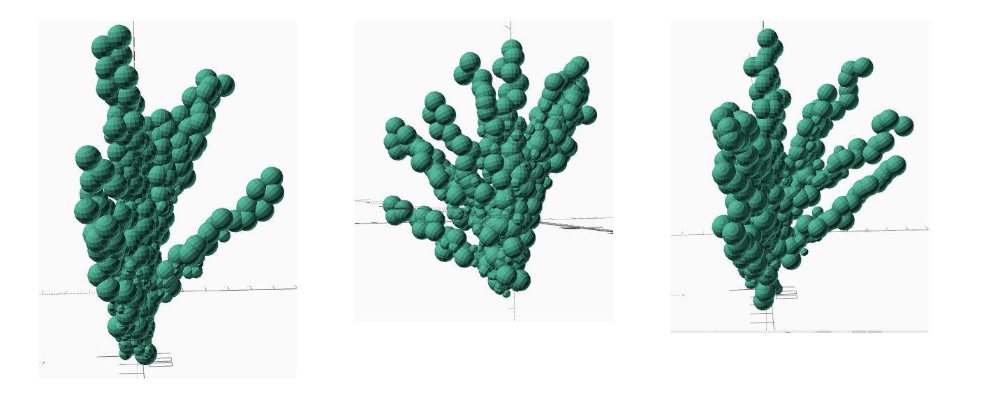
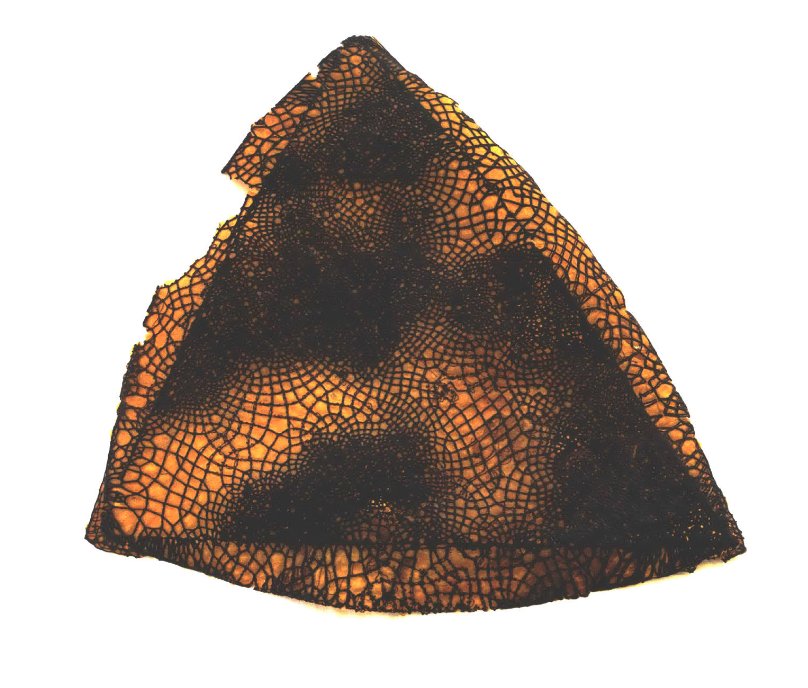
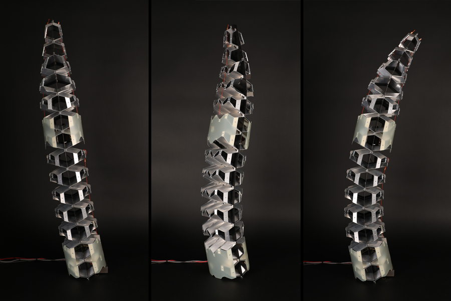
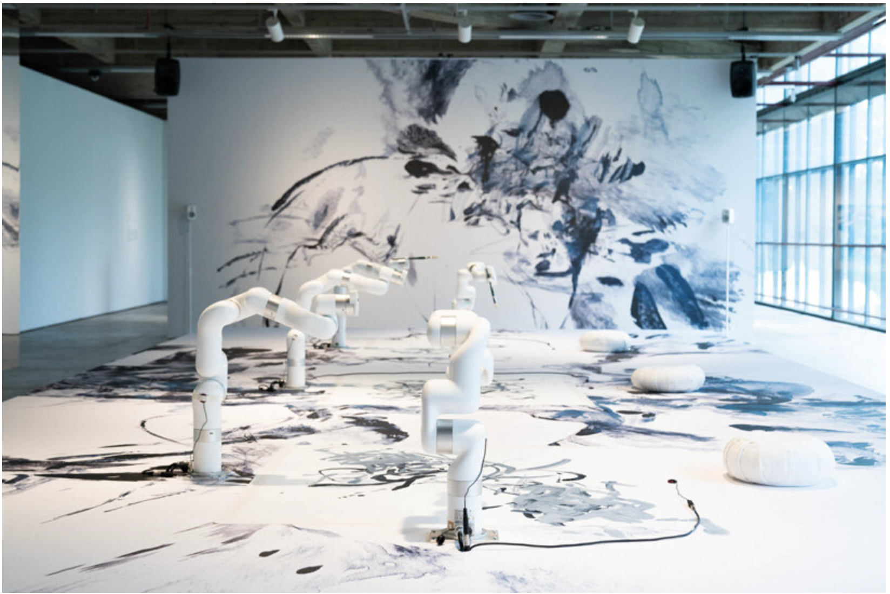
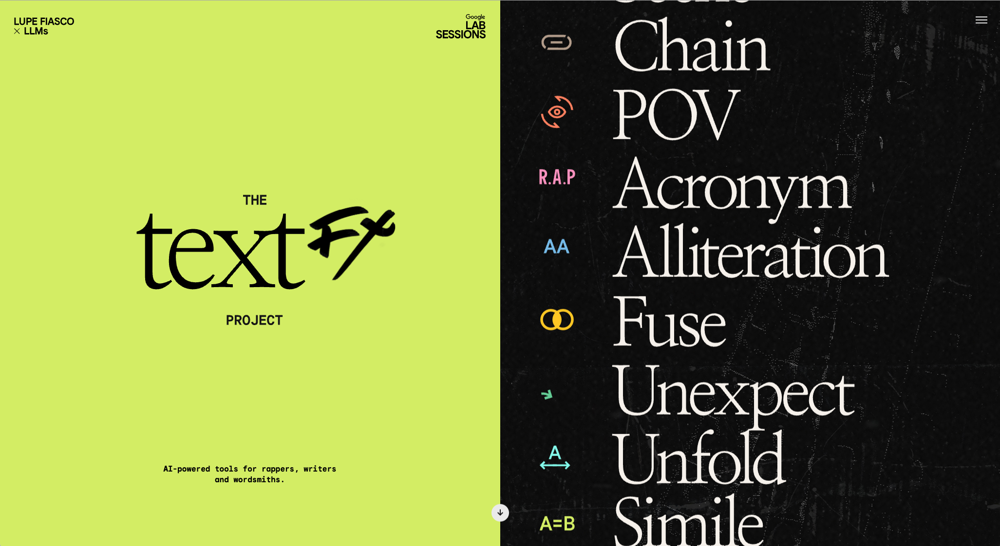
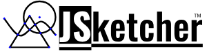
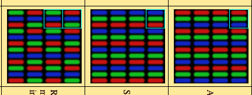
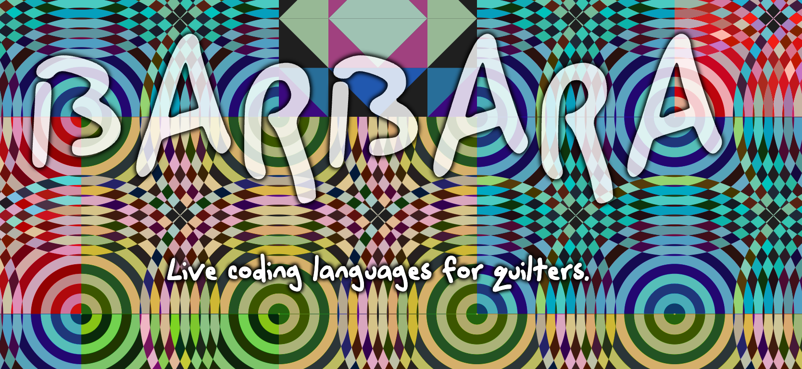
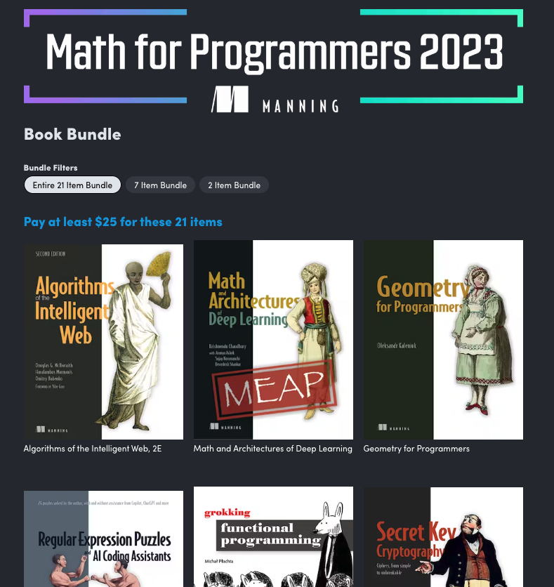

First published on [Substack](https://open.substack.com/pub/generative/p/live-coding-quilts-openscad-and-the?r=58kr3&utm_campaign=post&utm_medium=web)

> Developing the skill of creativity, like with any other skill, takes time. Do devote time to creativity. Honor its flow and its magic. Allow it to become your Life Force. Train Creativity daily. **-Natasa Pantovic Nuit**
> 

**Disclaimer: All in progress work.. just documenting the work here..** 

In my previous discussion, I shared my current artistic endeavors, which involves playing with 3D objects and creating generative abstract sculptures that I would like to 3D print. I have been experimenting with OpenSCAD, which has been more enjoyable than I initially anticipated and has proven to be an easy domain-specific language to work with. Check out their website at https://openscad.org/.

I have also been working with [Rhino3D + Grasshopper](https://www.rhino3d.com/) and have been pleasantly surprised by the size of the community of users in this space. The number of interesting packages that have been built is truly spectacular. To fully engage with these tools, I have focused on immersing myself in the techniques and ideas behind them.

I have found [this](http://grasshopperdocs.com/) contribution documentation site for Grasshopper, and some of the algorithms available are fascinating. I will post more about them in a later issue. My work on generative 3D models has led me to explore other materials that can be 3D printed. As I consider reproducing them or collaborating with someone to print them, I find myself going down a few rabbit trails. 

**Design by Decay, Decay by Design - Andrea Ling (2018)**

Then I’d need to find someone that has a [robotic arm](https://www.devonics.com/product-page/ufactory-xarm-5-lite) that I’d program to do hold the extruder. (By the way if anyone has a connection, I’d love to get in touch). For that just for inspiration, this was a great video… 



I’ve also been playing with [TouchDesigner](https://derivative.ca/), much like [MaxMSP](https://cycling74.com/products/max)  is a node based programming environment. Used for large Visual Effects chains for projection mapping, immersive experiences. One of the benefits of such a package are the many ways one can connect software and hardware to help provide inputs into the chain which are great creative outlets. 

This has led to some searching for resources…

Following are a few great channels to follow to get a better idea. 

- [Elekktronaut](https://www.youtube.com/@elekktronaut/videos)
- [Three Dashes](https://www.youtube.com/@threedashes___/videos)
- [Akenbak](https://www.youtube.com/@akenbak/videos)
- [TouchDesigner](https://www.youtube.com/@TouchDesignerOfficial/videos)
- [Acrylicode](https://www.youtube.com/@acrylicode/videos)
- [FunctionStore](https://www.youtube.com/@FunctionStore/videos)

Anyways I hope you all are having a wonderful week!

Chris 

# Book Recommendation

Being with what I’ve written above, the following book is a great resource for all sorts of amazing ideas. 



## Things Fall Together: A Guide to the New Materials Revolution

> Things in life tend to fall apart. Cars break down. Buildings fall into disrepair. Personal items deteriorate. Yet today’s researchers are exploiting newly understood properties of matter to program materials that physically sense, adapt, and fall together instead of apart. These materials open new directions for industrial innovation and challenge us to rethink the way we build and collaborate with our environment. Things Fall Together is a provocative guide to this emerging, often mind-bending reality, presenting a bold vision for harnessing the intelligence embedded in the material world.
> 

This video gives a great understanding on what the books is about. I’d highly recommend checking it out. 

# Articles:

## **[MIT engineers use kirigami to make ultrastrong, lightweight structures](https://news.mit.edu/2023/using-kirigami-ultrastrong-lightweight-structures-0822?fbclid=IwAR3UxQMTZ0RYoGfk7W1BERPc-uwFZkrMTRI4IFMwEPClGxU9Shl021iedKE)**

> Cellular solids are materials composed of many cells that have been packed together, such as a honeycomb. The shape of those cells largely determines the material’s mechanical properties, including its stiffness or strength. Bones, for instance, are filled with a natural material that enables them to be lightweight, but stiff and strong.
> 

Folding Paper Low Tech to create high tech technologies. 

## **[sougwen chung co-creates & meditates with multi-robotics through biosensors](https://www.designboom.com/art/sougwen-chung-installation-co-creates-meditates-multi-robotics-biosensors-assembly-lines-03-28-2023/)**

> A pioneer in the realm of human-machine collaboration, Chinese-Canadian artist and researcher Sougwen Chung has long explored the mark-made-by-hand and the mark-made-by-machine to delve into the dynamics between humans, **[AI systems](https://www.designboom.com/tag/artificial-intelligence/)**, and **[robotics](https://www.designboom.com/tag/robots/)**. The artist’s most recent work, Assembly Lines, spans research, dataset, performance, **[installation](https://www.designboom.com/tag/interactive-installation/)**, and drawing, demonstrating a poetic exploration of co-creation between the biological and mechanical. The kinetic installation unfolds as a ceremonial collaboration between the artist and their new generation of custom robotic art assistants, beginning with a live 24 minute meditation in which Chung co-creates with the newly upgraded D.O.U.G._5 system. Through an E.E.G headset, the robotic arms synchronize with Chung’s biometrics, sensing and responding to their brainwaves with paintbrushes in hand, as two together indulge in the centering rituals of drawing and meditation.
> 

# [TextFX - Lupe Fiasoco X LLMs](https://textfx.withgoogle.com/)

> TextFX is an AI experiment that uses Google's PaLM 2 large language model. These 10 tools are designed to expand the writing process by generating creative possibilities with text and language.
> 



> This video shows how you can programmatically create 3d models using python code and output to a suitable format for 3d printing or to have CADCAM toolpath added for CNC manufacturing.
> 
> 
> The code I show here allows me to make parametric 3D CAD models of 'LEG0' pieces.
> 

## **[JSSketcher](https://github.com/xibyte/jsketcher)**

> JSketcher is a parametric 3d modeler employing a 2D constraint solver for sketches and the feature/history metaphor to build models. The 2D constraint solver is completely written in javascript/typescript and is implemented in both the 3D CAD and the 2D sketcher. Originally developed by xibyte to make models for 3d printing. Today JSketcher provides a rich set of tools for visualizing, selecting/interacting with 3D geometry, tracking and storing model history all built on the foundation of the 2D sketcher engine and employing OpenCascade for solid modeling operations.
> 

## [Subpixel Zoo](https://geometrian.com/programming/reference/subpixelzoo/index.php)

> Pixels are in-reality not magical little squares that have a color associated with them.
> 
> 
> For displays, the color needs to be represented by discrete "subpixel"s (usually but not always three: some kind of red, green, or blue). The perceived color is then [the addition of](https://en.wikipedia.org/wiki/Additive_color) the subpixels' emissions.
> 

## **[Live Coding Languages for Quilters](https://www.barbara.graphics/)**

> Barbara is a novel live coding interface that enables users to design languages for visual geometric pattern generation. Inspired by algorithmic quilting patterns, Barbara helps users construct languages that mimic real-world quilting procedures which can be used for both live coding performance or digital quilt recreation. Users create languages and patterns in Barbara’s online coding environment with the Parsing Expression Grammar language formalism; the resulting patterns can be freely shared, remixed, and combined into new quilts. As a push towards the applications of language-oriented design, we created Barbara to broaden access to the power of computational media and the beauty of quilting for both programmers and quilters alike. Barbara is free and open-source software.
> 

# Books

## [Math for Programmers Books](https://www.humblebundle.com/books/math-for-programmers-2023-manning-books?hmb_source=humble_home&hmb_medium=product_tile&hmb_campaign=mosaic_section_3_layout_index_4_layout_type_threes_tile_index_1_c_mathforprogrammers2023manning_bookbundle)

> A yearly Math For Programmings bundle of books. The Geometry of Programmers is a great book to check out and look into along with many other interesting reads.
>