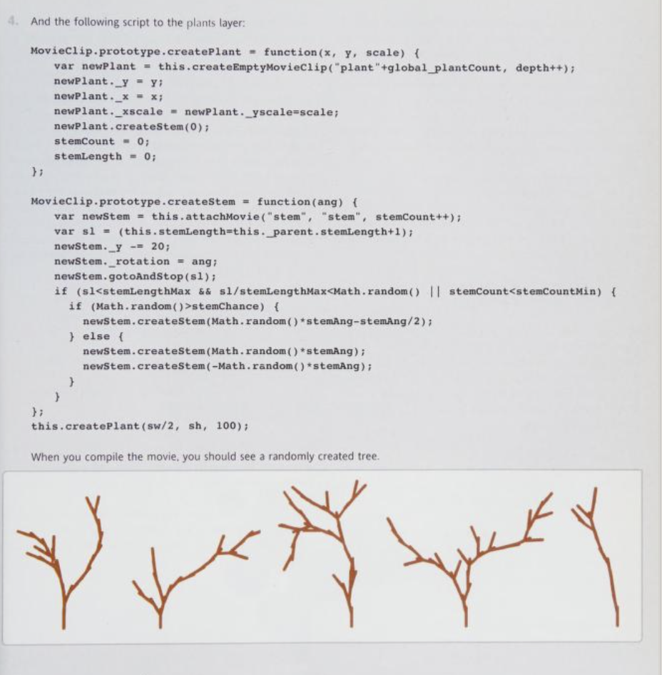
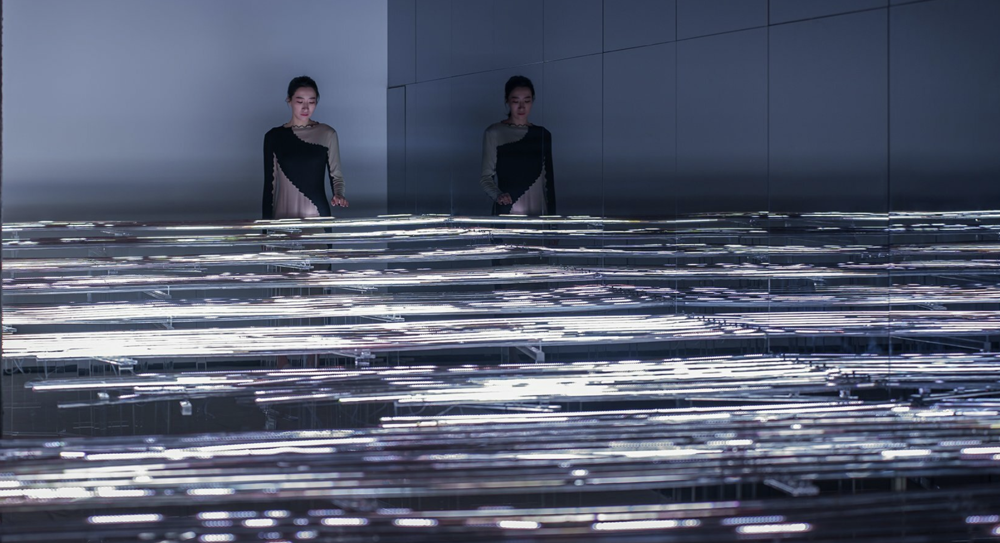
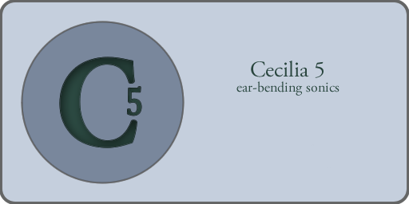
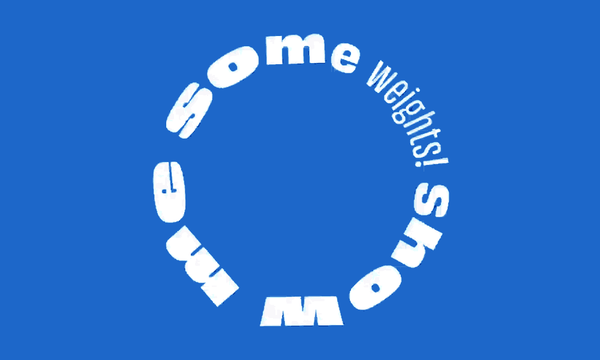
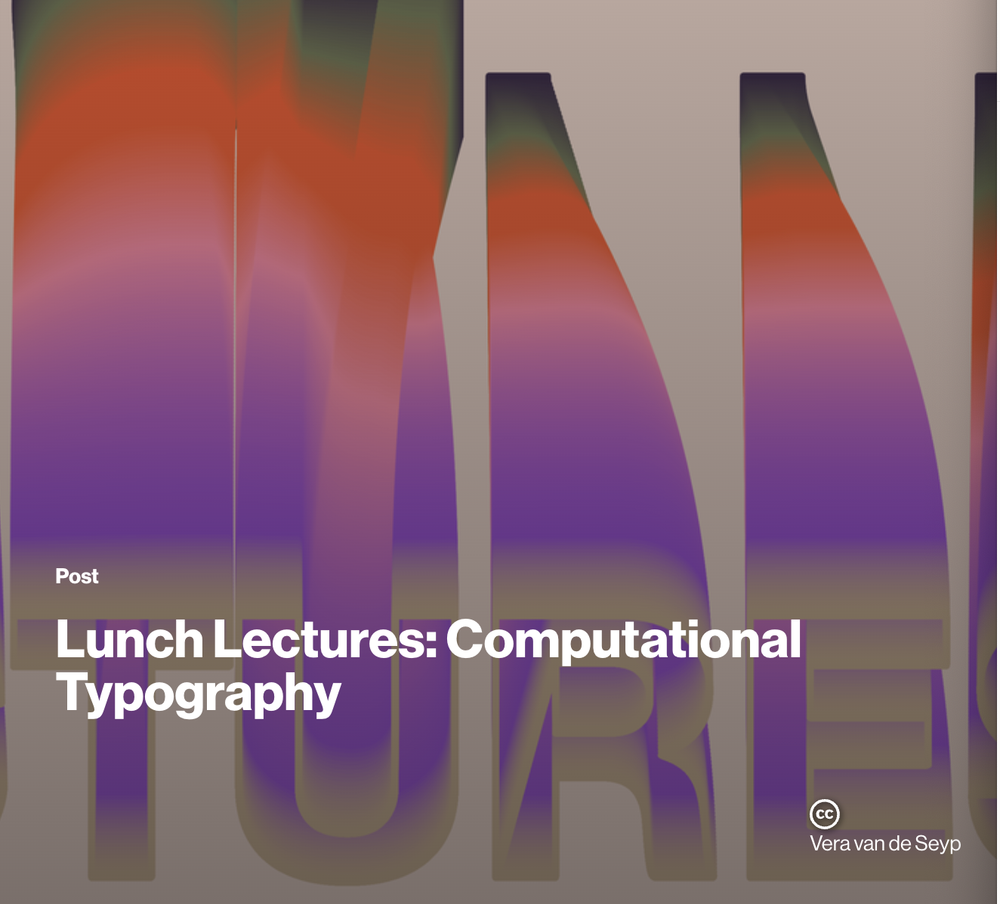
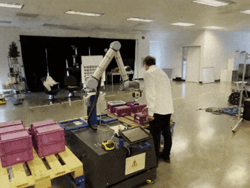
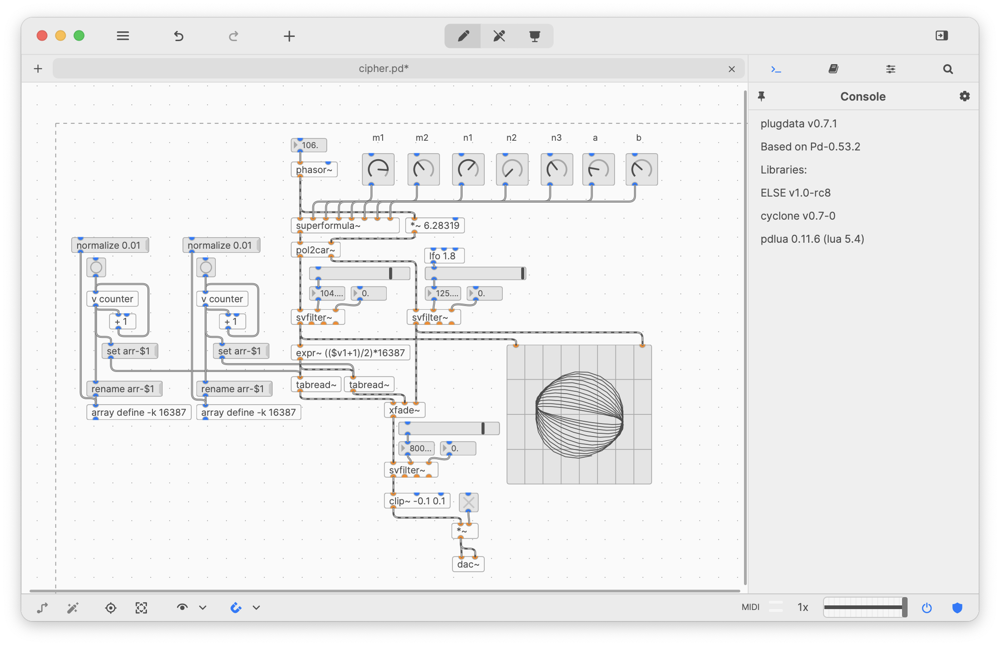
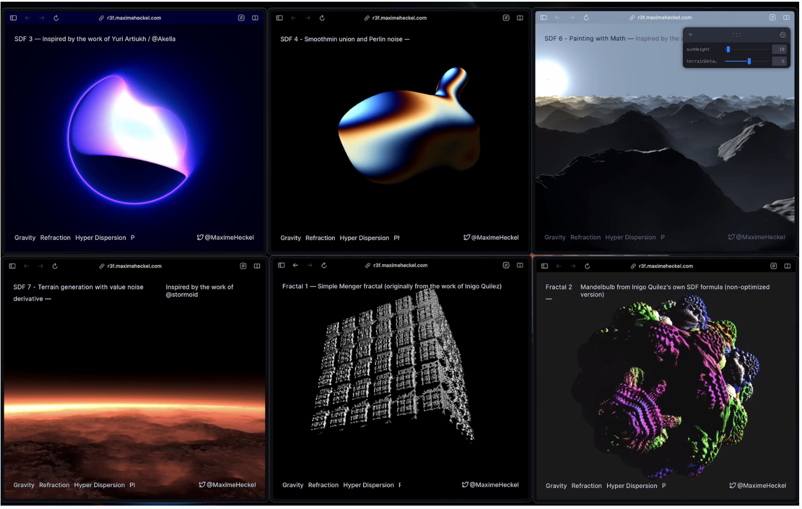

[Website](https://www.generativecollective.com/) |  [Instagram](https://www.instagram.com/generate.collective/) | [Youtube](https://www.youtube.com/channel/UCBOYyqA-mqyoTSJ8pO9sQiA) | [Behance](https://www.behance.net/generatecoll) | [Twitter](https://twitter.com/generatecoll) | [BuyMeACoffee](https://www.buymeacoffee.com/generatecoll)

> Admiring a creative soul at work is almost as satisfying as making your own paintings. E.A. Bucchianeri
> 

This weekend I was able to spend some time looking over some of the old Masters of Flash. These books  were huge inspirations in my early teens to come to realize that computers were powerful enough to explore new worlds using code.  

The web creatives of the day and it’s just nostalgic to flip through these.. you can on [Archive.com](http://Archive.com) with the following links. 

- **[New masters of flash : the 2002 annual](https://archive.org/details/newmastersofflas00pete/page/266/mode/2up)**
- **[New masters of Flash. Vol. 3](https://archive.org/details/newmastersofflas0000unse_d6f2/page/424/mode/2up) (2004)**

***Page 98 of New Masters in Flash (2002)*** 

I believe that many of today's techniques have roots that go back further than most people realize. You can see the influence of [Brendan Dawes](https://brendandawes.com/), [Kristen Henry](https://twitter.com/KristinHenry), and [Keith Peters](http://www.bit-101.com/blog/) in their work. These individuals, who are still active contributors to the arts, have indirectly shaped the next generation of tools by sharing their work with the sharing of their work. 

Flash, which used a coding environment called [Actionscript](https://www.notion.so/070-Creative-Coding-Generative-Arts-Weekly-f85002b636174ca3a5f77c5b94409fb6?pvs=21), was heavily influenced by [ECMAScript](https://en.wikipedia.org/wiki/ECMAScript#:~:text=ECMAScript%20(%2F%CB%88%C9%9Bkm,pages%20across%20different%20web%20browsers.), a standard also used in Javascript. This transition from ActionScript likely kickstarted Processing and P5 after Apple never added Flash support for their devices, effectively causing its decline and eventual extinction.

Anyways, hope you all have a wonderful week! 

Chris Ried 

# Articles / Tutorials



## Live Coding in SuperCollider

> This tutorial  is about programming custom performance tools. The video is an introduction to live coding in SuperCollider, presented by Eli Fieldsteel, assistant Professor at the University of Illinois, who hosts his own YouTube channel dedicated to SuperCollider.
> 

And for just some inspiration… 



## Generative Loops

> "Orca is an esoteric programming language designed to quickly create procedural sequencers, in which every letter of the alphabet is an operation, where lowercase letters operate on bang, uppercase letters operate each frame.
> 

## [‘Waves of Code’ Light Installation](https://www.designboom.com/art/liu-jiayu-waves-of-code-light-installation-media-reflexivity-aesthetics-digital-age-08-29-2023/)

> Young **[media artist](https://www.designboom.com/tag/digital-art/)** Liu Jiayu presents her latest artistic practice titled Waves of Code, an artwork generated after a discussion between the creative and **[ChatGPT](https://www.designboom.com/tag/artificial-intelligence/)**. The artist’s research and practice in **[light](https://www.designboom.com/tag/light-installation/)** and projection media over almost a decade have led to the realization that technology now shapes our experiences, serving as a somatosensory interface and main medium for information consumption. With electronic display screens and projector lenses being regarded as the main carrier media for viewing and reading information, the danger of the individual senses being forced and controlled by the industrial system is increased. Basing her research on the possibility of the elimination of human desire and unconscious existence suggested by Stigler from the perspective of Genesis, and Benjamin’s critique of the disappearance of the ‘spiritual halo’ in the age of mechanical reproduction, Jiayu attempts to break down this paradigm and creatively reshape it.
> 

## Cecilia 5

> Cecilia is an audio signal processing environment. Cecilia lets you create your own GUI (grapher, sliders, toggles, popup menus) using a simple syntax. Cecilia comes with many original builtin modules for sound effects and synthesis.
> 



> Neri Oxman is a designer, engineer, scientist, and artist working on computational design, synthetic biology and digital fabrication, previously at MIT, and now at OXMAN.
> 

As you might know, I am just in love with Neri’s work and the mission she stands for. The idea of sustainable materials using the mode of design to advertise and research to  

## **[Variable Fonts in p5](https://github.com/amehowc/p5.variableFont)**

> Variable Fonts is a p5 library to be played with and explore the moldable nature of variable fonts. There are some interesting ways to further expound on the shape of fonts. It will need to be used with p5.
> 

Not to mention, please be aware of the lecture series from MIT 

## [Computational Typography](https://www.media.mit.edu/posts/lunch-lectures-computational-typography/)

> The Future Sketches group welcomes you to the world of computational typography!
> 
> 
> In this lunch lecture series, we are delighted to host six designers/studios whose work explore the intersection of typography, language and computation and whose work speaks to what design may look like in the future.
> 
> Through their work, they are redefining the boundaries of traditional typography, unleashing the potential of computation to explore what new forms of communication arise when type is approached as a dynamic medium, how AI can inform new type design tools, and how computation can help democratize design.  We'll hear about what they are working on, what they are excited about and what visions they have for the future of typography.
> 

It’s well work watching these: 

- Friday September 8, 2023 (12-1pm ET): [Space Type Studio](https://spacetypeco.com/)
- Friday September 15, 2023 (12-1pm ET): [Just van Rossum](https://en.wikipedia.org/wiki/Just_van_Rossum)
- Friday September 22, 2023 (12-1pm ET): [Talia Cotton](https://taliacotton.com/)
- Friday September 29, 2023 (12-1pm ET): [Peter Cho](https://pcho.net/)
- Friday October 6, 2023 (12-1pm ET): [Beatriz Lozano](http://beatrizl.com/)
- Friday October 13, 2023 (12-1pm ET): [DIA studio](https://dia.tv/)

## [Plugdata](https://github.com/plugdata-team/plugdata)

> Plugin wrapper around Pure Data to allow patching in a wide selection of DAWs.

## [Instant Neural Graphics Primitives](https://github.com/NVlabs/instant-ngp)

> Ever wanted to train a NeRF model of a fox in under 5 seconds? Or fly around a scene captured from photos of a factory robot? Of course you have!
> 
> 
> Here you will find an implementation of four **neural graphics primitives**, being neural radiance fields (NeRF), signed distance functions (SDFs), neural images, and neural volumes. In each case, we train and render a MLP with multiresolution hash input encoding using the **[tiny-cuda-nn](https://github.com/NVlabs/tiny-cuda-nn)** framework.
> 

## **[Painting with Math: A Gentle Study of Raymarching](https://blog.maximeheckel.com/posts/painting-with-math-a-gentle-study-of-raymarching/)**

> Most of my experience writing GLSL so far focused on enhancing pre-existing Three.js/React Three Fiber scenes that contain diverse geometries and materials with effects that wouldn't be achievable without shaders, such as my work with **[dispersion](https://blog.maximeheckel.com/posts/refraction-dispersion-and-other-shader-light-effects/)** and **[particle effects](https://blog.maximeheckel.com/posts/the-magical-world-of-particles-with-react-three-fiber-and-shaders/)**. However, during my studies of shaders, I always found my way to **[Shadertoy](https://https//www.shadertoy.com/)**, which contains a multitude of impressive 3D scenes featuring landscapes, clouds, fractals, and so much more, **entirely implemented in GLSL**. No geometries. No materials. Just *a single fragment shader*.
>