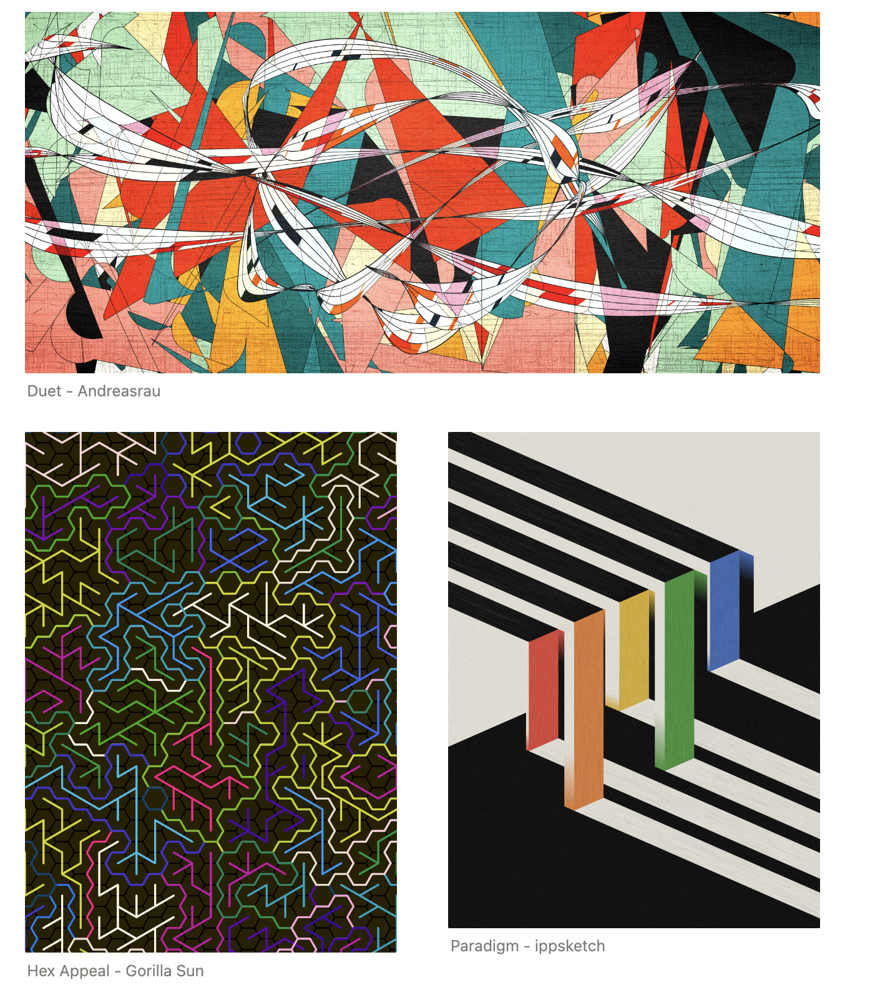
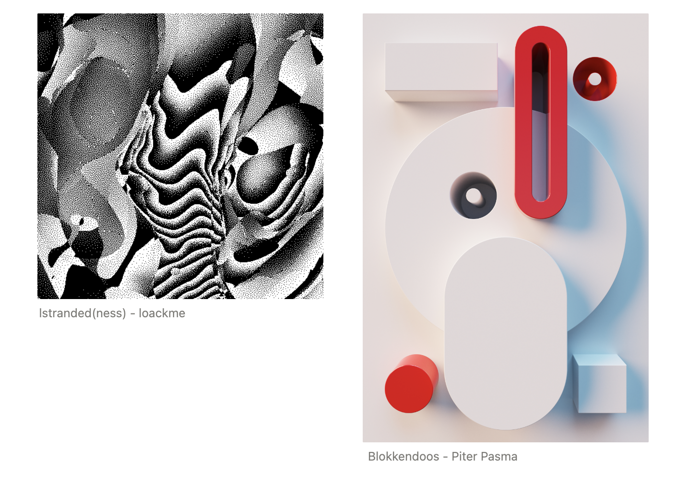
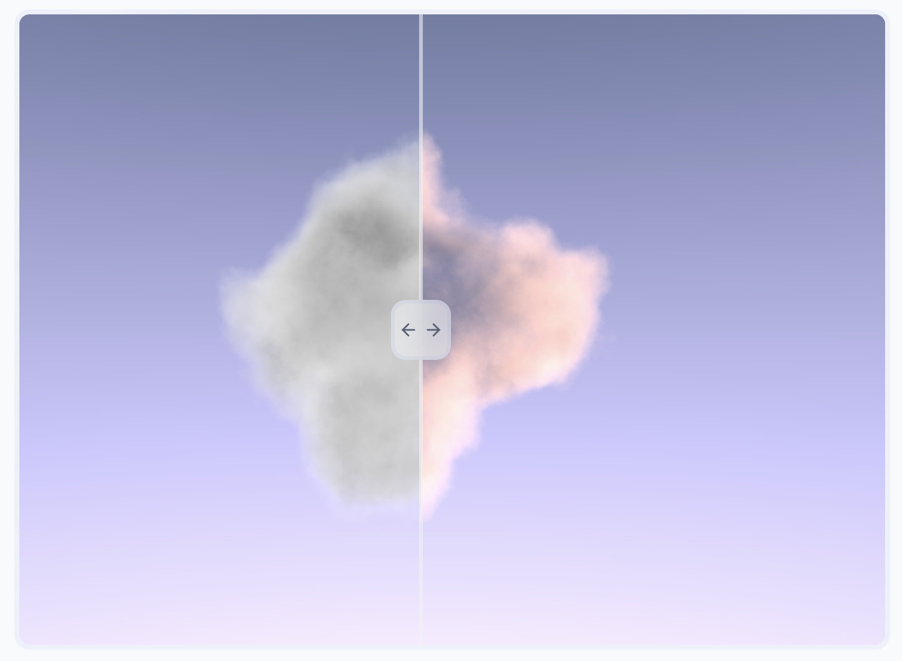
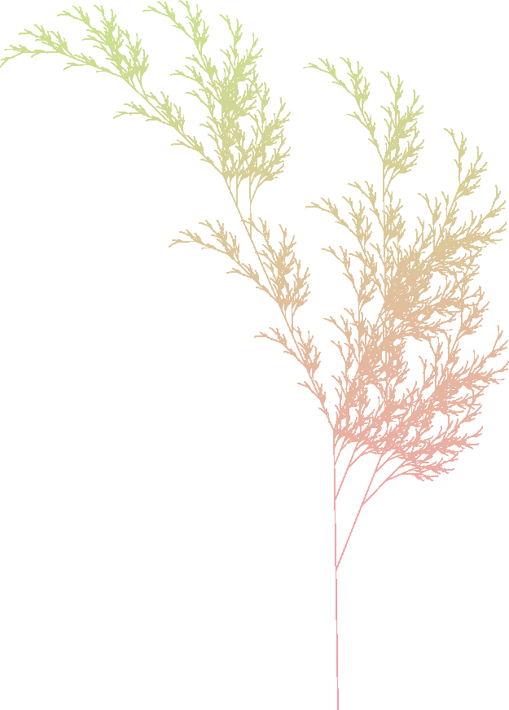
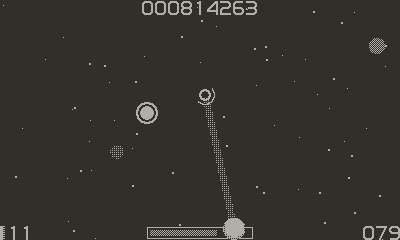
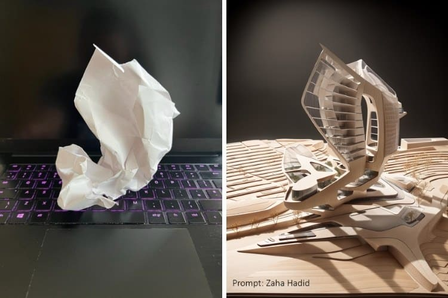
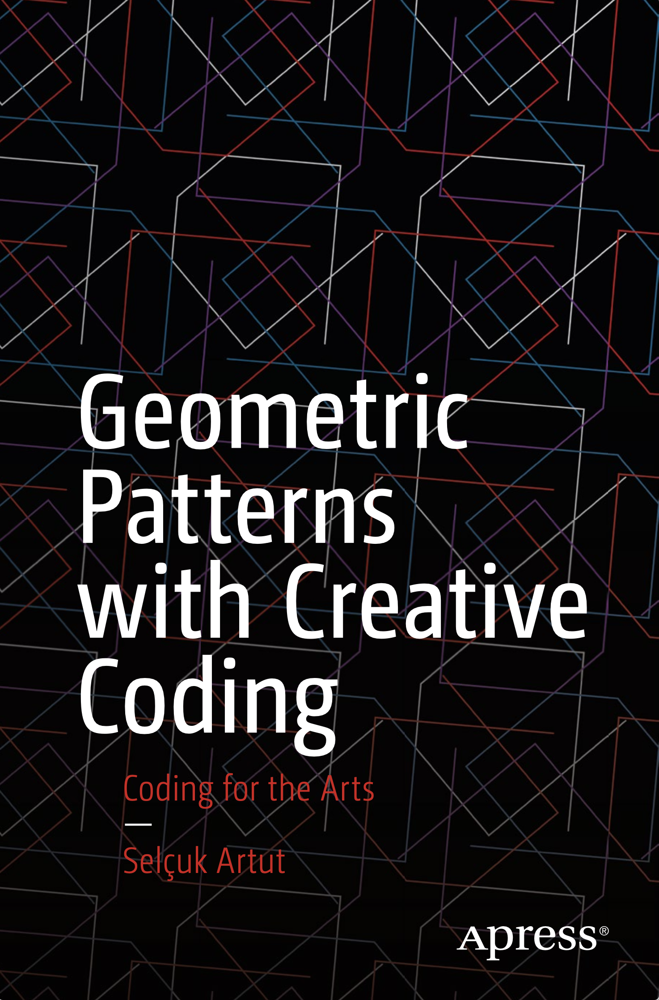

> Creativity can impact some sort of CHANGE in the WORLD. But we must first embrace pure DIFFERENCES and work together for a common cause. - Henry Johnson Jr
> 

Hi my Friends! 

First of all I want to thank all of you! We’ve **passed 2000 subscribers** to this newsletter and I can only thank you all so much for taking the time to subscribe. You don’t know how much it means to know that you are excited about 

I hope you have been well! I’ve been super busy the past couple months with a startup I am working with, taking masters classes, holidays, and my grandmother passing and thus its been a bit of a flurry of time. 

## [FX-Hash 2.0 Launch Calendar](https://www.fxhash.xyz/)

Take the time to enjoy exploring and collecting the works of these wonderful artists who are part of the launch of FX-Hash 2.0. Each of these artists has their own unique aesthetic and style, and it would be great if you could take a moment to appreciate their elegant work.

From Piter Pasma's compact coding practices and apex shading, to Gorilla Sun's brilliant color patterns (by the way, check out his [tutorials](https://www.gorillasun.de/blog/soft-body-physics-and-blobs/)), to the dithering genius of loackme and the ongoing exploration of a color palette and algorithmic variation by ippsketch in their saga that started with Bent.

Enjoy discovering the full potential of these artists and their creations.

## New Media Artist



# [Weidi Zhang](https://derivative.ca/community-post/human-machine-reality-immersive-art-weidi-zhang/68201)

> Weidi Zhang is a new media artist and designer whose visually lush and elegant narratives contemplate and conceptualize a not-so-distant-future human-machine relationship. Her interdisciplinary art and design research investigates *A Speculative Assemblage* at the intersection of interactive AI art, immersive media and experimental data visualization.
> 

Her work is beautiful, and I highly recommend taking some time to explore and appreciate the many stunning pieces she has created.

## [Real-Time Dreamy Cloudscapes with Volumetric Raymarching](https://blog.maximeheckel.com/posts/real-time-cloudscapes-with-volumetric-raymarching/)

> I spent the past few months diving into the realm of Raymarching and studying some of its applications that may come in handy for future 3D projects, and while I managed to build a pretty diverse set of scenes, all of them consisted of rendering *surfaces or solid objects*. **[My blog post on Raymarching](https://blog.maximeheckel.com/posts/painting-with-math-a-gentle-study-of-raymarching/)** covered some of the many impressive capabilities of this rendering technique, and as I mentioned at the end of that post, that was only the tip of the iceberg; there is *a lot more* we can do with it
> 



# [Tooll3](https://github.com/tooll3/t3)

> Tooll 3 is an open source software to create realtime motion graphics. We are targeting the sweet spot between real-time rendering, graph-based procedural content generation and linear keyframe animation and editing. This combination allows…
> 
> - artists to build audio reactive vj content
> - use advanced interfaces for exploring parameters
> - or to combine keyframe animation with automation

# **[Lindenmayer systems](https://vsekar.me/blog/log_coffee/chapter_0.html#lindenmayer-systems)**

> A Lindemayer system or LSystem for short consists of an alphabet of symbols that can be used to make strings, a collection of production that expand each symbol into some larger string of symbols, an initial “axiom” string from which to begin construction, and a mechanism for translating the generated strings into geometric structures.
> 

A good system to thoroughly study if you have the opportunity. 



# [Animate Anyone](https://humanaigc.github.io/animate-anyone/)

> Character Animation aims to generating character videos from still images through driving signals. Currently, diffusion models have become the mainstream in visual generation research, owing to their robust generative capabilities. However, challenges persist in the realm of image-to-video, especially in character animation, where temporally maintaining consistency with detailed information from character remains a formidable problem. In this paper, we leverage the power of diffusion models and propose a novel framework tailored for character animation. To preserve consistency of intricate appearance features from reference image, we design ReferenceNet to merge detail features via spatial attention. To ensure controllability and continuity, we introduce an efficient pose guider to direct character's movements and employ an effective temporal modeling approach to ensure smooth inter-frame transitions between video frames. By expanding the training data, our approach can animate arbitrary characters, yielding superior results in character animation compared to other image-to-video methods. Furthermore, we evaluate our method on benchmarks for fashion video and human dance synthesis, achieving state-of-the-art results.
> 

Unfortunately the code hasn’t been made public yet… but it just is good to see the work that is out there. 

# **[Easter egg emoji: converting pixels into particles](https://blog.gingerbeardman.com/2023/11/26/easter-egg-emoji-converting-pixels-into-particles/)**

> Instead of plotting values by hand in code I figured that it would make more sense if I could draw the patterns and then somehow convert them into coordinates. I use [Piskel](https://blog.gingerbeardman.com/2023/05/10/piskel-for-playdate/) as my *Playdate*-centric graphics editor. It’s a really useful tool. So I drew a few emoji-like patterns, keeping in mind that they would be converted into a cluster of points and exploded from an origin. This took a bit of experimentation but I ended up with a sort of already exploded look.
> 

## **[Architect Uses AI Technology to Transform Crumpled Paper Into Futuristic Buildings](https://mymodernmet.com/tim-fu-lookx-ai-architecture/)**

> Architectural designer [Tim Fu](https://www.timfu.com/), formerly of Zaha Hadid Architects, is embracing AI technology and showing how the tool can be integrated into architectural practices. A recent exercise using a crumpled piece of paper and [LookX](https://www.lookx.ai/), an AI platform for designers and architects, is particularly interesting.
> 

I think this is a great usage of creative AI to help further understand unique buildings. 

Oh and just for some peaceful generative organ… 

## Generative Organ Drone



# Books

# [Geometric Patterns with Creative Coding](https://amzn.to/48b55MD)

> Facilitate coding in generating geometric motives with a special focus on analyzing their geometric formulations. This book aims to teach analytical coding skills by combining arts and mathematics.
> 
> 
> Geometric patterns are quintessentially important for understanding today’s media arts and their relationship with mathematics. With the main emphasis on this, author Selçuk Artut proposes a certain workflow to mathematically analyze a geometric pattern and use creative coding skills to render it on a computer screen.
> 
> When done, you'll understand the basics of coding and expand the provided structure to cover issues of creative coding in particular. This book will also present a workflow to geometrically analyze and build patterns with detailed examples.

[Website](https://www.generativecollective.com/) |  [Instagram](https://www.instagram.com/generate.collective/) | [Youtube](https://www.youtube.com/channel/UCBOYyqA-mqyoTSJ8pO9sQiA) | [Behance](https://www.behance.net/generatecoll) | [Twitter](https://twitter.com/generatecoll) | [BuyMeACoffee](https://www.buymeacoffee.com/generatecoll)
