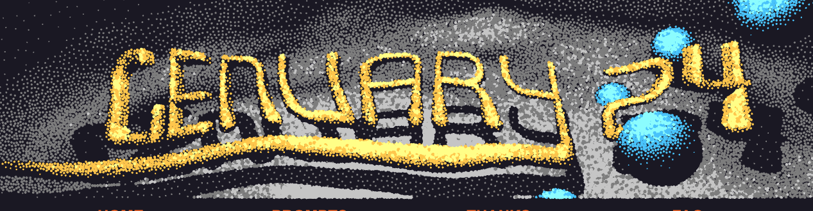
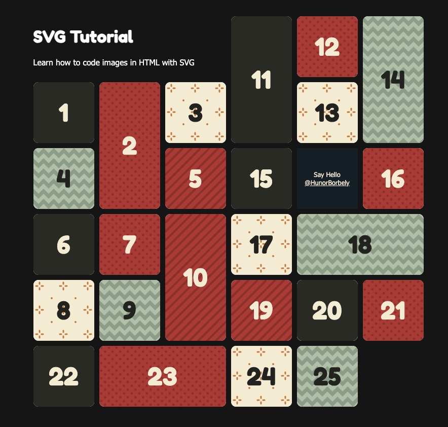
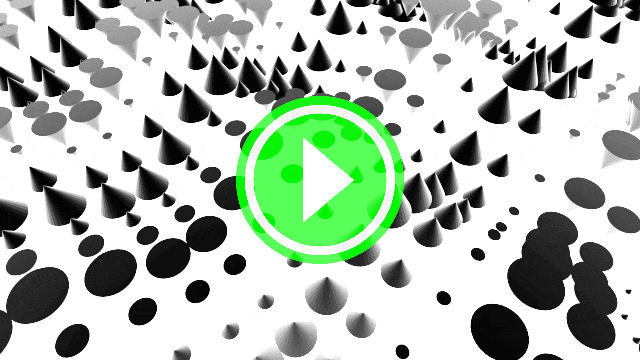
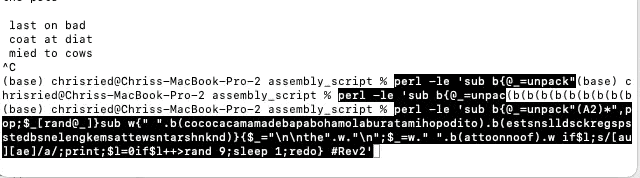
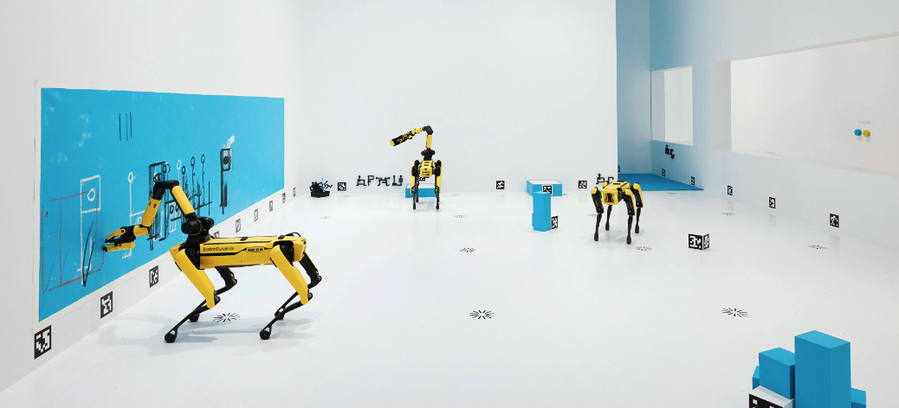
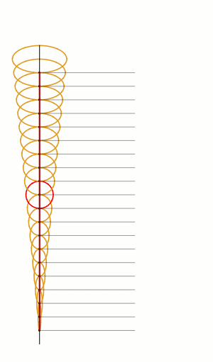
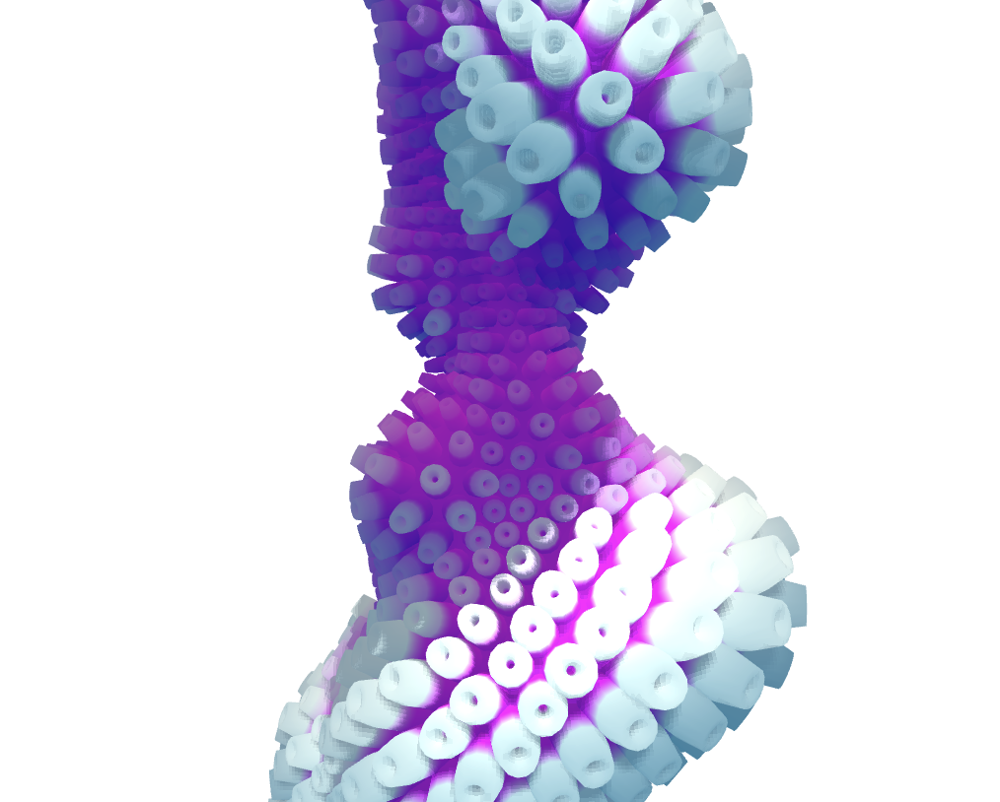
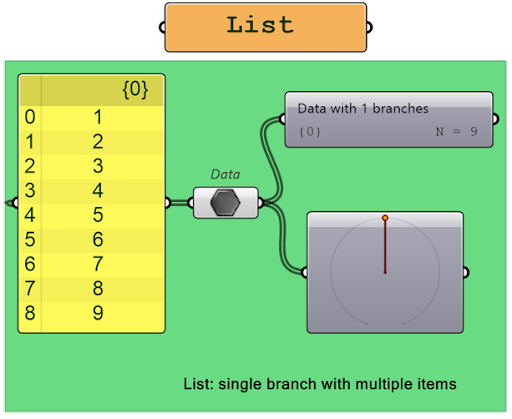
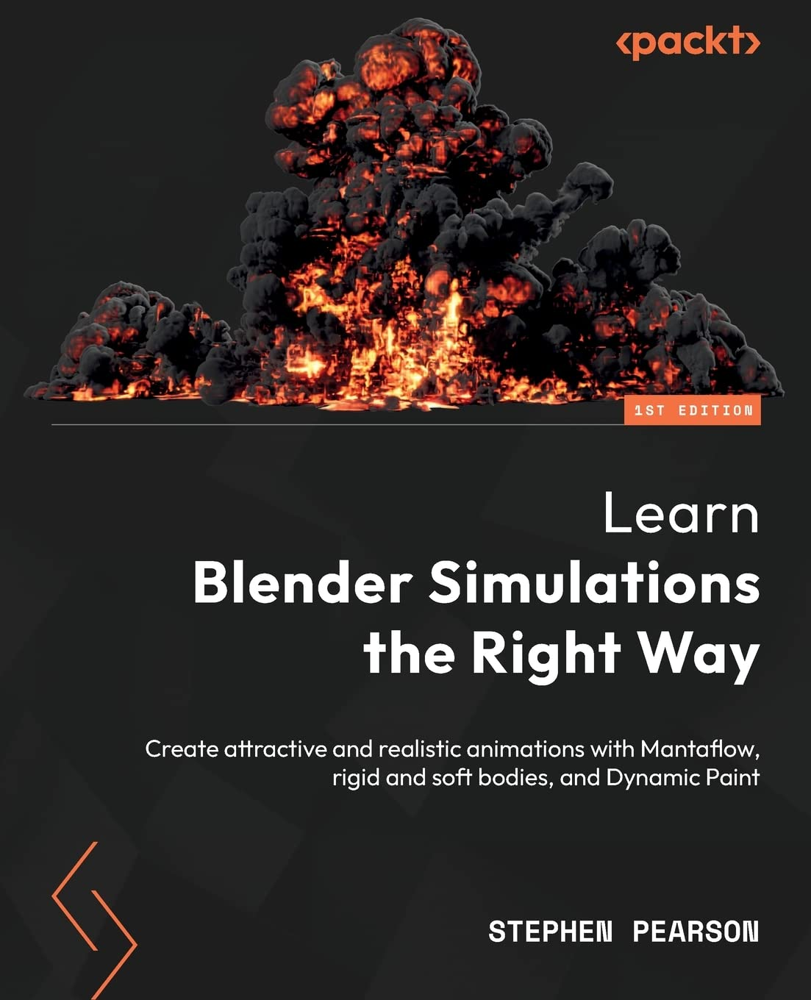

First published on [Substack](https://open.substack.com/pub/generative/p/noisy-svgs-dynamic-wearables-and?r=58kr3&utm_campaign=post&utm_medium=web)


> AS AN INNOVATOR, YOU NEED TO BE AWARE OF HOW TRADITIONS, HABITS AND BIAS CAN ACT AS BARRIERS TO ACCEPTING NEW IDEAS. - MAX MCKEOWN
> 

Has been previously posted on Substack. 

**Happy Holidays,** 

We are just about to enter a new year! 😱😱😱

This year flew by much faster than expected, which in hindsight isn’t surprising.

It does always bring a time of reflection and goal setting**. So without further ado..** 

**Things I’ve Learned:** 

- Spent much of my free-time this year working on a masters
- Learning / Playing with Generative - Parametric 3D Modellng Frameworks and Printing
- Building Weird LLMs (What happens if you mix training data from Eliot, Pound and Proverbs)
    - Haven’t found anything too interesting
- Deep dive into Frontend / Web Development  (much more of a backend OOP development kinda developer or scripting in Python / R)

**Thing I’ve Yet to Solve:** 

- Sustainable creative model (Building a consumable to fuel research and discovery)
    - I'm considering starting a separate Substack called "Creator Economy Thoughts and Ideas" as a way to explore sustainable means beyond traditional methods. I aim to stimulate interesting conversations and thoughts in that space. I have several unfinished posts in Notion and would appreciate more ideas in this area. However, I don't want to bore anyone who is solely here for learning.
- Continue providing you all interesting and engaging content..
    - I do love doing this.. I think this is one of my favorite things. It might not seem to be at times and community builder isn’t really my forte. But… doesn’t mean I can’t continue to learn from you all!

**Things I’ve been thinking:** 

- Creative Coding Festival - Is this something that people would enjoy doing?

## 2024 Predictions

What will Creative Coding / Generative Art look like for you in 2024? What are your predictions? 

- **More VR and AR creativity**
    - With the AR functionalities in the Quest 3 from Meta, there is potential to explore hybrid environments. It remains to be seen what Apple's Vision Pro project will achieve this year. While the price is high, the technology could offer truly unique experiences.
- **Interactive Generative Blockchain projects**
    - We haven’t even come close to scratching the surface of using Blockchain and the EVM to make some interesting and unique experiences.
- **AI Art Fatigue / Fear**
    - I’m thinking there is going to be a setback on AI transformer models due to the copyright that is involved. At least in the US.  I think fair usage will need to be dealt with and properly given thought before we make more decisions on how we use the technology. Blockchains have a unique advantage on data right usage that perhaps we shall see a standardization.
- **AI Image Metadata**
    - With the continued proliferation of AI generated images, I think we are going to need to start coming up with methods that will digitally mark pictures as a verification piece so that we can attempt to at least dampen the “true” image vs non-image. Or event stenography in every image produced by a model as a standard?
- **Continued blooming of the creator economy**
    - Personally, I believe that AI will inevitably become a reality, regardless of who develops it, whether it be the West or the East. Regulating it alone won't be a complete solution. Therefore, if AI does replace jobs (which I believe is still a ways off), we need to adapt. Finding new, interesting, and innovative avenues of commerce is one way to do that, and I believe we will witness such changes.

What are your predictions for this year? 

## Also do not forget!!



## [Genuary 2024](https://genuary.art/)

I look forward to participating in this every year. There is so many interesting ideas that I’ve ended up playing with the rest of the year that comes from these days. 

It is similar to [Inktober](https://inktober.com/).. there will be 31 prompts that have been curated by a group of artists and the point is to use the prompt to create a creative sketch every day for the 31 days of January 2024. 

Day 1: **Particles, lots of them.**


# Articles and Tutorials


Learning SVG Code Advent Calendar

This is a fun little 25 days to learn how to work with SVG. Why not make it holiday themed. The following SVG was taken from one of the 25 boxes. Can you guess which it is?

```svg
<svg width="200" height="200" viewBox="-100 -100 200 200">
  <defs>
    <g id="tree">
      <polygon points="-10,0 10,0 0 -50" fill="#38755b" />
      <line x1="0" y1="0" x2="0" y2="10" stroke="#778074" stroke-width="2" />
    </g>
  </defs>

  <rect x="-100" y="-100" width="200" height="200" fill="#F1DBC3" />
  <circle cx="0" cy="380" r="350" fill="#F8F4E8" />

  <use href="#tree" x="-30" y="25" transform="scale(2)" />
  <use href="#tree" x="-20" y="40" transform="scale(1.2)" />
  <use href="#tree" x="40" y="40" />
  <use href="#tree" x="50" y="30" transform="scale(1.5)" />
</svg>
```



## **[Procedural 3D Modelling](https://amzn.to/3TouJci) in Blender**

Also check out [part 1](https://tabreturn.github.io/code/blender/python/2020/06/06/a_quick_intro_to_blender_creative_coding-part_1_of_3.html) and [part 2](https://tabreturn.github.io/code/blender/python/2020/07/14/a_quick_intro_to_blender_creative_coding-part_2_of_3.html)

> In this series of tutorials, I’ll introduce Blender as a tool for creative coding. [Blender](https://www.blender.org/) is open-source software for 3D modelling and animation that can also handle compositing, video editing, and 2D animation. Artists and animators operate Blender using a graphic user interface (Figure 1.1), but it also features a Python API that can do everything the GUI can and more. That means you can use Python code draw, animate, and manipulate 3D objects.
> 

If you are somewhat familiar with the power of Blender and scripting, you can probably skip the first part of these tutorials. Although they might be a couple of years old, they provide a good basis to start and further understand the Python libraries that are associated with the details.

## Design for Dynamic Wearables (Course)




I do wish that Rhino was open source, but it isn’t though its probably one of the cheapest 3D modelling / parametrics systems on the market and used extensively in the Architect world. The course, though can be a little slow going,  I’ve worked through about 1/2 of the 9 2 hr videos and have been able to get alot out of it in terms of using the parameteric system Grasshopper. 

I know some of this can be done using Tissue and Sverock in Blender but I have yet to find someone who has put together a really solid presentation / course together without having to pay for yet another course. 



# [Perl Poetry Generators](https://nickm.com/poems/ppg256.html)

> Perl poetry generators in 256 characters created by Nick Montfort written back in 2012.
> 

Some of these have been updated but just letting them run in the terminal and enjoy the output. I need to pipe this into speech synthesizer. 

```perl
sub b{@_=unpack"(A2)*",pop;
$_[rand@_]}sub w{" ".b(cococacamamadebapabohamolaburatamihopodito).b(estsnslldsckregspsstedbsnelengkemsattewsntarshnknd)}
	{
		$_="\n\nthe".w."\n";
		$_=w." ".b(attoonnoof).w 
		if$l;s/[au][ae]/a/;
			print;
		$l=0
		if$l++>rand 9;sleep 1;redo} #Rev2
```



# **[agnieszka pilat taps boston dynamics’ robot dogs to paint autonomously at NGV triennial](https://www.designboom.com/art/agnieszka-pilat-boston-dynamics-robot-dogs-ngv-triennial-heterobota-12-23-2023/?fbclid=IwAR0xztGX8MNzZ1mCfM9IhU-wHT8c-MDqf_60mjkUY7cBjafl_yj0b-liXJ8)**

> At the [National Gallery of Victoria (NGV) Triennial](https://www.designboom.com/tag/ngv-triennial/), machine artist Agnieszka Pilat employs [Boston Dynamics’](https://www.designboom.com/tag/boston-dynamics-robotics/) robot dogs to paint and live on their own in front of the public until April 7th, 2024. It’s not the first time that the Polish artist and writer collaborates with the Boston Dynamics’ [robot dogs](https://www.designboom.com/tag/robots/).
> 

There is alot of interesting skills needed to creatively use Spot by Boston Dynamics to paint autonomously. I’m sure it would be an interesting project for sure. 


# [Maths and Science Animations](https://blog.matthen.com/) (Wolfram Language)

An older blog but has the code behind some of these and are interesting to look at and gleen ideas for projects or unique ways of implementing algorithms. 


# [Making Noisy SVGs](https://daniel.do/article/making-noisy-svgs/)

> In recent years there has been a design trend that runs counter to this. Illustrations still rule in web design, but instead of clean, flat shapes there has been an emergence of texture, usually as part of a design’s lighting or shading and *usually* a “noisy” or grainy texture.
> 

If you are looking for a method that takes an SVG and gives it a grainy output, this is a way to do that in SVG. 



## [Lars Berg](https://www.larsberg.net/#/)

> Hi! I’m an artist and creative developer based in Dallas, TX. I work with design studios and agencies to make immersive websites, VR/AR applications, and interactive installations. This is a place where I post sketches and documentation for some of the projects I've been involved with.
> 




## Jitter in Max / MSP - Texturing and Shading

> In this lesson we explore two topics:
> 
> 
> 1 • How to apply a texture to a 3D shape in Max/MSP.
> Applying a texture to an object in our virtual world means wrapping it using an image or a stream of images (video).
> 
> 2 • We see how to use the jit.gl.material object to apply different lighting algorithms and use textures to give the shapes a photorealistic appearance.
> 



# A Beginners Guide to Data Trees in Grasshopper

> One of the most challenging aspects of Grasshopper is understanding data tree structures, which can be a daunting task for even the most experienced users. However, with practice and the right guidance, mastering data trees can unlock a whole new level of design possibilities. In this article, I will explore the fundamentals of data trees in Grasshopper and provide exercises to help you practice and better understand this concept. With the help of this article and the attached exercises, you will have a solid understanding of how data trees work and be able to apply this knowledge.
> 

Grasshopper is a parametric tool that is built into Rhino 3D. It is powerful and considered a valuable asset for computational design and architects. There is a wealth of knowledge to explore within this community, which is incredibly diverse. Additionally, there are plugins available that contain interesting code and provide alternative approaches for understanding 3D algorithms.

# Books


## [Learn Blender Simulations the Right Way](https://amzn.to/47VHFep)

> This book is an in-depth guide to creating realistic and eye-catching simulations, understanding the various settings and options around their creation, and learning how to troubleshoot solutions to your own Blender problems. In addition, this book can also be used to simulate the behavior of certain physics effects, such as fire, fluid, soft bodies, and rigid bodies.
> 

Not necessarily complete creative coding, but there are a lot of powerful tools that make Blender an interesting tool to work with and perhaps find a way to use in your creative outlets. 

[Website](https://www.generativecollective.com/) |  [Instagram](https://www.instagram.com/generate.collective/) | [Youtube](https://www.youtube.com/channel/UCBOYyqA-mqyoTSJ8pO9sQiA) | [Behance](https://www.behance.net/generatecoll) | [Twitter](https://twitter.com/generatecoll) | [BuyMeACoffee](https://www.buymeacoffee.com/generatecoll)