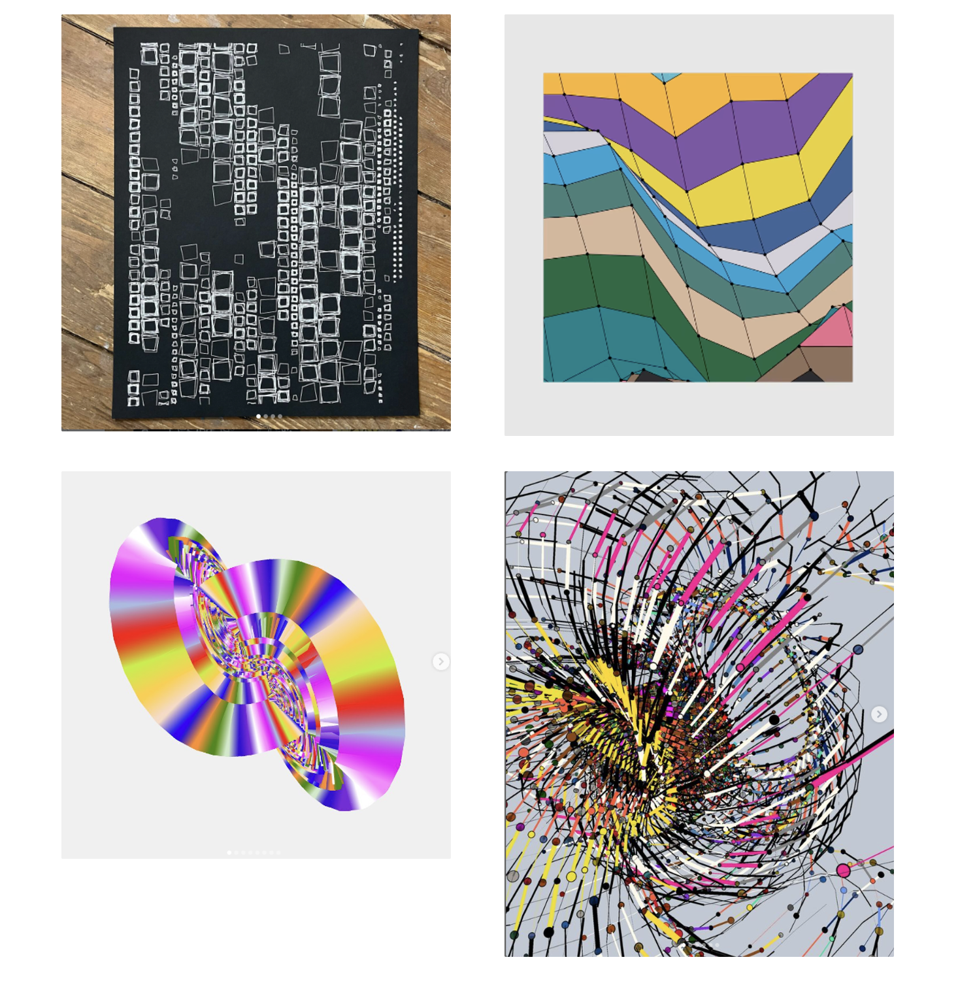
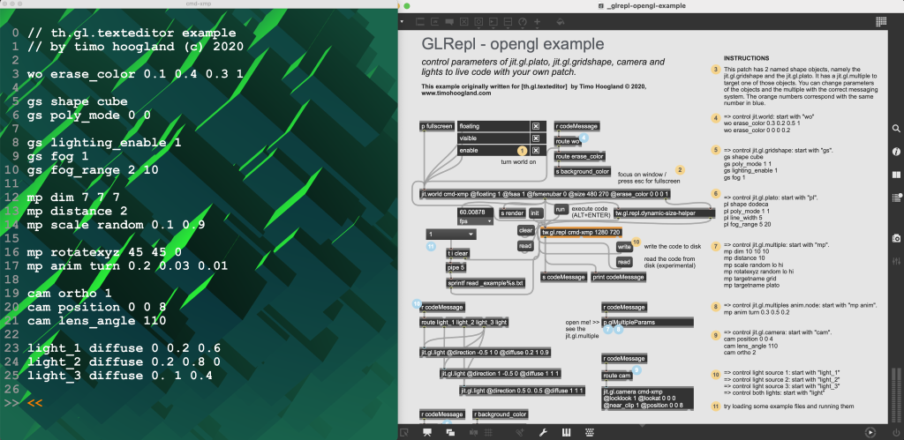
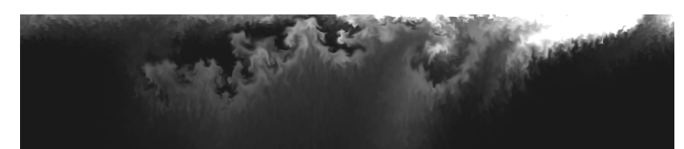
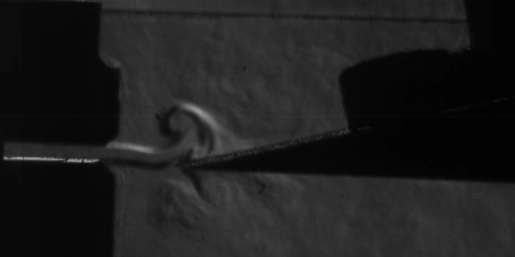
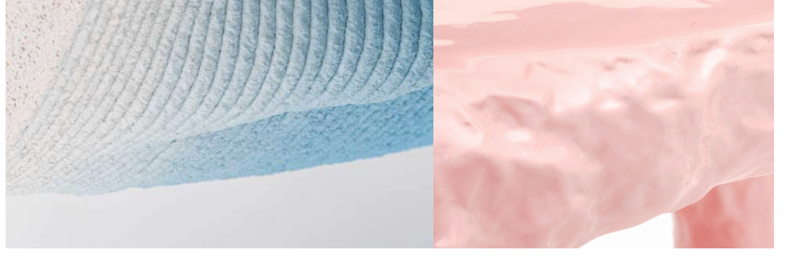
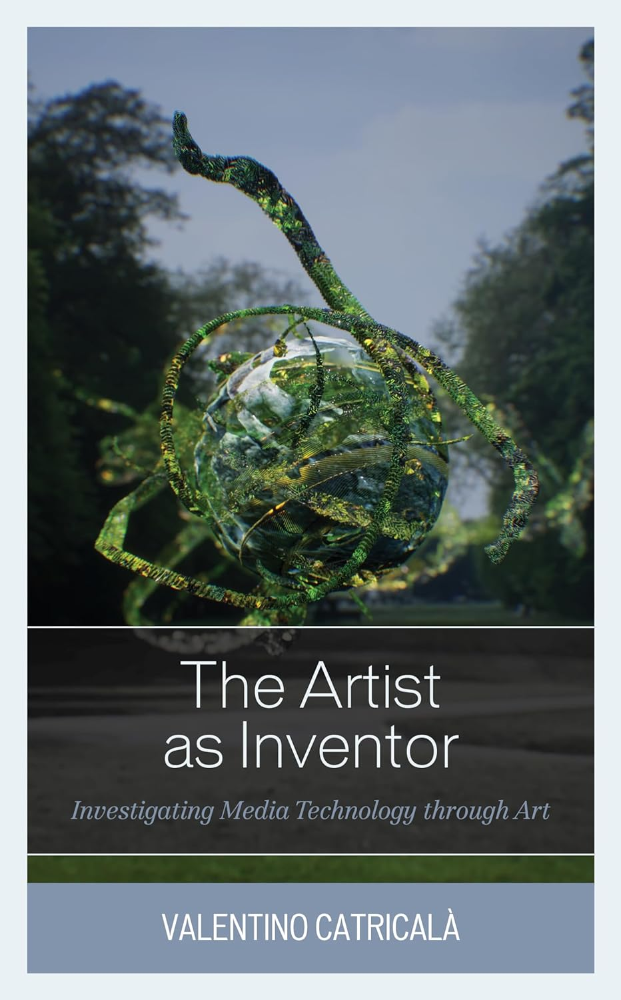

> CREATIVITY IS AN INTELLIGENT ESCAPE FROM THE PERCEIVED LIMITS. - SANDEEP KAKKAR

I recently finished reading "Artist as Inventor." Although it's an academic work that requires effort to digest, its arguments stand out. Primarily, it asserts that art has consistently advanced technology, suggesting a kinship rather than a division between the two. It also emphasizes the crucial role artists play in technology advancement through tool experimentation. The book delves into philosophy and culture, offering an alternative perspective to the prevalent art critique that war spurs technological innovation. This viewpoint is drawn from a broad range of historical examples across media arts.

The author starts by establishing an aesthetic perspective and the alignment between art and technology, specifically technological innovation. He then adopts a traditional art history approach, commencing with the Post-Impressionism movement and leading up to the Avant-gardes era. The rest of the book follows the precursors of New Media (e.g., photography, kinetic art, cinema) until it's eventually termed New Media in the 1990s.

From this historical narrative, I distilled the following insights:

> Artists shape innovation, leading and unleashing its poetics. The role of the artist is no longer confined to the artistic sphere alone, nor, as was common in those days, to the social sphere more generally speaking.

The author, Valentino, challenges the assumption that artists are merely passive consumers using pre-engineered platforms as mediums for their ideas. Instead, he suggests that artists have significantly shaped and pioneered their early development.

> Artists aren’t simply passive consumers using pre-engineered platforms as mediums for their ideas, but have been intrinsic in shaping and pioneering their early development.
> 

This perspective aligns with my views on the intersection of art and technology, although I acknowledge potential bias.

Personally, as an artist and creator, I constantly strive to experiment, explore new concepts, and push boundaries. This trait mirrors inventors'. I believe the difference lies in motivation: artists explore and experiment driven by an inner "calling," whereas inventors aim to solve problems.

# Tutorials & Articles



## An Introduction to Raymarching

> This tutorial guides you through the fundamentals of raymarching and space transformation, providing insight into the endless creative possibilities that this technique opens up.
> 

## **[Livecoding meets Max meets OpenGL: free GLRepl for Max](https://cdm.link/2024/01/glrepl-for-max/?fbclid=IwAR1Inqm0BVdze1q9x2kuf8DIHjj4xer3aAY4G6EIXNpxAdPJ9_WfFRVt-mw)**

> Take a Max patch and add easy livecoding for it. Work with anything you want, commanding Max from the keyboard – including powerful OpenGL, Jitter, JSON, and JavaScript functions and customization. It’s a live visual tool; it’s a powerful Max customization tool, so it’s whatever you imagine. GLRepl is here, it’s free, and it’s even right in the Max package manager.
> 



## **[Realtime shadow casting on 2D terrain](https://www.youtube.com/watch?v=bMTeCqNkId8)**

> Shadows have always seemed like a bit of an elusive effect to me but in this video I show you how to create a shader for real time shadows using ray casting for 2D height map terrain. I think the islands created with this method look really cool and I'm excited to share how I did it with you!
> 

## **[Simulating Fluids, Fire, and Smoke in Real-Time](https://andrewkchan.dev/posts/fire.html)**

> Fire is an interesting graphics problem. Past approaches generally faked it. For example, *Lord of the Rings* used sprites with lots and lots of smoke (the fluid sim was too expensive at the time, even for movies). Real-time applications like video games have pretty much exclusively used non-physical approaches.
> 

## **[Organ Pipe Physics](https://www.modartt.com/organteq_physical_modeling)**

> The organ pipes belong to the so-called *self-sustained instrument* family. They transform a continuous energy (the air flow) into a quickly oscillating energy (the acoustic vibration) thanks to a feedback loop. **Organ pipes are DC/AC converters!**
> 

Organ pipe physics, another wonderful way to explore the world. 

## [Philipp Aduatz](https://www.philippaduatz.com/)

> Vienna based Designer **Philipp Aduatz** (born 1982) creates limited edition functional objects that are highly sculptural in nature. Working with innovative materials and fabrication technologies, Aduatz is very much influenced by scientific matters such as chemistry, physics and material technologies.  His process combines traditional craft concepts and techniques with cutting edge implements such as 3D printing, 3D laser scanning, CNC milling, and Rapid Prototyping. The experimentation with different materials and their behavior is an important part of his research at the intersection of design and sculpture. Greatly influenced by sculptors such as Constantin Brancusi and Tony Cragg, the designer aims to develop a distinct language of form in each of his pieces, encouraging a new discourse between the object and its user or viewer.
> 

Though not necessary creative coding, there are a number of mediums that he uses that will most likely find interesting. Must of his work has an organic feeling that has a bit of a bio-industrial feel.  

# Books

## The Artist as Inventor

> Today the media arts not only address the great themes of our times, they inhabit the very media of which they speak. The contemporary is global, but only because of the media that enable globalisation. Those media are almost nowhere apparent in the mainstream practice of art that we see in biennials from Venice to Sao Paolo. The media arts reflect back to us our present condition, and in the archive present us with the ghosts of what we were, and what we failed to become. This book brings the reader into the centre of these strange encounters, introducing us to the rich legacies and futures of the most important arts of the last hundred years. It also looks ahead to the future and asks what happens to the condition of being human within the new constellation into which we are entering?
> 

I finished reading this a couple of days ago. It's an academic piece discussing the argument that artists play an integral role in pushing technology forward through their experimentation with tools. It falls more into the realm of philosophy and culture. It offers an alternative perspective to the common critique in art that war promotes technological innovation.

[Website](https://www.generativecollective.com/) |  [Instagram](https://www.instagram.com/generate.collective/) | [Youtube](https://www.youtube.com/channel/UCBOYyqA-mqyoTSJ8pO9sQiA) | [Behance](https://www.behance.net/generatecoll) | [Twitter](https://twitter.com/generatecoll) | [BuyMeACoffee](https://www.buymeacoffee.com/generatecoll)