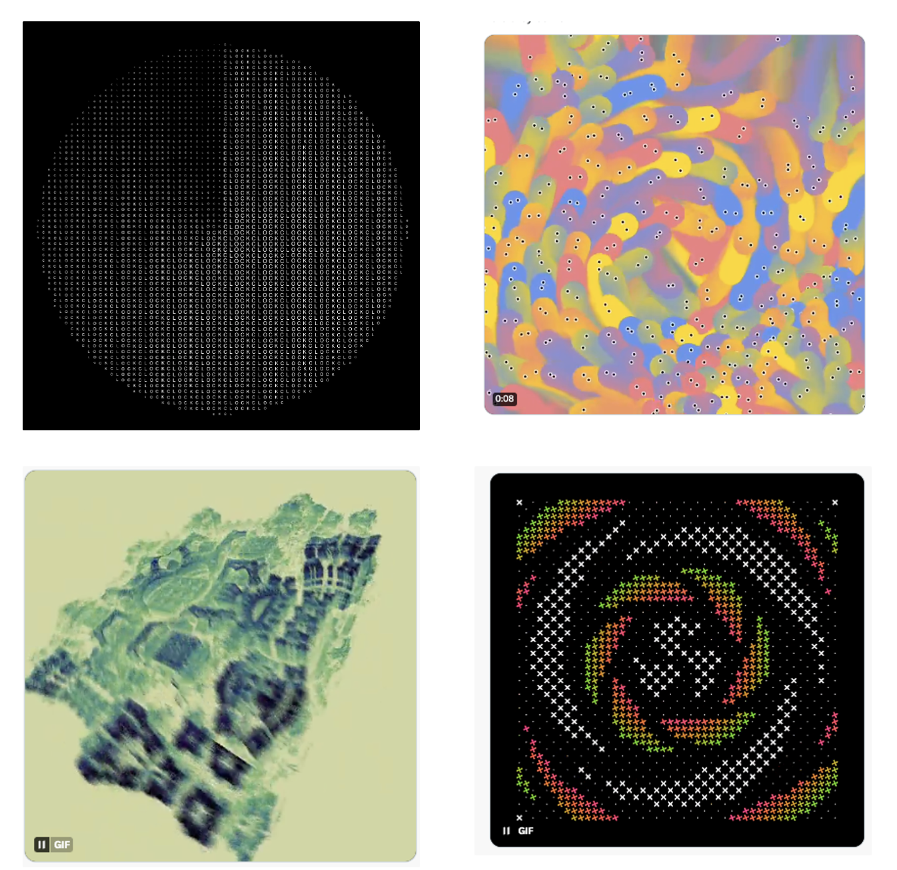
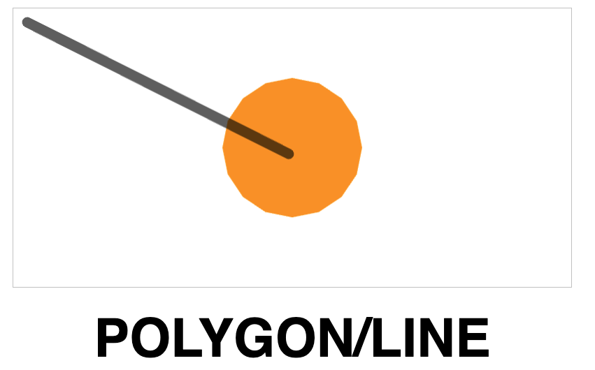
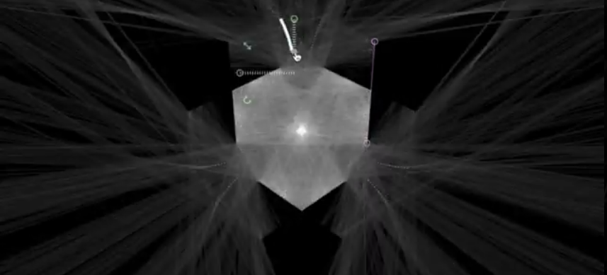
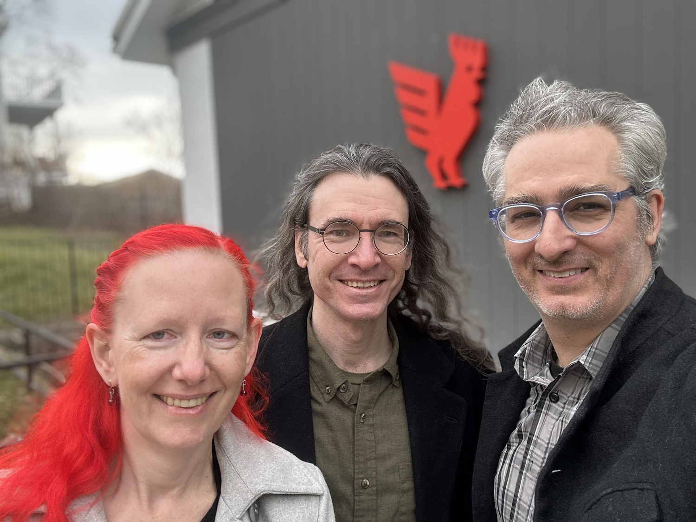
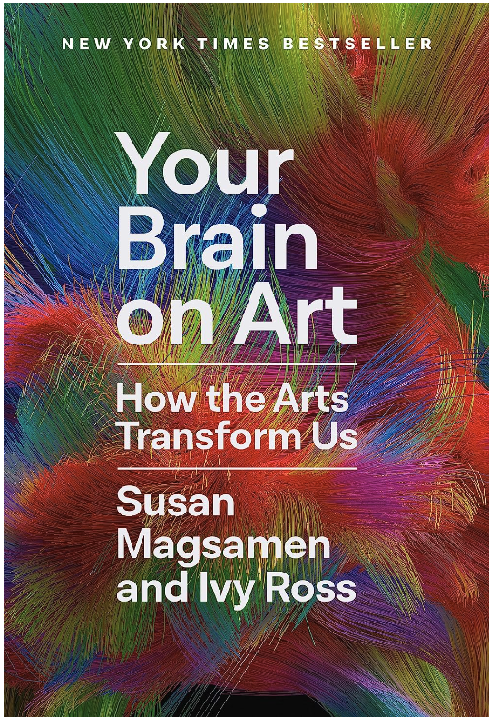

First published on [Substack](https://open.substack.com/pub/generative/p/your-brain-on-art-plotters-and-veoluz?r=58kr3&utm_campaign=post&utm_medium=web)

> Creativity is a continual surprise. - Ray Bradbury

Hello All, 

Welcome all who have recently subscribed in the last couple weeks. I am sovery grateful that you are all excited about this little practice of ours called creative coding. 

Also, I’ve been putting together a little Github document on content creators who are doing creative coding tutorials. This is an in progress but I hope you can check them out and find either software or projects that interest you to learn new things! 

https://github.com/cdr6934/CreativeCodingCreators

If you are a creator and want your info added (or you know of others that would be great), you can create a pull request to be added into a section.

Otherwise, I wish you all a great week! 

Chris Ried 

## Genuary Favorites

There are always so many wonderful entries.. here are a few of my favorites! 

[Andreiongd -](https://www.instagram.com/reel/C2qA3Z_oDvd/?utm_source=ig_web_copy_link&igsh=MzRlODBiNWFlZA==) Skeuomorphism  /   [Orr Kislev - Flocking](https://x.com/OrrKislev/status/1748248352083345690?s=20)   / [Lionel Radisson- SDF](https://x.com/MAKIO135/status/1751918106392588714?s=20) /      [Gorillasun - SDFs](https://x.com/gorillasu/status/1752100759569612859?s=20) 

Although this was the last day of Genuary, I was able to get a couple entries in this year. Much less than the previous years but it is always great to see the works that are made by you! 

# Tutorials & Articles

## [Collision Detection](https://www.jeffreythompson.org/collision-detection/thanks.php)

> The collision of objects underlies most game experiences and user-interfaces. Baseball bats collide with balls, zombies bump into walls, and Mario lands on platforms and stomps turtles. Even something as simple as clicking a button (a rectangle) with your mouse (a point) is a collision.
> 

This is a resource to highlight. There is so many use cases of collision detection that I believe you would find great value. 

## [20+ Questions about Licia’s Plotter Painting](https://www.eyesofpanda.com/project/plotter_painting_q_a/)

> Since the start of my plotter painting journey, I have received many wonderful questions about my practice. What plotters do you use? How do you refill the brush? What paper do you use? Why?
> 
> 
> I LOVE answering these questions and seeing curiosities turning into actions. But because these conversations often happen over short messages, my answers are shortened, incomplete, and need references.
> 

I’ve been following Licia’s work for years and I’m always have loved the intricate plotting she has done with the brush. Take some time, and really read through it as she has such a great perspective on her art. Also definitely check out [Golan’s](https://courses.ideate.cmu.edu/60-428/f2021/) Drawing With Machines course work as to Licia’s words, “its a treasure trove” 



## Hypotrochiod

> audiovisual artwork unfolds in real time infront of the viewer and explores aesthetics of mathematics throught generative sequence of manipulations with the parametric function of the hypotrochoid
> 

I am a sucker for large screens and immersive experiences. I could easily have a room in my house with a screen like this and watch it for hours. 

## [Veoluz](https://jaredforsyth.com/veoluz/)

> VeoLuz is an exploration-focused playground and an artistic tool. It attempts to mimic the behavior of photons as they interact with barriers of various kinds − those that absorb light, those that reflect light, and those that refract light.
> 



## How to Create a Particle System w/ Emitter in Max

Fedorico has a backlog of many tutorials mainly for Max MSP [here](https://www.federicofoderaro.com/max-msp-jitter-tutorials.html). Max is commercial software and so the ecosystem is less accessible; however it’s always great to see other using the creativity in many tools across the board.  

## [Flitter](https://github.com/jonathanhogg/flitter)

> **Flitter** is a functional programming language wrapped around a declarative system for describing 2D and 3D visuals. [The language](https://github.com/jonathanhogg/flitter/blob/main/docs/language.md) is designed to encourage an iterative, explorative, play-based approach to constructing generative visuals. The engine that runs **Flitter** programs is able to live reload all code (including shaders) and assets (images, models, etc.) while retaining current system state - thus supporting live-coding. It also has support for interacting with running programs via MIDI surfaces.
> 

## **[Bantam Tools Acquires Evil Mad Scientist to Accelerate Development of Next Generation Art and Handwriting Machines](https://www.bantamtools.com/blog/bantam-tools-acquires-evil-mad-scientist)**

> Bantam Tools, the desktop CNC manufacturer that builds exceptional computer controlled machines for innovators, is excited to announce the acquisition of [Evil Mad Scientist](https://www.evilmadscientist.com/), the designer and manufacturer of popular computer-controlled drawing and handwriting machines that provide versatile solutions to artists and educators. Dr. Windell Oskay and Lenore Edman, co-founders of Sunnyvale, California based Evil Mad Scientist, will move to Peekskill, New York, headquarters of Bantam Tools, as CTO and COO overseeing technical development and operations.
> 

If you own a plotter, or are considering purchasing one, this news should interest you. Evil Mad Scientist has been producing their Axidraw for several years. Their recent merger with Bantam Tools represents another step forward in their machine production journey, offering more growth opportunities for the Axidraw.

# Books

## [Your Brain on Art - How the Arts Transform Us](https://www.amazon.com/Your-Brain-Art-Arts-Transform-ebook/dp/B0B4QZ5V7R/ref=tmm_kin_swatch_0?_encoding=UTF8&qid=1706760917&sr=8-1)

> We’re on the verge of a cultural shift in which the arts can deliver potent, accessible, and proven solutions for the well-being of everyone. Magsamen and Ross offer compelling research that shows how engaging in an art project for as little as forty-five minutes reduces the stress hormone cortisol, no matter your skill level, and just one art experience per month can extend your life by ten years. They expand our understanding of how playing music builds cognitive skills and enhances learning; the vibrations of a tuning fork create sound waves to counteract stress; virtual reality can provide cutting-edge therapeutic benefit; and interactive exhibits dissolve the boundaries between art and viewers, engaging all of our senses and strengthening memory. Doctors have even been prescribing museum visits to address loneliness, dementia, and many other physical and mental health concerns.
> 

I'm three-quarters through the book. I've always used art as a form of processing issues, leading my brain into a meditative state. Thus, reading this book has affirmed my natural inclinations. I've found it accessible and truly enjoyable!